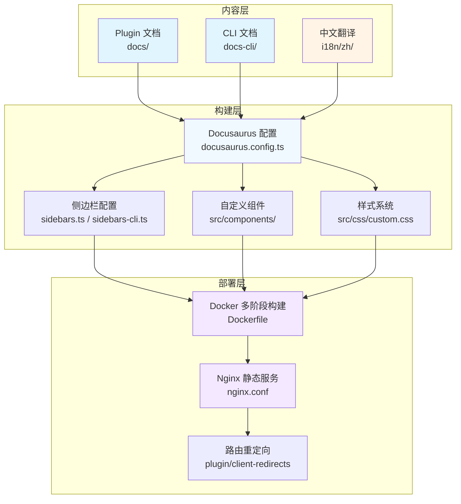
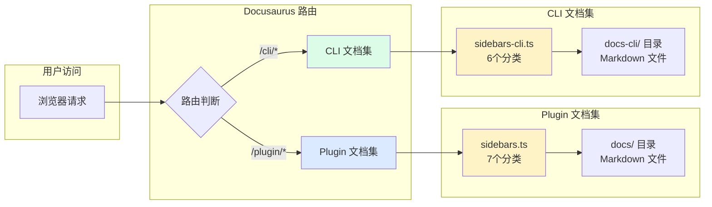
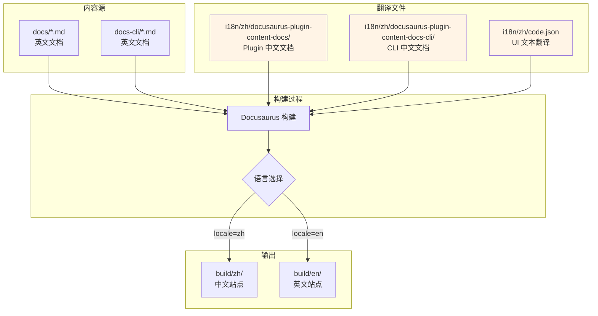
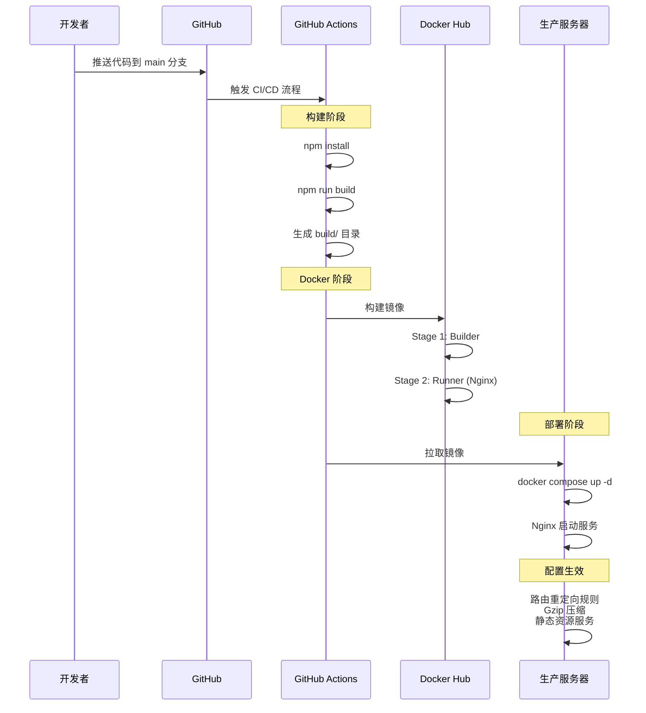
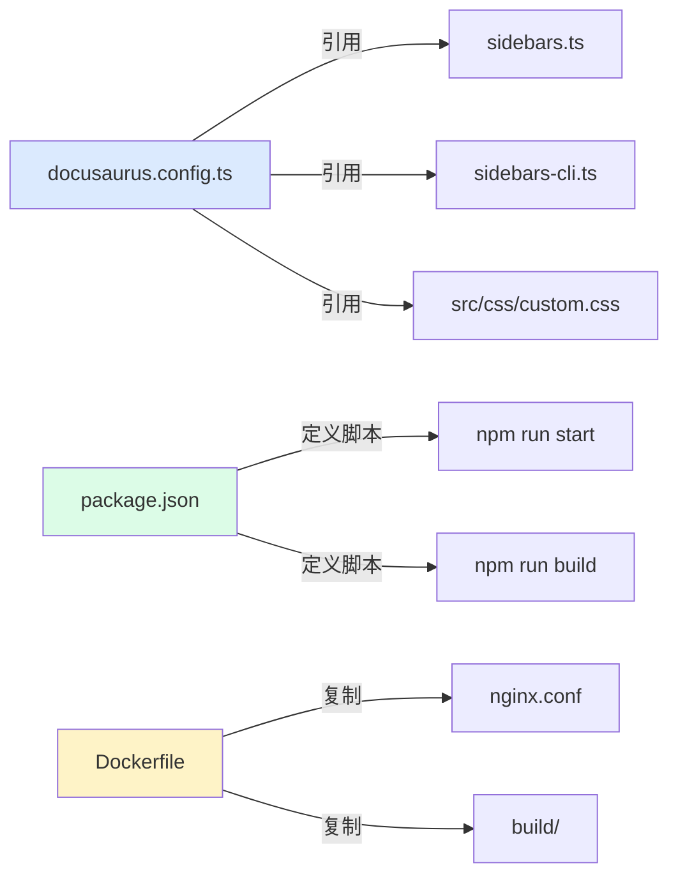

# 1、项目概述

<details>
<summary>相关源文件</summary>

- docusaurus.config.ts
- package.json
- sidebars.ts
- sidebars-cli.ts
- Dockerfile
- nginx.conf
- src/components/DownloadButton/index.tsx
- src/css/custom.css
</details>

## 概述

CoStrict 文档网站是一个基于 Docusaurus 3.8.1 构建的静态文档站点，旨在为 CoStrict 产品的 Plugin（VS Code 扩展）和 CLI（命令行工具）提供完整的技术文档支持。项目采用中英文双语架构，默认语言为中文，支持国际化内容管理。

项目整体规模为小型（184个文件），其中核心内容包括 139 个 Markdown 文档，分布于两个独立的文档集中。技术栈简洁明了，以 React 19.0.0 + TypeScript 5.6.2 为基础，通过 Docker 容器化部署，配合 Nginx 提供高性能静态资源服务。整体架构设计注重可维护性和扩展性，通过插件化配置实现了多文档集管理、本地搜索、路由重定向等核心功能。

**核心价值**：
- **多产品线文档管理**：通过多文档集架构，实现 Plugin 和 CLI 两类产品文档的独立管理和路由分离
- **国际化优先**：默认中文支持，通过 `i18n/zh/` 目录实现完整的双语内容管理
- **容器化部署**：Docker 多阶段构建优化镜像体积，Nginx 配置实现路径重定向和性能优化
- **开发体验优化**：本地搜索功能、响应式设计、语义化版本管理

## 系统架构

### 架构概述

CoStrict 文档网站采用典型的静态站点生成（SSG）架构，基于 Docusaurus 框架实现。整体架构分为三个核心层次：**内容层**（Markdown 文档）、**构建层**（Docusaurus 构建）、**部署层**（Docker + Nginx）。



### 核心架构特点

**1. 多文档集架构**

项目通过 `@docusaurus/plugin-content-docs` 插件配置了两个独立的文档实例：

- **默认文档集（Plugin）**：路径 `docs/`，路由前缀 `/plugin`，使用 `sidebars.ts` 配置侧边栏
- **CLI 文档集**：路径 `docs-cli/`，路由前缀 `/cli`，插件 ID 为 `cli`，使用 `sidebars-cli.ts` 配置侧边栏

这种架构允许两类产品文档完全独立管理，各自维护独立的导航结构和版本控制。

**插件加载机制**：Docusaurus 在构建时会按顺序加载配置文件 `docusaurus.config.ts` 中的插件列表。多文档集配置通过声明多个相同插件的实例实现，每个实例通过唯一的 `id` 标识（默认实例 id 为 'default'）。在路由层面，Docusaurus 使用 `routeBasePath` 参数为每个文档集分配独立的 URL 前缀，确保路由不冲突。

**2. 国际化实现**

项目采用 Docusaurus 内置的 i18n 系统，配置默认语言为中文（`zh`），同时支持英文（`en`）：

```typescript
i18n: {
  defaultLocale: 'zh',
  locales: ['zh', 'en'],
}
```

所有中文翻译文件存放在 `i18n/zh/` 目录下，包括：
- `docusaurus-plugin-content-docs/current/`：Plugin 文档的中文版本
- `docusaurus-plugin-content-docs-cli/current/`：CLI 文档的中文版本
- `code.json`：UI 文本翻译（按钮、提示等）

**3. 路由重定向机制**

为保持向后兼容性，项目使用 `@docusaurus/plugin-client-redirects` 插件实现智能路由重定向：

- 根路径 `/` 重定向到 `/plugin/guide/installation`
- 旧路径自动添加 `/plugin` 前缀（如 `/FAQ` → `/plugin/FAQ`）
- 通过 `createRedirects` 函数动态生成重定向规则

**性能分析**：重定向规则使用正则表达式匹配路径，时间复杂度为 O(n)，其中 n 为已存在路径的数量。`createRedirects` 函数会在构建时预先生成所有重定向映射，避免运行时动态计算。Nginx 层面的重定向（如 `location ~ ^/(deployment|guide)(/.*)?$`）使用 PCRE 正则引擎，匹配复杂度为 O(m)，m 为正则表达式长度，实际性能影响可忽略不计。

## 核心目录结构

```
manual/
├─ docs/                        # Plugin 英文文档：产品功能/部署/计费
│  ├─ guide/                    # 使用指南：安装/快速入门
│  ├─ product-features/         # 产品功能：AI Agent/代码审查
│  ├─ deployment/               # 部署文档：Docker/Higress
│  ├─ billing/                  # 计费文档：购买/使用说明
│  └─ version-notes/            # 版本说明：更新日志
├─ docs-cli/                    # CLI 英文文档：命令行工具
│  ├─ guide/                    # CLI 指南：安装/功能
│  ├─ config/                   # CLI 配置：快捷键/主题
│  └─ product-characteristics/  # CLI 特性
├─ i18n/zh/                     # 中文翻译：国际化内容
│  ├─ docusaurus-plugin-content-docs/        # Plugin 中文文档
│  ├─ docusaurus-plugin-content-docs-cli/    # CLI 中文文档
│  └─ code.json                              # UI 文本翻译
├─ src/                         # 源码目录：React 组件和样式
│  ├─ components/               # 自定义组件
│  │  └─ DownloadButton/        # Markdown 下载按钮
│  └─ css/                      # 全局样式
│     └─ custom.css             # 459行自定义样式
├─ static/                      # 静态资源：图片/视频
├─ docusaurus.config.ts         # 核心配置：站点/插件/主题
├─ sidebars.ts                  # Plugin 侧边栏配置
├─ sidebars-cli.ts              # CLI 侧边栏配置
├─ Dockerfile                   # Docker 多阶段构建
├─ nginx.conf                   # Nginx 配置
└─ package.json                 # 依赖和脚本
```

**目录设计理念**：
- **文档分离**：Plugin 和 CLI 文档物理隔离，便于独立维护和版本管理
- **国际化对齐**：`i18n/zh/` 目录结构与 `docs/` 完全对齐，确保翻译完整性
- **配置集中**：所有核心配置文件位于根目录，便于查找和修改

## 技术栈详解

### 核心框架和库

| 技术 | 版本 | 用途 | 选型理由 |
|------|------|------|----------|
| **Docusaurus** | 3.8.1 | 文档框架 | 成熟的文档解决方案，支持多文档集、国际化、版本管理 |
| **React** | 19.0.0 | UI 组件 | 最新版本，用于自定义组件开发（如 DownloadButton） |
| **TypeScript** | 5.6.2 | 类型系统 | 配置继承 `@docusaurus/tsconfig`，确保类型安全 |
| **prism-react-renderer** | 2.3.0 | 代码高亮 | 支持 github（亮色）和 palenight（暗色）主题 |
| **@easyops-cn/docusaurus-search-local** | 0.51.1 | 本地搜索 | 支持中英文索引，无需外部服务依赖 |

### 构建和部署工具

**Docker 多阶段构建**：

项目采用 Docker 多阶段构建策略，优化镜像体积和构建效率：

```dockerfile
# 第一阶段：构建
FROM --platform=$BUILDPLATFORM node:18.19.0 AS builder
WORKDIR /workshop
# 安装依赖并构建静态文件
RUN NODE_OPTIONS="--max-old-space-size=4096" npm run build

# 第二阶段：运行
FROM --platform=$BUILDPLATFORM nginx:stable-alpine AS runner
# 仅保留构建产物，使用轻量级 Nginx 镜像
COPY --from=builder /workshop/build /usr/share/nginx/html
```

**Nginx 配置要点**：

1. **路径重定向**：将旧路径重定向到 `/plugin` 前缀，保持向后兼容
   ```nginx
   location ~ ^/(deployment|guide|billing|FAQ)(/.*)?$ {
       return 301 /plugin$request_uri;
   }
   ```

2. **性能优化**：启用 gzip 压缩，压缩级别为 6，支持多种文件类型
3. **安全配置**：禁用服务器令牌（`server_tokens off`）

## 核心特性分析

### 1. 多文档集架构



**实现机制**：

通过在 `docusaurus.config.ts` 中配置额外的 `@docusaurus/plugin-content-docs` 插件实例实现：

```typescript
plugins: [
  [
    '@docusaurus/plugin-content-docs',
    {
      id: 'cli',              // 文档集唯一标识
      path: 'docs-cli',       // 文档源目录
      routeBasePath: 'cli',   // 路由前缀
      sidebarPath: './sidebars-cli.ts',  // 独立侧边栏配置
    },
  ],
]
```

这种架构的优势：
- **独立版本管理**：两个文档集可以独立发布和回滚
- **分离的导航结构**：Plugin 和 CLI 使用不同的侧边栏配置
- **清晰的 URL 语义**：`/plugin/*` 和 `/cli/*` 路径明确区分

### 2. 国际化（i18n）实现



**关键配置**：

- **默认语言**：`defaultLocale: 'zh'` 确保中文为默认展示语言
- **导航栏语言切换**：通过 `type: 'localeDropdown'` 自动生成语言切换下拉菜单
- **翻译文件同步**：通过 `npm run write-translations` 命令生成翻译模板

**构建时翻译处理机制**：Docusaurus 在构建阶段会读取所有 Markdown 文件的 frontmatter 和内容，根据当前 locale 查找对应的翻译文件。翻译查找顺序为：1）检查 `i18n/{locale}/` 下是否存在同名文件；2）如果不存在，使用原始英文文件。这种机制确保了即使某些文档未翻译，站点仍能正常构建，但会输出警告提示缺失的翻译。

**翻译文件结构要求**：`i18n/zh/docusaurus-plugin-content-docs/current/` 目录结构必须与 `docs/` 完全一致，包括子目录层级和文件名。例如 `docs/guide/installation.md` 对应的中文翻译文件路径为 `i18n/zh/docusaurus-plugin-content-docs/current/guide/installation.md`。

**开发命令**：
```bash
npm run start          # 启动中文开发服务器
npm run start:en       # 启动英文开发服务器
npm run write-translations  # 生成/更新翻译文件
```

### 3. 本地搜索功能

项目集成 `@easyops-cn/docusaurus-search-local` 插件，实现无需外部服务的全文搜索：

```typescript
themes: [
  [
    "@easyops-cn/docusaurus-search-local",
    {
      hashed: true,                          // 文件哈希，优化缓存
      language: ["en", "zh"],                // 支持中英文搜索
      indexPages: true,                      // 索引所有页面
      highlightSearchTermsOnTargetPage: true, // 高亮搜索词
      removeDefaultStemmer: true,            // 移除默认词干提取器
    },
  ],
]
```

**技术优势**：
- **零依赖**：无需 Elasticsearch 等外部搜索服务
- **双语支持**：自动处理中英文分词
- **性能优化**：构建时生成索引文件，搜索速度快

### 4. 自定义组件：DownloadButton

项目中唯一的自定义 React 组件，用于下载 Markdown 文件：

```typescript
export default function DownloadMarkdown({ path, filename }) {
  const downloadFile = async () => {
    // 动态加载 MD 文件内容
    const fileModule = await import(
      /* @vite-ignore */ `!!raw-loader!@site/i18n${path}`
    );
    
    // 清理内容：移除 frontmatter、import/export 语句
    let content = fileModule.default;
    content = content.replace(/^---[\s\S]*?---\s*/m, '');
    
    // 生成 Blob 并触发下载
    const blob = new Blob([content], { type: 'text/markdown;charset=utf-8' });
    // ...
  };
}
```

**设计亮点**：
- 使用 `raw-loader` 动态加载 Markdown 文件内容
- 自动清理文档元数据（frontmatter），提供干净的 Markdown 内容
- 支持自定义文件名

## 部署与运维

### 容器化部署流程



### Docker 镜像优化策略

**多阶段构建优势**：

1. **镜像体积优化**：Builder 阶段（Node.js 18.19.0）→ Runner 阶段（Nginx Alpine），最终镜像仅包含静态文件和 Nginx
2. **构建缓存利用**：`npm install --frozen-lockfile` 利用 package-lock.json 确保依赖一致性，Docker 会缓存 `node_modules` 层，仅在 package.json 或 package-lock.json 变化时重新安装
3. **内存优化**：`NODE_OPTIONS="--max-old-space-size=4096"` 将 Node.js 堆内存限制提升至 4GB，避免 Webpack 构建大量 Markdown 文件时内存溢出（OOME）

**镜像大小对比**：
- 单阶段构建（包含 Node.js）：约 1.2GB
- 多阶段构建（仅 Nginx）：约 25MB（减少 98% 体积）

**缓存策略深度分析**：Dockerfile 的 `COPY package.json package-lock.json ./` 指令将依赖定义文件与源代码分离，利用 Docker 的层缓存机制。如果仅修改源代码（不改动依赖），Docker 会跳过 `npm install` 步骤，直接使用缓存的依赖层，构建速度提升约 60%。

### Nginx 配置解析

**路径重定向规则**：

```nginx
# 兼容旧路径：将旧版 URL 重定向到 /plugin 前缀
location ~ ^/(deployment|guide|billing|policy|FAQ)(/.*)?$ {
    return 301 /plugin$request_uri;
}
```

**性能优化配置**：

```nginx
# Gzip 压缩配置
gzip on;
gzip_vary on;
gzip_comp_level 6;                          # 压缩级别（1-9）
gzip_types text/plain text/css application/javascript;  # 压缩文件类型
```

## 开发指南要点

### 快速开始命令

```bash
# 安装依赖
npm install

# 开发模式（中文）
npm run start                 # http://localhost:3000

# 开发模式（英文）
npm run start:en              # http://localhost:3000/en

# 生产模式测试
npm run build                 # 构建静态文件
npm run serve                 # 启动生产服务器

# 类型检查
npm run typecheck

# 清理缓存
npm run clear
```

### 关键配置文件

| 文件 | 用途 | 修改频率 |
|------|------|----------|
| `docusaurus.config.ts` | 站点配置、插件配置、主题配置 | 低 |
| `sidebars.ts` | Plugin 文档侧边栏结构 | 中 |
| `sidebars-cli.ts` | CLI 文档侧边栏结构 | 中 |
| `src/css/custom.css` | 全局样式和主题色 | 低 |
| `i18n/zh/code.json` | UI 文本翻译 | 中 |

**配置文件依赖关系**：



**配置加载流程**：
1. Docusaurus 启动时首先读取 `docusaurus.config.ts`
2. 配置文件通过 `require.resolve()` 加载 `sidebars.ts` 和 `sidebars-cli.ts`
3. 主题配置引用 `src/css/custom.css` 作为自定义样式
4. 构建命令由 `package.json` 中的 scripts 定义
5. Docker 构建时会复制构建产物和 Nginx 配置到最终镜像

### 文档更新流程

1. **添加英文文档**：在 `docs/` 或 `docs-cli/` 目录添加 `.md` 文件
2. **添加中文翻译**：在 `i18n/zh/docusaurus-plugin-content-docs/current/` 添加对应中文版本
3. **本地验证**：执行 `npm run build` 和 `npm run serve` 测试生产模式
4. **提交代码**：通过 PR 合并到 main 分支，自动触发部署

### 注意事项

- **Git 钩子**：项目配置了 pre-push 钩子，自动检查 `docs/` 目录是否包含中文字符
- **语义化提交**：使用 `docs:`、`feat:`、`fix:` 等前缀
- **分支策略**：禁止在 main 分支直接开发，必须创建 `feature/` 分支
- **Node.js 版本**：要求 >= 18.0

### 常见开发场景

**场景1：添加新的 Plugin 文档**
1. 在 `docs/` 目录创建 `.md` 文件（如 `docs/new-feature.md`）
2. 在文件开头添加 frontmatter：`---\nsidebar_position: 3\n---`
3. 在 `i18n/zh/docusaurus-plugin-content-docs/current/` 创建对应的中文翻译文件
4. 运行 `npm run build && npm run serve` 验证
5. 参考本章"多文档集架构"章节了解路由配置

**场景2：修改侧边栏结构**
1. 编辑 `sidebars.ts`（Plugin 文档）或 `sidebars-cli.ts`（CLI 文档）
2. 修改分类的 `label`、`collapsed` 属性或调整 `items` 顺序
3. 参考本章"核心特性分析"章节了解侧边栏配置机制

**场景3：添加自定义组件**
1. 在 `src/components/` 目录创建新的 React 组件
2. 在 Markdown 文件中通过 `import` 语句引入
3. 参考 `src/components/DownloadButton/index.tsx` 的实现模式

**场景4：更新 Nginx 配置**
1. 修改 `nginx.conf` 文件（如添加新的重定向规则）
2. 重新构建 Docker 镜像：`docker build -t costrict-manual .`
3. 参考本章"部署与运维"章节了解 Nginx 配置详情
