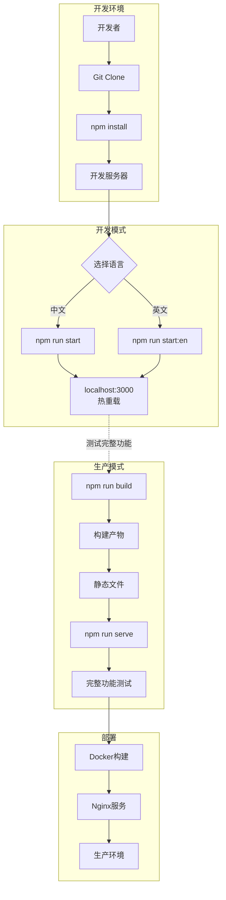
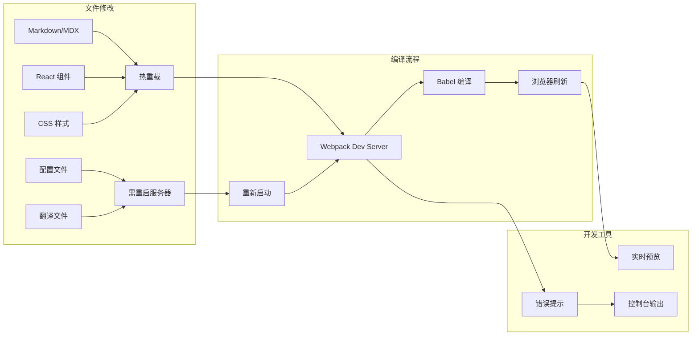
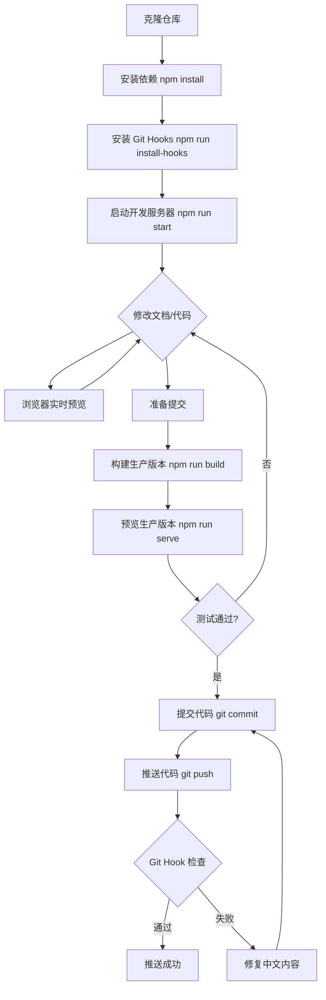

# 快速开始

<details>
<summary>相关源文件</summary>

- package.json
- docusaurus.config.ts
- tsconfig.json
- Dockerfile
- scripts/install-git-hooks.sh
- test-chinese-check.js

</details>

## 概述

本文档将指导您快速搭建 CoStrict 文档网站的本地开发环境。CoStrict 是一个基于 Docusaurus 3.8.1 构建的静态文档站点，提供 Plugin（VS Code 扩展）和 CLI（命令行工具）两部分产品文档，支持中英文双语。通过本文档，您将了解如何安装依赖、启动开发服务器、构建生产版本以及掌握常用开发命令和调试技巧。

整个开发流程设计简洁高效，采用热重载机制实现实时预览，同时提供完整的生产构建和国际化测试流程。项目集成了自动化代码质量检查工具，包括 TypeScript 类型检查和中文内容检测，确保代码质量和文档规范。

## 环境要求

在开始之前，请确保您的开发环境满足以下要求：

### 必需环境

| 工具 | 版本要求 | 说明 |
|------|---------|------|
| Node.js | >= 18.0 | 运行时环境，在 package.json 的 engines 字段中定义 |
| npm | 随 Node.js 安装 | 包管理器，用于安装项目依赖 |
| Git | 任意版本 | 版本控制工具，用于克隆仓库和提交代码 |

### 推荐工具

- **代码编辑器**：Visual Studio Code（推荐安装 MDX 和 TypeScript 插件）
- **浏览器**：Chrome、Firefox 或 Safari（用于本地开发和调试）
- **代理工具**：如需访问 GitHub，可能需要配置网络代理（参考 README.md 中的代理设置说明）

### 验证环境

```bash
# 检查 Node.js 版本
node --version
# 应输出 v18.x.x 或更高版本

# 检查 npm 版本
npm --version

# 检查 Git 版本
git --version
```

## 项目架构概览



CoStrict 文档网站采用典型的静态站点生成（SSG）架构，核心流程包括：本地开发 → 生产构建 → 容器化部署。开发阶段支持热重载和实时预览，生产阶段通过 Docker 和 Nginx 提供高性能静态文件服务。

## 安装步骤

### 1. 克隆代码仓库

**方式一：直接克隆（适用于项目成员）**

```bash
git clone https://github.com/zgsm-ai/manual.git
cd manual
```

**方式二：Fork 后克隆（适用于外部贡献者）**

如果您是外部贡献者，建议先 Fork 主仓库到个人账户，然后克隆您的 Fork 副本：

```bash
# 1. 在 GitHub 上 Fork 主仓库
# 2. 克隆您的 Fork 副本
git clone https://github.com/您的用户名/manual.git
cd manual

# 3. 创建开发分支（避免在 main 分支直接开发）
git checkout -b feature/your-feature-name
```

> **网络问题解决**：如果克隆失败，可能需要配置代理：
> ```bash
> # Git Bash
> export https_proxy=http://localhost:7890
> export http_proxy=http://localhost:7890
> 
> # Windows CMD
> set https_proxy=http://localhost:7890
> set http_proxy=http://localhost:7890
> ```

### 2. 安装依赖

在项目根目录执行以下命令安装所有依赖包：

```bash
npm install
```

**使用国内镜像源（推荐）**

如果 npm 官方源访问较慢，可以使用 npmmirror 镜像源：

```bash
# 方式一：临时使用
npm install --registry=https://registry.npmmirror.com/

# 方式二：永久配置
npm config set registry https://registry.npmmirror.com/
npm install
```

> **说明**：Dockerfile 中已配置使用 npmmirror 镜像源（第 5 行），生产构建时会自动使用该镜像。

### 3. 安装 Git Hooks（可选但推荐）

项目提供了 Git pre-push 钩子，用于在推送前自动检查 docs 文件夹是否包含中文字符：

```bash
npm run install-hooks
```

安装后，每次推送代码时会自动执行中文检查，防止将中文内容误提交到英文文档目录。

## 开发服务器

### 启动开发服务器

项目支持中英文两种开发模式，根据需要选择：

**启动中文开发服务器（默认）**

```bash
npm run start
```

- 访问地址：`http://localhost:3000`
- 默认语言：中文（zh）
- 配置参数：`--host 0.0.0.0 --locale zh`（package.json 第 8 行）

**启动英文开发服务器**

```bash
npm run start:en
```

- 访问地址：`http://localhost:3000`
- 默认语言：英文（en）
- 配置参数：`--host 0.0.0.0 --locale en`（package.json 第 7 行）

### 开发模式特性

开发服务器支持以下特性：

1. **热重载（Hot Reload）**：修改 Markdown 文档、React 组件或样式文件后，浏览器会自动刷新显示最新内容
2. **实时编译**：TypeScript 和 MDX 文件会实时编译，并在控制台显示错误信息
3. **源码映射**：浏览器开发者工具中可以直接查看源码，便于调试



### 开发模式限制

开发模式无法测试以下功能（需要使用生产模式）：
- 中英文文档切换
- 搜索功能（@easyops-cn/docusaurus-search-local 插件）
- 完整的国际化路由

## 构建和预览

### 构建生产版本

开发完成后，需要构建生产版本以测试完整功能：

```bash
npm run build
```

**构建过程说明**：

1. **清理旧文件**：删除 `.docusaurus` 缓存目录和 `build` 输出目录

2. **编译资源**：
   - TypeScript 代码编译为 JavaScript
   - MDX 文档转换为 React 组件
   - CSS 样式文件优化和压缩
   - **技术细节**：使用 Webpack 进行模块打包，支持 Tree Shaking 优化

3. **国际化处理**：
   - 为每种语言生成独立的静态文件
   - 生成翻译 JSON 文件的引用
   - **实现机制**：基于 docusaurus.config.ts 的 i18n 配置（第 58-61 行），默认语言为中文

4. **搜索索引构建**：
   - 使用 @easyops-cn/docusaurus-search-local 插件
   - 为中英文文档创建搜索索引（hashed: true，docusaurus.config.ts 第 122 行）
   - **索引策略**：去除默认词干提取器（removeDefaultStemmer: true），提高中文搜索准确性

5. **资源优化**：
   - 图片压缩和优化
   - 代码分割和懒加载
   - 生成静态 HTML 文件（SSG）
   - **性能优化**：配置浏览器兼容性（package.json browserslist 字段），生产环境排除低使用率浏览器

**构建输出**：所有产物输出到 `build/` 目录，包含：
- `/plugin/` - Plugin 文档的静态文件
- `/cli/` - CLI 文档的静态文件
- `/assets/` - 编译后的 JS、CSS 和图片资源
- `/search-index.json` - 搜索索引文件

### 预览生产版本

构建完成后，启动生产服务器预览：

```bash
npm run serve
```

- 访问地址：`http://localhost:3000`
- 功能完整：支持中英文切换、搜索功能、完整路由
- 性能接近真实部署：静态文件服务，无热重载

> **最佳实践**：提交代码前必须通过生产模式验证，确保所有功能正常工作（参考 README.md 第 246 行）。

## 常用开发命令

### NPM Scripts 完整列表

| 命令 | 功能 | 使用场景 |
|------|------|---------|
| `npm run start` | 启动中文开发服务器 | 日常开发、实时预览 |
| `npm run start:en` | 启动英文开发服务器 | 英文文档编辑 |
| `npm run build` | 构建生产版本 | 提交前测试、部署准备 |
| `npm run serve` | 启动生产服务器 | 预览构建结果 |
| `npm run clear` | 清除缓存和构建产物 | 解决构建异常、重新构建 |
| `npm run typecheck` | TypeScript 类型检查 | 代码质量检查 |
| `npm run write-translations` | 生成翻译文件 | 添加新文档后更新翻译 |
| `npm run write-heading-ids` | 生成文档标题 ID | 标准化文档结构 |
| `npm run deploy` | 部署到 GitHub Pages | 自动化部署 |
| `npm run install-hooks` | 安装 Git Hooks | 首次设置项目时 |

### 清除缓存

当遇到构建异常或缓存问题时：

```bash
npm run clear
```

此命令会删除：
- `.docusaurus/` - Docusaurus 运行时缓存
- `build/` - 构建输出目录

清除后需要重新执行 `npm run build` 构建项目。

### TypeScript 类型检查

项目使用 TypeScript 5.6.2，配置继承自 `@docusaurus/tsconfig`：

```bash
npm run typecheck
```

**配置说明**（tsconfig.json）：
- `baseUrl: "."` - 模块解析基准路径
- `exclude: [".docusaurus", "build"]` - 排除构建产物
- 支持所有 Docusaurus 类型定义

类型检查通过后无输出，发现类型错误时会显示详细信息。

### 生成翻译文件

当添加新的分组文档（包含 `_category_.json`）后，需要更新翻译文件：

```bash
npm run write-translations
# 或使用完整命令
npm run docusaurus -- write-translations
```

此命令会更新 `i18n/zh/docusaurus-plugin-content-docs/current.json`，需要手动将英文翻译为中文（参考 README.md 第 240 行）。

## 开发调试技巧

### 热重载机制

Docusaurus 的热重载机制支持以下文件类型：

| 文件类型 | 热重载支持 | 说明 |
|---------|-----------|------|
| Markdown/MDX 文档 | ✅ 完全支持 | 修改后浏览器自动刷新 |
| React 组件 | ✅ 完全支持 | 组件代码变更实时生效 |
| CSS 样式 | ✅ 完全支持 | 样式修改无需刷新页面 |
| 配置文件（docusaurus.config.ts） | ❌ 需重启 | 修改后需重启开发服务器 |
| 侧边栏配置（sidebars.ts） | ❌ 需重启 | 修改后需重启开发服务器 |
| 翻译文件（i18n/） | ⚠️ 部分支持 | 建议重启服务器 |

### 浏览器开发者工具

**React DevTools 调试**：

1. 安装 React Developer Tools 浏览器扩展
2. 开发模式下可以查看组件树、Props、State
3. 示例：DownloadButton 组件（src/components/DownloadButton/index.tsx）

**性能分析**：

```javascript
// 在浏览器控制台中使用 React Profiler
// 分析组件渲染性能，识别性能瓶颈
```

**网络请求分析**：

- 开发模式：动态加载资源，请求较多
- 生产模式：静态资源，请求较少，性能更优

### 常见错误排查

#### 1. 端口被占用

**错误信息**：`Error: listen EADDRINUSE: address already in use :::3000`

**解决方案**：

```bash
# Windows: 查找占用端口的进程
netstat -ano | findstr :3000
# 终止进程（PID 为查询到的进程ID）
taskkill /PID <PID> /F

# 或者使用其他端口启动
npm run start -- --port 3001
```

#### 2. 依赖安装失败

**错误信息**：`npm ERR! network` 或依赖下载超时

**解决方案**：

```bash
# 清除 npm 缓存
npm cache clean --force

# 使用国内镜像源
npm config set registry https://registry.npmmirror.com/

# 删除 node_modules 重新安装
rm -rf node_modules package-lock.json
npm install
```

#### 3. 构建内存不足

**错误信息**：`JavaScript heap out of memory`

**解决方案**：

项目已在 Dockerfile 中配置内存限制（第 8 行）：

```bash
NODE_OPTIONS="--max-old-space-size=4096" npm run build
```

本地开发如遇到内存问题，可使用相同命令：

```bash
# Windows PowerShell
$env:NODE_OPTIONS="--max-old-space-size=4096"; npm run build

# Linux/Mac
NODE_OPTIONS="--max-old-space-size=4096" npm run build
```

#### 4. 中文内容检查失败

**错误信息**：Git pre-push 钩子阻止推送

**原因**：docs/ 目录下包含中文内容

**解决方案**：

```bash
# 手动检查中文内容
node test-chinese-check.js

# 将中文内容移动到正确的国际化目录
# 英文文档：docs/
# 中文文档：i18n/zh/docusaurus-plugin-content-docs/current/
```

**检查逻辑**（test-chinese-check.js）：
- 递归扫描 `docs/` 目录下所有 `.md` 和 `.json` 文件
- 使用正则 `/[\u4e00-\u9fff]/` 匹配中文字符（覆盖基本汉字区间 U+4E00 到 U+9FFF）
- 输出包含中文的文件和行号
- **实现原理**：
  - 使用 Node.js fs 模块同步读取文件（第 25 行）
  - 按行分割内容，逐行检查（第 30 行）
  - 返回匹配结果包含行号、内容和匹配字符（第 32-36 行）

**Git Hook 机制**（scripts/pre-push）：
- 在 `git push` 前自动触发（第 1 行）
- 获取即将推送的提交范围（第 16-21 行）
- 仅检查变更的文件，提高检查效率
- 使用 `LC_ALL=C grep` 确保跨平台兼容性（第 39 行）

#### 5. TypeScript 类型错误

**常见类型错误**：

```typescript
// 错误：找不到模块
import MyComponent from '@site/src/components/MyComponent';

// 解决：检查文件路径，确保文件存在且导出正确
```

```bash
# 运行类型检查查看详细错误
npm run typecheck
```

### 开发工作流最佳实践



### 性能优化建议

1. **开发模式优化**：
   - 关闭不必要的浏览器扩展
   - 使用 SSD 硬盘存储项目
   - 增加系统内存（推荐 8GB 以上）

2. **构建优化**：
   - 使用生产模式构建测试完整功能
   - 定期执行 `npm run clear` 清理缓存
   - 监控构建时间和内存使用
   - **Docker 构建优化**：Dockerfile 采用多阶段构建（第 1 行和第 9 行），builder 阶段使用 node:18.19.0 镜像，runner 阶段使用 nginx:stable-alpine 镜像，最终镜像体积更小

3. **文档编写优化**：
   - 图片压缩后再放入项目（推荐 WebP 格式）
   - 避免在单个文档中嵌入过大的代码块
   - 合理使用文档分组和链接引用

### Docker 本地测试（可选）

如果需要测试 Docker 部署，可以本地构建和运行：

```bash
# 构建 Docker 镜像
docker build -t costrict-manual .

# 运行容器
docker run -p 80:80 costrict-manual

# 访问 http://localhost
```

**Dockerfile 技术细节**：
- **阶段一（builder）**：
  - 基础镜像：node:18.19.0（第 1 行）
  - 工作目录：/workshop
  - 依赖安装：使用 npmmirror 镜像源（第 5 行）
  - 构建命令：`npm run build`，内存限制 4GB（第 8 行）
  
- **阶段二（runner）**：
  - 基础镜像：nginx:stable-alpine（第 9 行）
  - Nginx 配置：自定义配置文件（第 12 行）
  - 静态文件：从 builder 阶段复制（第 14 行）
  - 暴露端口：80（第 16 行）

## 国际化开发说明

### 文档结构约定

项目采用 Docusaurus 标准国际化结构：

```
project_root/
├── docs/                    # 英文文档（Plugin）
│   ├── guide/
│   │   ├── installation.md
│   │   └── img/
│   └── _category_.json
├── docs-cli/                # 英文文档（CLI）
│   └── guide/
│       └── introduction.md
└── i18n/
    └── zh/                  # 中文翻译
        ├── docusaurus-plugin-content-docs/
        │   └── current/     # Plugin 中文文档
        │       ├── guide/
        │       │   ├── installation.md
        │       │   └── img/
        │       └── _category_.json
        └── docusaurus-plugin-content-docs-cli/
            └── current/     # CLI 中文文档
                └── guide/
                    └── introduction.md
```

### 语言切换

- 默认语言：中文（zh），配置在 docusaurus.config.ts 第 59 行
- 支持语言：中文和英文（locales: ['zh', 'en']，第 60 行）
- 路由规则：
  - 中文：`/plugin/guide/installation`
  - 英文：`/en/plugin/guide/installation`

### 翻译流程

1. 在 `docs/` 或 `docs-cli/` 添加英文文档
2. 在对应 `i18n/zh/` 目录添加中文翻译
3. 执行 `npm run write-translations` 更新翻译索引
4. 使用生产模式验证中英文切换功能

## 下一步

- 📖 阅读 [项目结构文档](#) 了解完整的目录结构
- 🌍 查看 [国际化指南](#) 学习多语言文档管理
- 🚀 参考 [部署文档](docs/deployment/) 了解生产环境部署
- 🤝 阅读 [贡献指南](#) 参与项目开发
