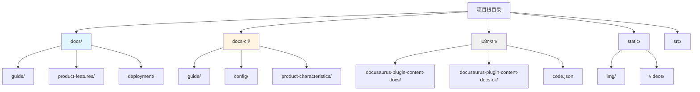
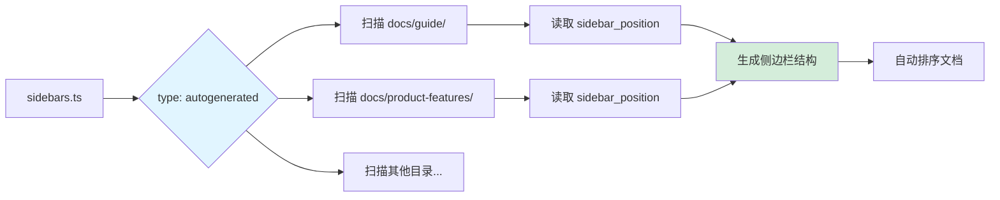
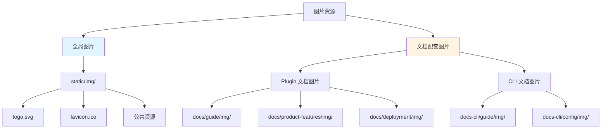
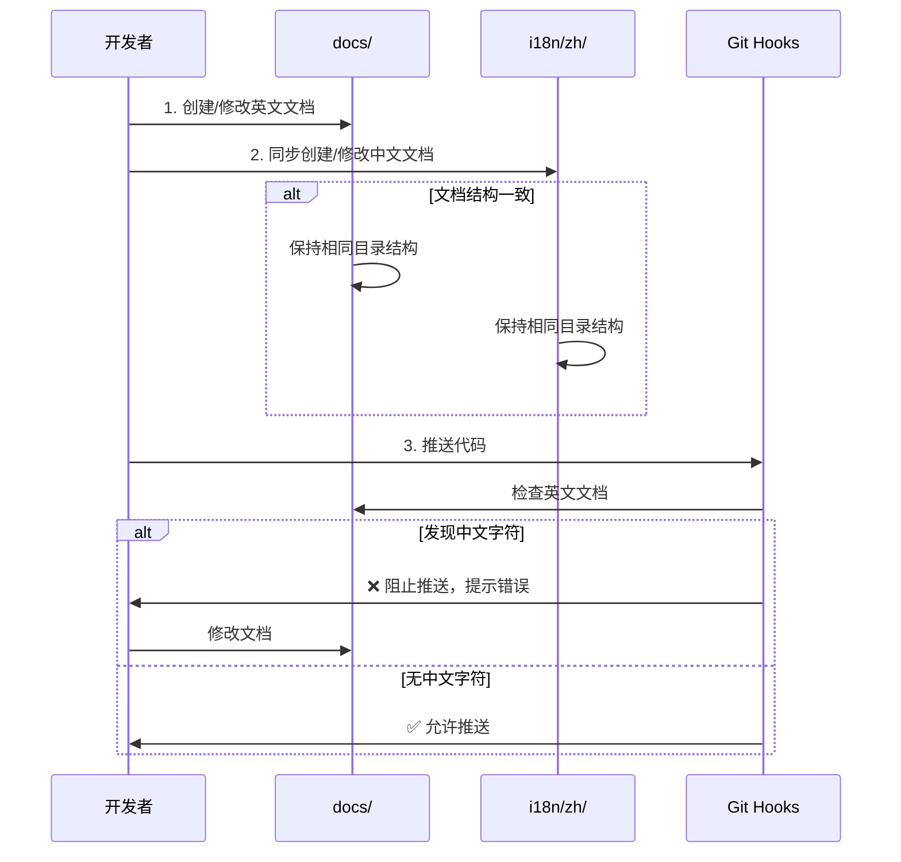

# 3、文档编写指南

<details>
<summary>相关源文件</summary>

- docusaurus.config.ts
- sidebars.ts
- sidebars-cli.ts
- docs/guide/installation.md
- docs/guide/_category_.json
- i18n/zh/docusaurus-plugin-content-docs/current/guide/installation.md
- scripts/pre-push
- test-chinese-check.js
- docs/product-features/strict-mode.md
- i18n/zh/code.json

</details>

## 概述

CoStrict 文档网站基于 **Docusaurus 3.8.1** 构建，提供 Plugin（VS Code 扩展）和 CLI（命令行工具）两部分产品文档，支持中英文双语。文档编写遵循 Docusaurus 标准规范，通过统一的配置管理和自动化机制确保文档质量和一致性。

### 核心特性

- **双文档集架构**：Plugin 和 CLI 独立文档集，各自拥有独立侧边栏和路由
- **国际化支持**：默认中文，支持中英文双语切换
- **自动化侧边栏**：通过 `autogenerated` 模式自动扫描文档目录生成导航结构
- **智能检查机制**：Git 钩子自动检查英文文档中的中文字符，确保文档语言纯净
- **搜索增强**：集成 `@easyops-cn/docusaurus-search-local` 插件，支持中英文全文搜索

### 文档技术栈

- **文档框架**：Docusaurus 3.8.1
- **开发语言**：TypeScript 5.6.2
- **前端框架**：React 19.0.0
- **代码高亮**：prism-react-renderer 2.3.0（支持 github 和 palenight 主题）
- **搜索插件**：@easyops-cn/docusaurus-search-local 0.51.1

## 文档目录结构

### 整体架构



### 目录详细说明

#### 英文文档目录

**Plugin 文档** (`docs/`)
```
docs/
├─ guide/                    # 使用指南
│  ├─ _category_.json       # 分类配置
│  ├─ installation.md       # 安装指南
│  ├─ img/                  # 指南配套图片
│  └─ ...
├─ product-features/         # 产品功能
│  ├─ _category_.json
│  ├─ strict-mode.md
│  ├─ img/
│  └─ ...
├─ deployment/               # 部署文档
├─ best-practices/           # 最佳实践
├─ billing/                  # 计费说明
├─ version-notes/            # 版本说明
├─ policy/                   # 政策文档
├─ FAQ.md                    # 常见问题
└─ tutorial-videos/          # 教程视频
```

**CLI 文档** (`docs-cli/`)
```
docs-cli/
├─ guide/                    # 使用指南
│  ├─ introduction.md
│  ├─ installation.md
│  └─ img/
├─ config/                   # 配置说明
│  ├─ plugins.md
│  ├─ keybinds.md
│  └─ img/
├─ product-characteristics/  # 产品特性
├─ best-practices.md
└─ FAQ.md
```

#### 中文文档目录

**Plugin 中文翻译** (`i18n/zh/docusaurus-plugin-content-docs/current/`)
- 目录结构与 `docs/` 完全一致
- 所有 `.md` 文件为对应的中文翻译版本

**CLI 中文翻译** (`i18n/zh/docusaurus-plugin-content-docs-cli/current/`)
- 目录结构与 `docs-cli/` 完全一致
- 所有 `.md` 文件为对应的中文翻译版本

**UI 文本翻译** (`i18n/zh/code.json`)
- 存放界面文本的中文翻译
- 包括按钮、提示、标签等 UI 元素

#### 静态资源目录

**全局资源** (`static/`)
```
static/
├─ img/                      # 全局图片资源
│  ├─ logo.svg              # 网站 Logo
│  ├─ favicon.ico           # 网站图标
│  └─ ...
└─ videos/                   # 全局视频资源
```

**文档配套图片**
- Plugin 文档图片：`docs/*/img/`
- CLI 文档图片：`docs-cli/*/img/`
- 使用相对路径引用，如：``

## Frontmatter 配置规范

### 必需配置项

每个文档文件必须在文件头部包含 **Frontmatter** 配置，使用 YAML 格式：

```yaml
---
sidebar_position: 1
---

# 文档标题
```

### 配置项说明

| 配置项 | 类型 | 必需 | 说明 |
|--------|------|------|------|
| `sidebar_position` | number | ✅ | 控制文档在侧边栏中的排序位置，数字越小越靠前 |
| `title` | string | ❌ | 自定义侧边栏标题（不设置时使用一级标题） |

### 一级标题规范

- **必须**包含一级标题（`# 标题`）
- 一级标题将作为文档在侧边栏的显示标题
- 标题应简洁明了，准确反映文档内容

### 完整示例

```markdown
---
sidebar_position: 1
---

# Installation

:::tip[Installation Requirements]

`CoStrict` supports the minimum VS Code version is `1.86.3`.

:::

## Plugin Installation

- In the vscode plugin store, search for `CoStrict`
- Click to install


```

**参考文件**：`docs/guide/installation.md`

## _category_.json 配置

### 配置文件作用

`_category_.json` 文件用于定义文档分类（目录）在侧边栏中的显示方式和行为。

### 配置位置

- 放置在需要配置的分类目录根部
- 例如：`docs/guide/_category_.json`

### 配置字段

```json
{
  "label": "Getting Started",
  "position": 1,
  "link": {
    "title": "Getting Started",
    "type": "generated-index"
  }
}
```

| 字段 | 类型 | 说明 |
|------|------|------|
| `label` | string | 分类在侧边栏显示的名称 |
| `position` | number | 分类在侧边栏中的排序位置 |
| `link.title` | string | 生成的索引页标题 |
| `link.type` | string | 链接类型，`generated-index` 会自动生成分类索引页 |

### generated-index 类型

当 `link.type` 设置为 `generated-index` 时，Docusaurus 会自动为该分类生成一个索引页面：

- 显示该分类下所有文档的卡片列表
- 每个卡片包含文档标题、描述和链接
- 用户可以快速浏览分类内容

**参考文件**：`docs/guide/_category_.json`, `docs/product-features/_category_.json`

## 侧边栏管理

### 配置文件

项目使用两个独立的侧边栏配置文件：

- **Plugin 侧边栏**：`sidebars.ts` - 管理 `docs/` 目录下的文档
- **CLI 侧边栏**：`sidebars-cli.ts` - 管理 `docs-cli/` 目录下的文档

### 自动生成机制



### 配置示例

**Plugin 侧边栏配置** (`sidebars.ts`)：
```typescript
const sidebars: SidebarsConfig = {
  tutorialSidebar: [
    {
      type: 'category',
      label: 'Getting Started',
      collapsible: true,
      collapsed: true,
      items: [
        {
          type: 'autogenerated',
          dirName: 'guide',  // 自动扫描 docs/guide/ 目录
        },
      ],
    },
    {
      type: 'category',
      label: 'Product Features',
      items: [
        {
          type: 'autogenerated',
          dirName: 'product-features',
        },
      ],
    },
    // ...
  ],
};
```

**CLI 侧边栏配置** (`sidebars-cli.ts`)：
```typescript
const sidebarsCli: SidebarsConfig = {
  cliSidebar: [
    {
      type: 'category',
      label: 'Getting Started',
      items: [
        'guide/introduction',  // 手动指定文档
        'guide/installation',
        'guide/quick_start',
      ],
    },
    {
      type: 'category',
      label: 'Product Characteristics',
      items: [
        {
          type: 'autogenerated',
          dirName: 'product-characteristics',  // 自动生成
        },
      ],
    },
  ],
};
```

### 配置模式对比

| 模式 | 优点 | 缺点 | 适用场景 |
|------|------|------|----------|
| `autogenerated` | 自动扫描、维护简单 | 灵活性较低 | 文档结构稳定的分类 |
| 手动指定 | 完全控制顺序、灵活性高 | 维护成本高 | 需要精确控制顺序的场景 |

### 最佳实践

1. **优先使用 autogenerated**：对于结构稳定的分类，使用自动生成减少维护成本
2. **合理设置 position**：通过 `sidebar_position` 和 `_category_.json` 的 `position` 控制排序
3. **保持一致性**：同一级别的分类使用相同的配置模式

## 图片资源管理

### 资源分类



### 管理规范

#### 全局图片 (`static/img/`)

**用途**：
- 网站 Logo 和 Favicon
- 导航栏图标
- 社交媒体分享图片
- 跨多个文档使用的公共图片

**引用方式**：
```markdown

```

#### 文档配套图片

**Plugin 文档图片** (`docs/*/img/`)
```
docs/
├─ guide/
│  └─ img/
│     ├─ install.png
│     ├─ login.png
│     └─ version.png
├─ product-features/
│  └─ img/
│     ├─ strict-mode/
│     │  ├─ image1.png
│     │  └─ image2.png
│     └─ todolist/
│        └─ image1.png
```

**CLI 文档图片** (`docs-cli/*/img/`)
```
docs-cli/
├─ guide/
│  └─ img/
│     ├─ quick_start/
│     └─ feature/
├─ config/
│  └─ img/
│     ├─ notify/
│     ├─ mcp/
│     └─ lsp/
```

**引用方式**：
```markdown
# 在 docs/guide/installation.md 中引用


# 引用子目录图片

```

### 命名规范

1. **语义化命名**：使用描述性的文件名，如 `install.png`、`login.png`
2. **避免特殊字符**：使用小写字母、数字和连字符
3. **编号图片**：多张相关图片使用数字编号，如 `image1.png`、`image2.png`

### 最佳实践

1. **就近原则**：文档配套图片放在对应文档目录的 `img/` 子目录
2. **相对路径**：使用相对路径引用，便于文档迁移
3. **适当压缩**：优化图片大小，提升加载速度
4. **替代文本**：为图片添加描述性替代文本

## 国际化规范

### 中英文文档对应关系



### 文档结构一致性

**目录结构必须完全一致**：

```
docs/guide/installation.md
  ↕
i18n/zh/docusaurus-plugin-content-docs/current/guide/installation.md

docs/product-features/strict-mode.md
  ↕
i18n/zh/docusaurus-plugin-content-docs/current/product-features/strict-mode.md
```

**文件命名必须一致**：
- 英文文档：`docs/guide/installation.md`
- 中文文档：`i18n/zh/.../guide/installation.md`
- 文件名相同，内容翻译不同

### 中文检查机制

#### Git Pre-push 钩子

项目配置了自动化的中文检查机制（`scripts/pre-push`）：

**检查范围**：
- `docs/` 目录下的所有 `.md` 和 `.json` 文件
- `docs-cli/` 目录下的所有 `.md` 和 `.json` 文件

**检查规则**：
- 使用正则表达式 `/[一-龯]/` 检测中文字符
- 发现中文字符时阻止推送并显示错误信息

**检查流程**：
```bash
🔍 检查docs文件夹中的文件是否包含中文字符...
检测到以下docs文件夹中的文件变更：
docs/guide/installation.md

正在检查文件: docs/guide/installation.md
❌ 文件 docs/guide/installation.md 包含中文字符：
  行 5: 这是中文内容

🚨 发现中文字符！docs文件夹中的文件不应包含中文内容。
请将中文内容移至 i18n/zh/docusaurus-plugin-content-docs/current/ 目录下对应的文件中。

推送被阻止。修复问题后再次尝试推送。
```

#### 手动检查脚本

可使用 `test-chinese-check.js` 脚本进行手动检查：

```bash
node test-chinese-check.js
```

**脚本功能**：
- 递归扫描 `docs/` 目录下的所有 `.md` 和 `.json` 文件
- 检测中文字符并显示具体行号和内容
- 提供修复建议

### 同步更新原则

1. **同时更新**：修改英文文档时，必须同时更新对应的中文文档
2. **结构同步**：添加/删除文档时，中英文目录结构保持一致
3. **内容对应**：确保翻译准确，内容完整
4. **检查通过**：推送前确保通过中文检查

### 翻译文件管理

**UI 文本翻译** (`i18n/zh/code.json`)：
```json
{
  "theme.admonition.tip": {
    "message": "提示",
    "description": "Tip admonition 的默认标签"
  },
  "theme.admonition.warning": {
    "message": "警告",
    "description": "Warning admonition 的默认标签"
  }
}
```

**更新翻译**：
```bash
npm run write-translations
```

此命令会自动提取需要翻译的 UI 文本。

## Markdown 编写最佳实践

### Admonition 组件

Docusaurus 支持多种提示组件，用于突出重要信息：

#### Tip（提示）
```markdown
:::tip[标题]
这是一个提示信息。
:::
```

#### Warning（警告）
```markdown
:::warning
这是一个警告信息。
:::
```

#### Info（信息）
```markdown
:::info
这是一个信息提示。
:::
```

#### Danger（危险）
```markdown
:::danger
这是一个危险警告。
:::
```

#### Caution（注意）
```markdown
:::caution
这是一个注意事项。
:::
```

### 代码块语法高亮

支持多种编程语言的语法高亮：

````markdown
```typescript
const config: Config = {
  title: 'costrict',
  tagline: 'AI-powered coding assistant',
};
```

```bash
npm run start
npm run build
```

```json
{
  "label": "Getting Started",
  "position": 1
}
```
````

**主题配置**：
- 亮色主题：`github`
- 暗色主题：`palenight`

### 标题层级规范

**合理的标题层级**：
```markdown
# 一级标题（文档标题）

## 二级标题（主要章节）

### 三级标题（子章节）

#### 四级标题（细节说明）
```

**最佳实践**：
1. 每个文档只有一个一级标题
2. 层级不要超过 4 级
3. 标题简洁明了，具有描述性
4. 标题层级递进合理，不跳级

### 折叠内容

使用 `<details>` 标签创建可折叠内容：

```markdown
<details>
  <summary>点击展开查看详细信息</summary>
  
  这里是折叠的内容，用户点击后才会显示。
  
  
</details>
```

### 列表和表格

**有序列表**：
```markdown
1. 第一步
2. 第二步
3. 第三步
```

**无序列表**：
```markdown
- 项目一
- 项目二
- 项目三
```

**表格**：
```markdown
| 字段 | 类型 | 说明 |
|------|------|------|
| name | string | 名称 |
| value | number | 数值 |
```

### 链接和引用

**内部链接**：
```markdown
[安装指南](/plugin/guide/installation)
[配置说明](./config)
```

**外部链接**：
```markdown
[Docusaurus 官网](https://docusaurus.io/)
```

**图片引用**：
```markdown


```

### 文档编写清单

编写文档时，确保满足以下要求：

- ✅ 包含 Frontmatter 配置（`sidebar_position`）
- ✅ 包含一级标题作为文档标题
- ✅ 使用正确的图片引用路径
- ✅ 英文文档不包含中文字符
- ✅ 中英文文档结构一致
- ✅ 合理使用 Admonition 组件
- ✅ 代码块使用正确的语法高亮
- ✅ 标题层级合理，不跳级
- ✅ 链接有效，路径正确

### 常见问题

**Q: 如何控制文档在侧边栏中的顺序？**

A: 通过 Frontmatter 中的 `sidebar_position` 配置，数字越小越靠前。

**Q: 如何为分类目录设置索引页？**

A: 在分类目录下创建 `_category_.json` 文件，设置 `link.type: "generated-index"`。

**Q: 图片应该放在哪里？**

A: 全局图片放在 `static/img/`，文档配套图片放在对应文档目录的 `img/` 子目录。

**Q: 为什么推送被阻止？**

A: 英文文档（`docs/` 和 `docs-cli/`）中包含中文字符，需要将中文内容移至 `i18n/zh/` 对应目录。

**Q: 如何更新 UI 文本翻译？**

A: 运行 `npm run write-translations` 命令，然后更新 `i18n/zh/code.json` 文件。

## 相关工具和命令

### 开发命令

```bash
# 启动中文开发服务器
npm run start

# 启动英文开发服务器
npm run start:en

# 构建生产版本
npm run build

# 启动生产服务器（构建后）
npm run serve

# 生成/更新翻译文件
npm run write-translations
```

### 检查命令

```bash
# TypeScript 类型检查
npm run typecheck

# 检查 docs 文件夹中文内容
node test-chinese-check.js

# 安装 Git pre-push 钩子
npm run install-hooks
```

### Git 工作流

```bash
# 1. 创建功能分支
git checkout -b docs/update-guide

# 2. 修改英文文档
# 编辑 docs/guide/installation.md

# 3. 同步修改中文文档
# 编辑 i18n/zh/docusaurus-plugin-content-docs/current/guide/installation.md

# 4. 本地测试
npm run start

# 5. 构建验证
npm run build
npm run serve

# 6. 提交更改
git add .
git commit -m "docs: update installation guide"

# 7. 推送（会自动检查中文）
git push origin docs/update-guide
```

## 总结

CoStrict 文档编写遵循以下核心原则：

1. **规范性**：严格遵守 Frontmatter 配置、目录结构和命名规范
2. **一致性**：中英文文档结构完全一致，确保国际化质量
3. **自动化**：充分利用 Docusaurus 的自动生成机制，减少手动维护
4. **质量保证**：通过 Git 钩子和检查脚本确保文档质量
5. **用户体验**：合理使用 Admonition 组件、代码高亮等功能提升文档可读性

遵循本指南，可以高效地编写、组织和维护高质量的文档，为用户提供优秀的学习和参考体验。
