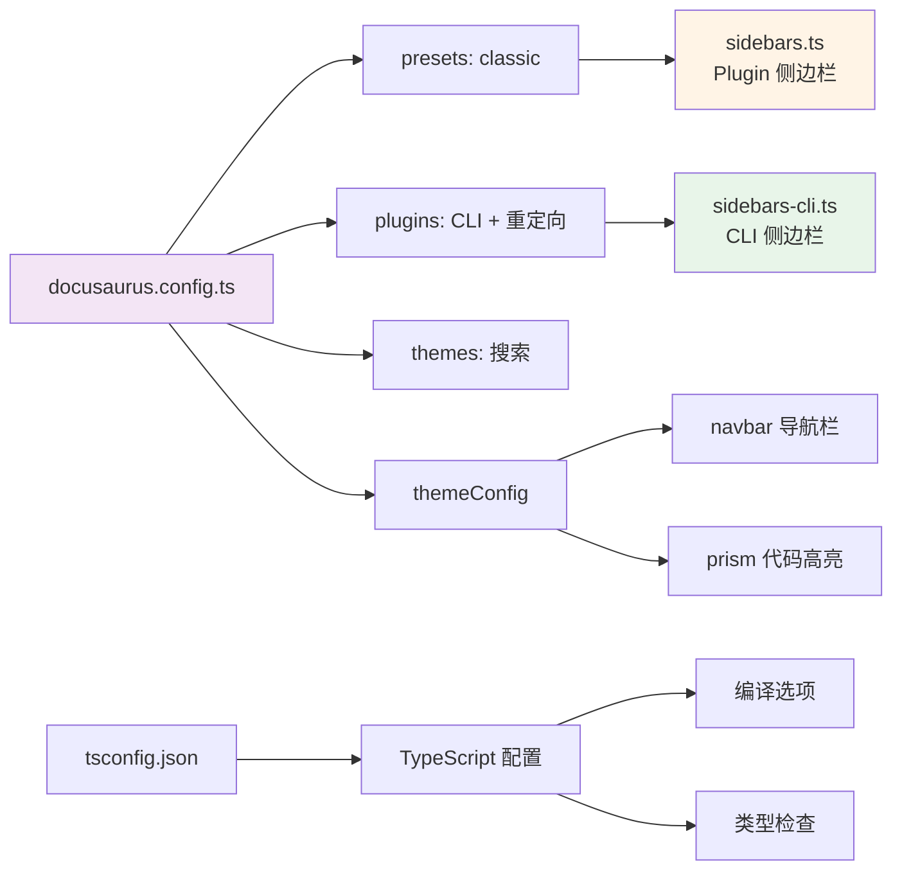
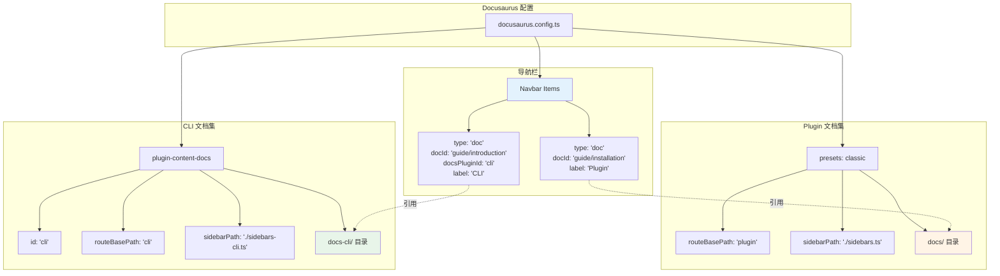
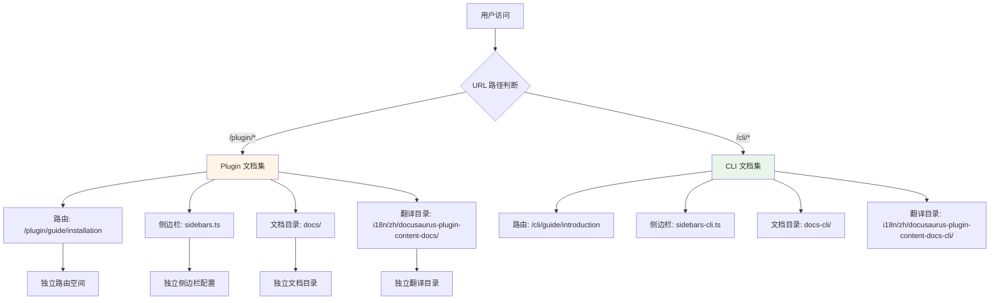
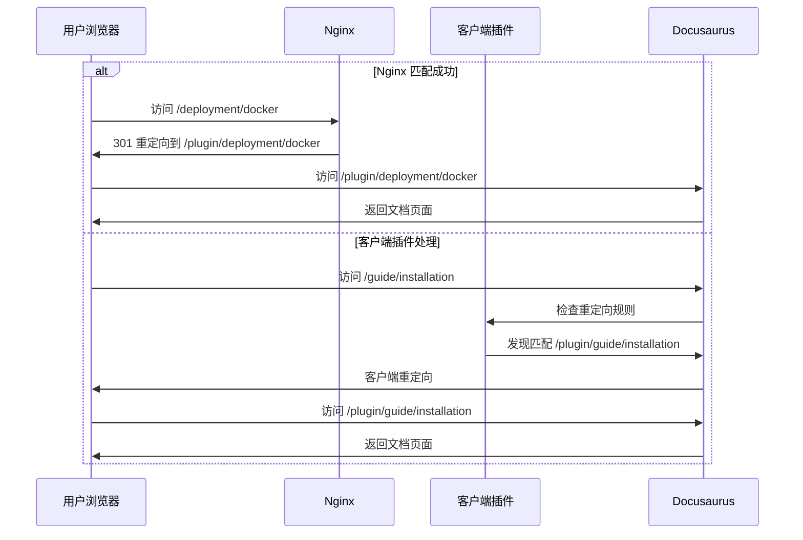
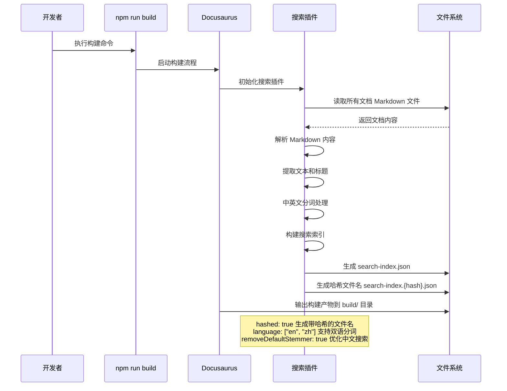
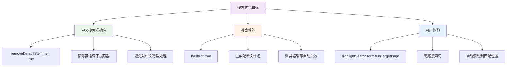
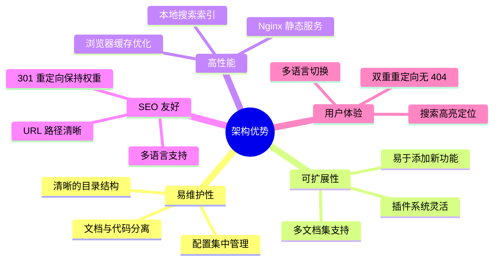

# 4、架构设计

<details>
<summary>相关源文件</summary>

- docusaurus.config.ts
- sidebars.ts
- sidebars-cli.ts
- nginx.conf
- tsconfig.json
- package.json
- Dockerfile
- src/components/DownloadButton/index.tsx
- i18n/zh/code.json

</details>

## 概述

costrict 文档网站采用 Docusaurus 3.8.1 框架构建，实现了双文档集（Plugin + CLI）架构，支持中英文双语国际化，并通过客户端和服务端双重定向机制确保旧路径的兼容性。整体架构设计遵循"配置驱动"原则，核心功能通过少量配置文件实现，维护成本低、扩展性强。

**核心架构特点**：
- **双文档集隔离**：Plugin 和 CLI 文档使用独立路由空间、侧边栏配置和文档目录
- **多重重定向机制**：结合客户端插件和服务端 Nginx 实现无缝路径迁移
- **本地搜索优化**：针对中英文混合搜索进行定制化配置
- **渐进式国际化**：默认中文，按需切换英文，翻译文件结构清晰
- **Docker 容器化部署**：多阶段构建优化镜像体积，Nginx 提供高性能静态资源服务

## 系统架构

```mermaid
graph TB
    subgraph "用户访问层"
        A[用户浏览器] --> B[Nginx 反向代理]
    end
    
    subgraph "应用层 - Docusaurus"
        B --> C{路由分发}
        C -->|/plugin/*| D[Plugin 文档集]
        C -->|/cli/*| E[CLI 文档集]
        C -->|/| F[重定向到 /plugin/guide/installation]
        
        D --> G[sidebars.ts]
        E --> H[sidebars-cli.ts]
    end
    
    subgraph "内容层"
        D --> I[docs/ 目录<br/>Markdown 文档]
        E --> J[docs-cli/ 目录<br/>Markdown 文档]
        
        I --> K[i18n/zh/ 中文翻译]
        J --> L[i18n/zh/ CLI 中文翻译]
    end
    
    subgraph "插件系统"
        M[@docusaurus/plugin-content-docs<br/>CLI 文档实例]
        N[@docusaurus/plugin-client-redirects<br/>客户端重定向]
        O[@easyops-cn/docusaurus-search-local<br/>本地搜索]
    end
    
    subgraph "配置层"
        P[docusaurus.config.ts<br/>主配置]
        Q[presets: classic<br/>文档/主题预设]
        R[themes: search-local<br/>搜索主题]
    end
    
    style A fill:#e1f5ff
    style D fill:#fff4e6
    style E fill:#e8f5e9
    style P fill:#f3e5f5
```

**架构分层说明**：

1. **用户访问层**：Nginx 处理静态资源请求和路径重定向，提升访问性能
2. **应用层**：Docusaurus 路由系统根据 URL 前缀分发到不同文档集
3. **内容层**：Markdown 文档源文件与国际化翻译文件分离管理
4. **插件系统**：通过插件扩展文档集、重定向、搜索等核心功能
5. **配置层**：集中式配置管理，所有功能通过配置文件驱动

## 核心目录结构

```
manual/
├─ docusaurus.config.ts       # 主配置：站点/插件/主题配置
├─ sidebars.ts                # Plugin 文档侧边栏配置
├─ sidebars-cli.ts            # CLI 文档侧边栏配置
├─ tsconfig.json              # TypeScript 编译配置
├─ package.json               # 依赖管理和脚本命令
├─ Dockerfile                 # Docker 多阶段构建配置
├─ nginx.conf                 # Nginx 服务端重定向配置
│
├─ docs/                      # Plugin 英文文档目录
│  ├─ guide/                  # 使用指南：安装/快速入门
│  ├─ product-features/       # 产品功能：AI Agent/代码审查
│  ├─ deployment/             # 部署文档：Docker/Higress
│  ├─ billing/                # 计费文档：购买/服务说明
│  ├─ best-practices/         # 最佳实践：使用技巧
│  ├─ policy/                 # 政策文档：隐私/服务条款
│  ├─ version-notes/          # 版本更新日志
│  └─ FAQ.md                  # 常见问题
│
├─ docs-cli/                  # CLI 英文文档目录
│  ├─ guide/                  # CLI 指南：安装/功能/IDE 集成
│  ├─ config/                 # CLI 配置：快捷键/主题/模型
│  ├─ product-characteristics/# CLI 特性：Notify/ACP/TDD
│  ├─ best-practices/         # CLI 最佳实践
│  └─ FAQ.md                  # CLI 常见问题
│
├─ i18n/                      # 国际化目录
│  └─ zh/                     # 中文翻译
│     ├─ docusaurus-plugin-content-docs/        # Plugin 中文文档
│     ├─ docusaurus-plugin-content-docs-cli/    # CLI 中文文档
│     ├─ docusaurus-theme-classic/              # 主题文本翻译
│     └─ code.json                              # UI 文本翻译
│
├─ src/                       # 源码目录
│  ├─ components/             # React 组件
│  │  └─ DownloadButton/      # 下载按钮组件
│  └─ css/                    # 全局样式
│     └─ custom.css           # 自定义 CSS
│
├─ static/                    # 静态资源
│  ├─ img/                    # 图片资源
│  └─ videos/                 # 视频资源
│
└─ scripts/                   # 脚本工具
   ├─ install-git-hooks.sh    # Git 钩子安装
   ├─ pre-push                # 推送前检查
   └─ setup-project.sh        # 项目初始化
```

## 4.1 Docusaurus 核心架构

### 4.1.1 Presets 机制

Docusaurus 使用 **classic 预设**作为核心功能的基础配置，该预设集成了 docs、blog、theme 等常用模块。

**配置位置**：`docusaurus.config.ts` 第 63-78 行

```typescript
presets: [
  [
    'classic',
    {
      docs: {
        sidebarPath: './sidebars.ts',
        routeBasePath: 'plugin',  // Plugin 文档路由前缀
      },
      theme: {
        customCss: require.resolve('./src/css/custom.css'),
      },
    } satisfies Preset.Options,
  ],
],
```

**classic 预设包含的功能模块**：

| 模块 | 功能 | 配置方式 |
|------|------|----------|
| **@docusaurus/plugin-content-docs** | 文档内容管理 | presets.docs 配置 |
| **@docusaurus/plugin-content-blog** | 博客功能（本项目未使用） | presets.blog 配置 |
| **@docusaurus/plugin-content-pages** | 独立页面管理 | presets.pages 配置 |
| **@docusaurus/theme-classic** | 经典主题 | presets.theme 配置 |

**设计理由**：
- **开箱即用**：classic 预设提供完整文档站点功能，减少手动配置
- **统一管理**：文档、主题等核心配置集中在一个预设中
- **可覆盖性**：预设的默认配置可在 plugins 中覆盖或扩展

### 4.1.2 Plugins 系统

项目通过 **plugins 数组**配置了两个关键插件：

#### 1. CLI 文档集插件

**配置位置**：`docusaurus.config.ts` 第 8-17 行

```typescript
plugins: [
  [
    '@docusaurus/plugin-content-docs',
    {
      id: 'cli',                    // 文档集唯一标识
      path: 'docs-cli',             // 文档目录路径
      routeBasePath: 'cli',         // URL 路由前缀
      sidebarPath: './sidebars-cli.ts', // 侧边栏配置文件
    },
  ],
  // ... 其他插件
],
```

**关键参数说明**：
- `id: 'cli'`：文档集实例标识，用于在导航栏中引用特定文档集
- `path: 'docs-cli'`：指定 CLI 文档的 Markdown 文件目录
- `routeBasePath: 'cli'`：所有 CLI 文档 URL 以 `/cli/` 开头
- `sidebarPath`：独立侧边栏配置，与 Plugin 文档集隔离

#### 2. 客户端重定向插件

**配置位置**：`docusaurus.config.ts` 第 18-42 行

```typescript
[
  '@docusaurus/plugin-client-redirects',
  {
    redirects: [
      // 静态重定向规则
      { from: '/', to: '/plugin/guide/installation' },
      { from: '/FAQ', to: '/plugin/FAQ' },
    ],
    // 动态重定向函数
    createRedirects(existingPath) {
      if (existingPath.startsWith('/plugin/')) {
        return [existingPath.replace('/plugin/', '/')];
      }
      return undefined;
    },
  },
],
```

**重定向机制**：
- **静态重定向**：`redirects` 数组定义固定的路径映射
- **动态重定向**：`createRedirects` 函数根据现有路径自动生成重定向规则
- **应用场景**：兼容旧版 URL 结构，避免用户访问到 404 页面

### 4.1.3 Themes 主题系统

项目使用 **@easyops-cn/docusaurus-search-local** 主题插件提供本地搜索功能。

**配置位置**：`docusaurus.config.ts` 第 117-130 行

```typescript
themes: [
  [
    "@easyops-cn/docusaurus-search-local",
    {
      hashed: true,                          // 启用文件哈希优化
      language: ["en", "zh"],                // 支持中英文搜索
      indexPages: true,                      // 索引所有页面
      highlightSearchTermsOnTargetPage: true,// 高亮搜索词
      explicitSearchResultPath: true,        // 显示明确路径
      removeDefaultStemmer: true,            // 移除默认词干提取器
    },
  ],
],
```

**关键配置解析**：

| 参数 | 作用 | 技术价值 |
|------|------|----------|
| `hashed: true` | 为搜索索引文件生成哈希名 | 缓存失效自动更新 |
| `language: ["en", "zh"]` | 配置中英文分词 | 支持双语混合搜索 |
| `indexPages: true` | 索引独立页面 | 扩大搜索覆盖范围 |
| `highlightSearchTermsOnTargetPage` | 跳转后高亮搜索词 | 提升用户体验 |
| `removeDefaultStemmer: true` | 移除英语词干提取器 | **优化中文搜索准确性** |

**中英文搜索优化**：
- 移除默认的英语词干提取器，避免对中文进行错误处理
- 支持中文分词和拼音搜索（需配合索引构建）
- 搜索索引在 `npm run build` 时自动生成，存放在 `build/search-index.json`

### 4.1.4 核心配置文件关系



**配置文件职责划分**：

1. **docusaurus.config.ts**：主配置文件，定义站点、插件、主题、导航栏等
2. **sidebars.ts**：Plugin 文档的侧边栏结构和分类
3. **sidebars-cli.ts**：CLI 文档的侧边栏结构和分类
4. **tsconfig.json**：TypeScript 编译配置，继承 `@docusaurus/tsconfig`

## 4.2 多文档集实现

### 4.2.1 多文档集配置架构



### 4.2.2 文档集配置详解

#### Plugin 文档集（默认文档集）

**配置方式**：通过 `presets` 配置，使用 classic 预设

```typescript
presets: [
  [
    'classic',
    {
      docs: {
        sidebarPath: './sidebars.ts',
        routeBasePath: 'plugin',  // Plugin 文档 URL 前缀
      },
    },
  ],
],
```

**特点**：
- 使用预设配置，简化设置
- 默认文档集，导航栏引用时无需指定 `docsPluginId`
- 文档存放在 `docs/` 目录

#### CLI 文档集（独立文档集）

**配置方式**：通过 `plugins` 显式配置 plugin-content-docs 实例

```typescript
plugins: [
  [
    '@docusaurus/plugin-content-docs',
    {
      id: 'cli',                    // 唯一标识符
      path: 'docs-cli',             // 文档目录
      routeBasePath: 'cli',         // 路由前缀
      sidebarPath: './sidebars-cli.ts',
    },
  ],
],
```

**特点**：
- 显式配置插件实例，需指定唯一 `id`
- 导航栏引用时必须使用 `docsPluginId: 'cli'`
- 文档存放在 `docs-cli/` 目录

### 4.2.3 导航栏集成

**配置位置**：`docusaurus.config.ts` 第 90-109 行

```typescript
navbar: {
  items: [
    {
      type: 'doc',
      docId: 'guide/installation',
      position: 'left',
      label: 'Plugin',
      // 默认引用 Plugin 文档集
    },
    {
      type: 'doc',
      docId: 'guide/introduction',
      docsPluginId: 'cli',  // ⭐ 指定 CLI 文档集
      position: 'left',
      label: 'CLI',
    },
    {
      type: 'localeDropdown',
      position: 'right',
    },
  ],
},
```

**关键参数**：
- `type: 'doc'`：导航项类型为文档
- `docId`：文档 ID（相对于文档目录的路径）
- `docsPluginId`：指定文档集实例 ID（默认为 classic 预设的文档集）
- `label`：导航栏显示的标签

### 4.2.4 文档集隔离机制



**隔离维度**：

1. **路由空间隔离**：
   - Plugin: `/plugin/*` 路由前缀
   - CLI: `/cli/*` 路由前缀
   - URL 结构：`{routeBasePath}/{文档路径}`

2. **侧边栏配置隔离**：
   - Plugin: `sidebars.ts` 定义 `tutorialSidebar`
   - CLI: `sidebars-cli.ts` 定义 `cliSidebar`
   - 侧边栏结构完全独立，互不影响

3. **文档目录隔离**：
   - Plugin: `docs/` 目录
   - CLI: `docs-cli/` 目录
   - Markdown 文件物理隔离

4. **翻译目录隔离**：
   - Plugin: `i18n/zh/docusaurus-plugin-content-docs/current/`
   - CLI: `i18n/zh/docusaurus-plugin-content-docs-cli/current/`

**设计优势**：
- **模块化管理**：两个产品文档完全独立，便于团队协作
- **灵活扩展**：可轻松添加更多文档集（如 API 文档、教程文档等）
- **SEO 友好**：URL 路径清晰，搜索引擎易于理解网站结构

## 4.3 路由与重定向机制

### 4.3.1 路由结构设计

```mermaid
graph LR
    A[根路径 /] -->|重定向| B[/plugin/guide/installation]
    
    subgraph "Plugin 文档路由"
        B
        C[/plugin/guide/*]
        D[/plugin/product-features/*]
        E[/plugin/deployment/*]
        F[/plugin/FAQ]
    end
    
    subgraph "CLI 文档路由"
        G[/cli/guide/*]
        H[/cli/config/*]
        I[/cli/product-characteristics/*]
    end
    
    J[旧路径<br/>如 /deployment/*] -->|客户端重定向| K[/plugin/deployment/*]
    J -->|Nginx 重定向| K
    
    style B fill:#4caf50,color:#fff
    style G fill:#2196f3,color:#fff
    style J fill:#ff9800,color:#fff
```

**路由设计原则**：
- **前缀隔离**：使用 `/plugin/` 和 `/cli/` 区分不同文档集
- **语义化路径**：URL 路径反映文档分类和层级关系
- **默认入口**：根路径重定向到 Plugin 安装文档

### 4.3.2 客户端重定向配置

**配置位置**：`docusaurus.config.ts` 第 18-42 行

#### 1. 静态重定向规则

```typescript
redirects: [
  // 根路径重定向到 Plugin 首页
  {
    from: '/',
    to: '/plugin/guide/installation',
  },
  // FAQ 重定向
  {
    from: '/FAQ',
    to: '/plugin/FAQ',
  },
],
```

**静态重定向特点**：
- 固定的路径映射关系
- 在构建时生成重定向 HTML
- 适用于确定的 URL 迁移场景

#### 2. 动态重定向函数

```typescript
createRedirects(existingPath) {
  // 如果是 plugin 路径,创建不带 /plugin 前缀的旧路径重定向
  if (existingPath.startsWith('/plugin/')) {
    return [existingPath.replace('/plugin/', '/')];
  }
  return undefined; // 不创建重定向
},
```

**动态重定向机制**：

| 现有路径 | 生成的重定向路径 | 重定向目标 |
|----------|------------------|------------|
| `/plugin/deployment/docker` | `/deployment/docker` | `/plugin/deployment/docker` |
| `/plugin/guide/installation` | `/guide/installation` | `/plugin/guide/installation` |
| `/plugin/product-features/ai-agent` | `/product-features/ai-agent` | `/plugin/product-features/ai-agent` |

**设计理由**：
- **向后兼容**：旧版文档 URL（无 `/plugin/` 前缀）自动重定向到新版
- **自动化**：无需手动为每个路径配置重定向规则
- **SEO 友好**：避免 404 错误，保持搜索引擎收录的 URL 有效

### 4.3.3 Nginx 服务端重定向

**配置位置**：`nginx.conf` 第 7-11 行

```nginx
# 兼容旧路径: 将非 plugin/cli 的文档路径重定向到 plugin 下
# 例如: /deployment/xxx -> /plugin/deployment/xxx
location ~ ^/(deployment|guide|billing|policy|FAQ|best-practices|product-features|version-notes|tutorial-videos|category)(/.*)?$ {
    return 301 /plugin$request_uri;
}
```

**Nginx 正则表达式解析**：

```nginx
location ~ ^/(deployment|guide|billing|...)(/.*)?$
```

- `~`：启用正则表达式匹配
- `^/`：匹配以 `/` 开头的路径
- `(deployment|guide|...)`：匹配指定的文档分类目录名
- `(/.*)?`：可选的子路径部分（如 `/docker`）
- `$`：路径结尾

**重定向示例**：

| 请求路径 | 重定向目标 | HTTP 状态码 |
|----------|------------|-------------|
| `/deployment/docker` | `/plugin/deployment/docker` | 301 |
| `/guide/installation` | `/plugin/guide/installation` | 301 |
| `/FAQ` | `/plugin/FAQ` | 301 |
| `/billing/purchase` | `/plugin/billing/purchase` | 301 |

### 4.3.4 双重重定向机制



**双重重定向的价值**：

1. **Nginx 层重定向**：
   - 服务端处理，性能更高
   - 301 永久重定向，SEO 友好
   - 覆盖已知的文档分类路径

2. **客户端插件重定向**：
   - 补充 Nginx 未覆盖的路径
   - 动态生成重定向规则
   - 支持更复杂的重定向逻辑

**优先级**：Nginx 重定向优先于客户端重定向，确保性能最优

## 4.4 搜索插件集成

### 4.4.1 搜索插件配置

**配置位置**：`docusaurus.config.ts` 第 117-130 行

```typescript
themes: [
  [
    "@easyops-cn/docusaurus-search-local",
    {
      hashed: true,                          // 启用文件哈希优化
      language: ["en", "zh"],                // 支持中英文搜索
      indexPages: true,                      // 索引所有页面
      highlightSearchTermsOnTargetPage: true,// 高亮搜索词
      explicitSearchResultPath: true,        // 显示明确搜索结果路径
      removeDefaultStemmer: true,            // 移除默认词干提取器
    },
  ],
],
```

### 4.4.2 搜索索引构建流程



**索引构建时机**：
- **开发环境**：不生成搜索索引，实时搜索
- **生产构建**：`npm run build` 时自动生成索引文件
- **索引文件位置**：`build/search-index.{hash}.json`

### 4.4.3 搜索功能特性

#### 1. 中英文混合搜索

**技术实现**：
- 配置 `language: ["en", "zh"]` 启用中英文分词
- 中文使用字符级分词，支持拼音搜索
- 英文使用标准分词器

**搜索示例**：
```
用户输入: "安装 installation"
搜索结果: 同时匹配 "安装指南" 和 "Installation Guide" 文档
```

#### 2. 搜索结果上下文预览

**实现方式**：
- 索引时提取文档的上下文片段
- 搜索结果中显示匹配文本周围的 50-100 个字符
- 高亮显示搜索关键词

**用户体验**：
```
搜索词: "Docker 部署"

结果预览:
... 本文档介绍如何使用 Docker 部署 CoStrict 文档网站。Docker 
镜像已经过优化，支持多阶段构建...
```

#### 3. 高亮搜索词

**配置参数**：`highlightSearchTermsOnTargetPage: true`

**实现原理**：
- 用户点击搜索结果后，在目标页面中查找搜索词
- 使用 `<mark>` 标签包裹匹配的文本
- 自动滚动到第一个匹配位置

#### 4. 明确的搜索结果路径

**配置参数**：`explicitSearchResultPath: true`

**显示效果**：
```
搜索结果标题: Installation Guide
完整路径: /plugin/guide/installation
```

### 4.4.4 搜索优化策略



**关键优化点**：

1. **移除默认词干提取器**：
   ```typescript
   removeDefaultStemmer: true
   ```
   - 避免对中文进行错误的词根提取
   - 提升中文搜索的准确性
   - 保持搜索结果的完整性

2. **文件哈希缓存策略**：
   ```typescript
   hashed: true
   ```
   - 每次构建生成唯一的哈希文件名
   - 内容更新时浏览器自动获取新索引
   - 减少不必要的网络请求

3. **全页面索引**：
   ```typescript
   indexPages: true
   ```
   - 不仅索引文档，还索引独立页面
   - 扩大搜索覆盖范围
   - 提升搜索结果的全面性

## 架构设计总结

### 设计理念

costrict 文档网站的架构设计遵循以下核心理念：

1. **配置驱动**：所有功能通过配置文件实现，代码量最小化
2. **模块隔离**：Plugin 和 CLI 文档完全独立，互不干扰
3. **渐进增强**：基础功能简单，高级功能可选
4. **性能优先**：多重重定向、本地搜索、Nginx 部署确保高性能

### 技术选型理由

| 技术选型 | 选型理由 |
|----------|----------|
| **Docusaurus 3.8.1** | 成熟的文档框架，支持多文档集、国际化、插件扩展 |
| **classic 预设** | 开箱即用的文档、主题配置，减少手动设置 |
| **plugin-client-redirects** | 客户端重定向，无需服务端配置，灵活性高 |
| **@easyops-cn/docusaurus-search-local** | 本地搜索，无需第三方服务，支持中英文 |
| **Docker + Nginx** | 容器化部署，高性能静态资源服务，易于扩展 |
| **TypeScript** | 类型安全，代码提示友好，减少配置错误 |

### 架构优势



### 扩展建议

1. **添加更多文档集**：
   - 通过 `plugins` 配置新的 `@docusaurus/plugin-content-docs` 实例
   - 指定唯一的 `id`、`routeBasePath` 和 `sidebarPath`

2. **增强搜索功能**：
   - 配置 `searchResultLimits` 限制搜索结果数量
   - 启用 `removeDefaultChineseStopWordFilter` 优化中文搜索
   - 添加 `ignoreFiles` 排除特定文档

3. **优化国际化**：
   - 使用 `npm run write-translations` 自动生成翻译模板
   - 配置 `i18n.defaultLocale` 设置默认语言
   - 添加更多语言支持（如日语、韩语）

4. **性能优化**：
   - 启用 Gzip 压缩（已在 Nginx 配置）
   - 配置 CDN 加速静态资源
   - 使用 `webpack-bundle-analyzer` 分析构建产物

---

**架构文档版本**：v1.0  
**生成时间**：2026-03-06  
**适用版本**：Docusaurus 3.8.1
