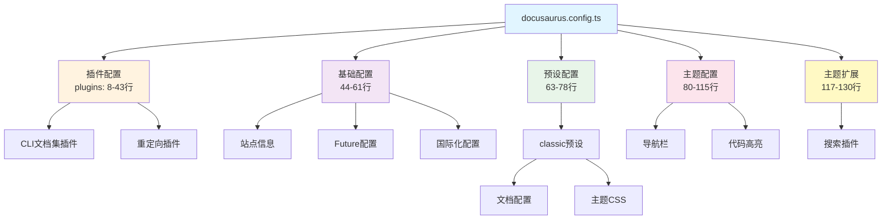
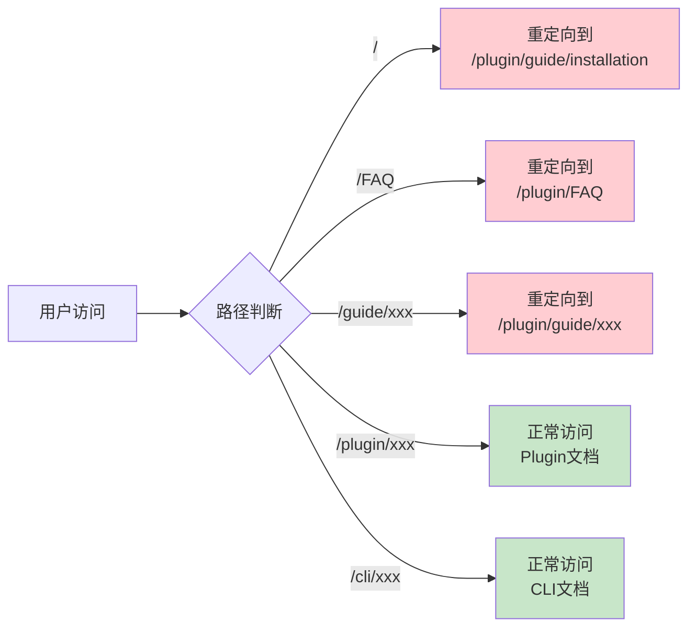
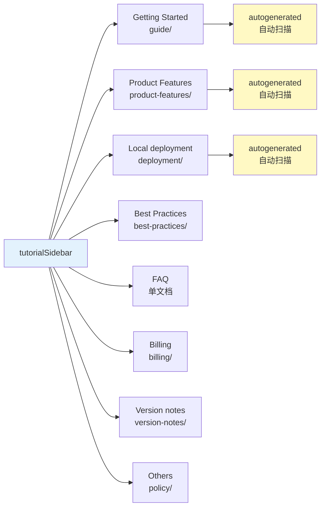
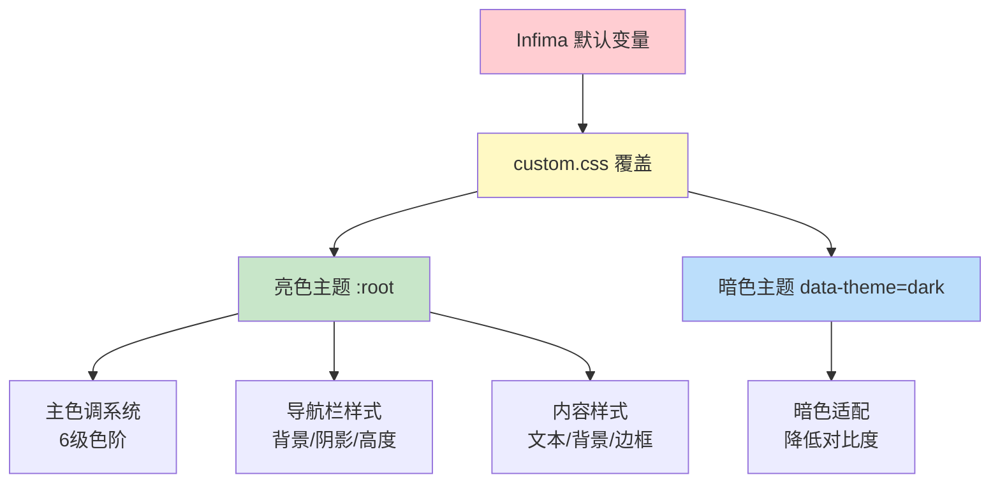
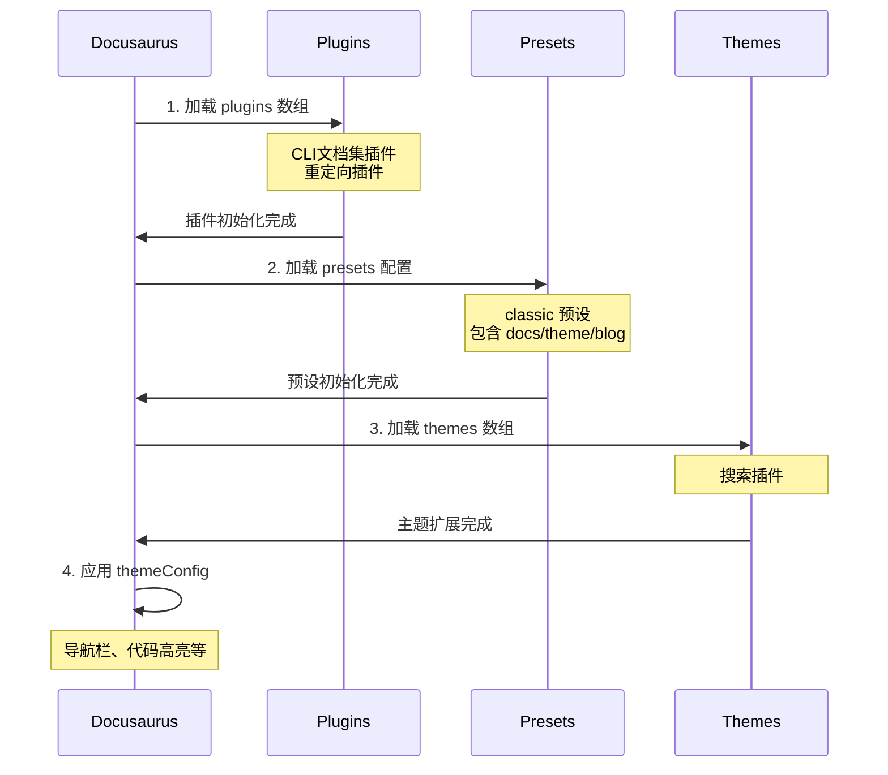

# 5、核心配置详解

<details>
<summary>相关源文件</summary>

- docusaurus.config.ts
- sidebars.ts
- sidebars-cli.ts
- src/css/custom.css
- package.json
- docs/guide/_category_.json
- docs-cli/config/_category_.json
</details>

## 概述

CoStrict 文档网站基于 Docusaurus 3.8.1 构建，采用分层配置架构管理站点行为、文档结构、主题样式和插件扩展。核心配置体系以 `docusaurus.config.ts` 为中心，通过插件机制支持 Plugin 和 CLI 两个独立文档集，使用 `sidebars.ts` 和 `sidebars-cli.ts` 分别管理导航结构，配合 `custom.css` 实现深度主题定制。配置策略强调灵活性（自动生成与手动列举相结合）和国际化支持（默认中文、双语切换），通过重定向插件保证旧路径兼容性，集成本地搜索插件提供中英文检索能力。

## 5.1 docusaurus.config.ts 配置

### 配置文件结构

`docusaurus.config.ts` 是项目的核心配置文件（共 133 行），采用 TypeScript 强类型约束，定义了站点从基础信息到主题扩展的完整配置体系。



### 站点基础配置

站点基础配置定义了文档网站的核心元信息和运行时行为（第 44-61 行）：

```typescript
title: 'costrict',                    // 站点标题，显示在浏览器标签页
tagline: 'Dinosaurs are cool',        // 站点标语，用于 SEO 优化
favicon: 'img/favicon.ico',           // 网站图标，位于 static/img/ 目录

future: {
  v4: true,                           // 启用 Docusaurus v4 兼容性改进
},

url: 'https://your-docusaurus-site.example.com',  // 生产环境站点 URL
baseUrl: '/',                         // 基础路径，用于子目录部署

onBrokenLinks: 'warn',                // 链接检查策略：警告模式
onBrokenMarkdownLinks: 'warn',        // Markdown 链接检查：警告模式

i18n: {
  defaultLocale: 'zh',                // 默认语言：中文
  locales: ['zh', 'en'],              // 支持语言：中文和英文
},
```

**配置要点**：
- **链接检查策略**：`onBrokenLinks` 和 `onBrokenMarkdownLinks` 设置为 `warn` 而非 `throw`，避免构建时因链接问题中断，适合文档迭代频繁的场景
- **Future 配置**：`v4: true` 提前启用 Docusaurus v4 的兼容性改进，平滑过渡到新版本
- **国际化优先**：`defaultLocale: 'zh'` 确保默认访问展示中文内容，符合产品目标用户群体

### 插件配置

插件配置分为两个核心插件：CLI 文档集插件和客户端重定向插件（第 8-43 行）。

#### CLI 文档集插件

通过 `@docusaurus/plugin-content-docs` 创建独立的 CLI 文档集实例：

```typescript
[
  '@docusaurus/plugin-content-docs',
  {
    id: 'cli',                        // 插件 ID，用于引用配置
    path: 'docs-cli',                 // 文档源目录
    routeBasePath: 'cli',             // URL 路由前缀：/cli/
    sidebarPath: './sidebars-cli.ts', // 侧边栏配置文件
  },
],
```

**设计意图**：项目包含 Plugin（VS Code 扩展）和 CLI（命令行工具）两个独立产品，通过插件 ID 区分文档集，实现独立的路由、侧边栏和文档管理。

#### 客户端重定向插件

使用 `@docusaurus/plugin-client-redirects` 实现 URL 重定向策略：

```typescript
[
  '@docusaurus/plugin-client-redirects',
  {
    redirects: [
      // 根路径重定向到 Plugin 首页
      {
        from: '/',
        to: '/plugin/guide/installation',
      },
      // FAQ 重定向（保持旧路径兼容）
      {
        from: '/FAQ',
        to: '/plugin/FAQ',
      },
    ],
    // 动态创建重定向规则
    createRedirects(existingPath) {
      // 如果是 /plugin/ 路径，创建不带前缀的旧路径重定向
      if (existingPath.startsWith('/plugin/')) {
        return [existingPath.replace('/plugin/', '/')];
      }
      return undefined;
    },
  },
],
```



**重定向策略**：
- **根路径重定向**：访问 `/` 直接跳转到 Plugin 安装指南，优化用户首次访问体验
- **旧路径兼容**：通过 `createRedirects` 函数动态生成重定向规则，确保旧版本文档链接（`/guide/xxx`）自动重定向到新路径（`/plugin/guide/xxx`），避免链接失效

### 预设配置

项目使用 `classic` 预设，集成文档、博客、页面功能（第 63-78 行）：

```typescript
presets: [
  [
    'classic',
    {
      docs: {
        sidebarPath: './sidebars.ts',     // Plugin 文档侧边栏配置
        routeBasePath: 'plugin',          // Plugin 文档路由前缀：/plugin/
      },
      theme: {
        customCss: require.resolve('./src/css/custom.css'),  // 自定义样式
      },
    } satisfies Preset.Options,
  ],
],
```

**配置解析**：
- **routeBasePath**: 设置为 `plugin` 而非默认的 `docs`，使 Plugin 文档 URL 更符合产品命名
- **customCss**: 引入 `src/css/custom.css` 覆盖默认样式，实现品牌化视觉定制

### 主题配置

主题配置（`themeConfig`）定义导航栏、代码高亮等 UI 细节（第 80-115 行）。

#### 导航栏配置

```typescript
navbar: {
  title: 'COSTRICT',               // 导航栏标题
  logo: {
    alt: 'costrict logo',
    src: 'img/logo.svg',           // Logo 图片路径
    href: '/plugin/guide/installation',  // Logo 点击跳转地址
  },
  items: [
    {
      type: 'doc',                 // 文档链接类型
      docId: 'guide/installation', // 文档 ID
      position: 'left',
      label: 'Plugin',             // 显示文本
    },
    {
      type: 'doc',
      docId: 'guide/introduction',
      docsPluginId: 'cli',         // 引用 CLI 文档集
      position: 'left',
      label: 'CLI',
    },
    {
      type: 'localeDropdown',      // 语言切换下拉框
      position: 'right',
    },
  ],
},
```

**关键配置**：
- **docsPluginId**: CLI 导航项通过 `docsPluginId: 'cli'` 引用 CLI 文档集插件，实现跨文档集导航
- **localeDropdown**: 自动生成语言切换器，支持中英文切换（基于 `i18n.locales` 配置）

#### 代码高亮配置

```typescript
prism: {
  theme: prismThemes.github,       // 亮色主题：GitHub 风格
  darkTheme: prismThemes.palenight, // 暗色主题：Palenight 风格
},
```

**主题适配**：根据用户系统主题自动切换代码高亮样式，提升阅读体验。

### 主题扩展配置

通过 `themes` 数组添加搜索插件（第 117-130 行）：

```typescript
themes: [
  [
    "@easyops-cn/docusaurus-search-local",
    {
      hashed: true,                           // 文件名哈希，优化缓存
      language: ["en", "zh"],                 // 支持中英文搜索
      indexPages: true,                       // 索引页面内容
      highlightSearchTermsOnTargetPage: true, // 高亮搜索词
      explicitSearchResultPath: true,         // 显示完整路径
      removeDefaultStemmer: true,             // 移除默认词干提取器
    },
  ],
],
```

**搜索增强**：
- **中英文支持**：`language: ["en", "zh"]` 配置中英文分词器，确保中文搜索准确性
- **搜索体验优化**：高亮搜索词、显示完整路径，提升用户查找效率

## 5.2 侧边栏配置

项目采用两种侧边栏配置策略：`sidebars.ts` 使用 `autogenerated` 自动生成模式，`sidebars-cli.ts` 使用手动列举与自动生成混合模式。

### sidebars.ts 配置（Plugin 文档）

Plugin 文档侧边栏配置（共 115 行）包含 8 个主要分类，统一使用 `autogenerated` 模式：

```typescript
const sidebars: SidebarsConfig = {
  tutorialSidebar: [
    // 1. 快速开始
    {
      type: 'category',
      label: 'Getting Started',
      collapsible: true,       // 可折叠
      collapsed: true,         // 默认折叠
      items: [
        {
          type: 'autogenerated', // 自动生成
          dirName: 'guide',      // 扫描 docs/guide/ 目录
        },
      ],
    },
    // 2. 产品特性
    {
      type: 'category',
      label: 'Product Features',
      collapsible: true,
      collapsed: true,
      items: [{ type: 'autogenerated', dirName: 'product-features' }],
    },
    // 3-8: 其他分类...
    // Local deployment, Best Practices, FAQ, Billing, Version notes, Others
  ],
};
```



**配置特点**：
- **autogenerated 优势**：自动扫描目录，新增文档无需手动配置，适合文档频繁迭代的场景
- **折叠控制**：`collapsible: true` 和 `collapsed: true` 实现分类默认折叠，减少侧边栏视觉噪音
- **分类粒度**：8 个分类覆盖文档全生命周期（安装、功能、部署、最佳实践、FAQ、计费、版本、政策）

### sidebars-cli.ts 配置（CLI 文档）

CLI 文档侧边栏配置（共 77 行）采用手动列举与自动生成混合模式：

```typescript
const sidebarsCli: SidebarsConfig = {
  cliSidebar: [
    // 1. Getting Started - 手动列举
    {
      type: 'category',
      label: 'Getting Started',
      collapsible: true,
      collapsed: true,
      items: [
        'guide/introduction',    // 精确控制顺序
        'guide/installation',
        'guide/quick_start',
        'guide/feature',
        'guide/cli',
        'guide/ide',
      ],
    },
    // 2. Configuration - 手动列举 20+ 配置文档
    {
      type: 'category',
      label: 'Configuration',
      collapsible: true,
      collapsed: true,
      items: [
        'config/plugins',
        'config/formatters',
        'config/config',
        // ... 共 20+ 配置文档
        'config/mcp',
        'config/skills',
      ],
    },
    // 3. Product Characteristics - 自动生成
    {
      type: 'category',
      label: 'Product Characteristics',
      collapsible: true,
      collapsed: true,
      items: [
        {
          type: 'autogenerated',
          dirName: 'product-characteristics',
        },
      ],
    },
    // 4-6: 单文档项
    'best-practices',
    'FAQ',
    'redirect',
  ],
};
```

**混合模式优势**：
- **Getting Started**：手动列举确保新手引导顺序（安装→快速开始→功能介绍）
- **Configuration**：20+ 配置文档需要精确控制顺序（基础配置→高级配置），手动列举提供完全控制
- **Product Characteristics**：产品特性文档频繁更新，使用自动生成减少维护成本

### 两种配置方式对比

| 配置方式 | 适用场景 | 优势 | 劣势 | 示例 |
|---------|---------|------|------|------|
| **autogenerated** | 文档数量多、迭代频繁 | 自动扫描、零维护 | 无法控制顺序 | Plugin 文档分类 |
| **手动列举** | 需要精确控制顺序 | 完全控制、支持跨目录 | 维护成本高 | CLI Configuration |
| **混合模式** | 平衡维护成本与控制需求 | 灵活性高 | 配置复杂度增加 | CLI 文档整体 |

### _category_.json 分类配置

`_category_.json` 文件用于定义文档目录的分类元数据，与 `autogenerated` 配合使用：

```json
// docs/guide/_category_.json
{
  "label": "Getting Started",     // 分类显示标签
  "position": 1,                  // 分类排序位置
  "link": {
    "title": "Getting Started",   // 分类索引页标题
    "type": "generated-index"     // 自动生成索引页
  }
}
```

**配置作用**：
- **label**: 覆盖默认目录名（guide → Getting Started）
- **position**: 控制分类在 autogenerated 列表中的位置（数值越小越靠前）
- **generated-index**: 自动生成分类索引页，展示该分类下所有文档的概览

**实际应用**：
```
docs/
├── guide/
│   ├── _category_.json      (position: 1)
│   ├── installation.md
│   └── ...
├── product-features/
│   ├── _category_.json      (position: 4)
│   └── ...
```

## 5.3 主题与插件配置

### 自定义 CSS 配置

`src/css/custom.css` 提供深度主题定制（共 459 行），覆盖 Docusaurus 默认样式。

#### CSS 变量覆盖

```css
/* 亮色主题变量 */
:root {
  --ifm-color-primary: #2563eb;              /* 主色调：蓝色 */
  --ifm-color-primary-dark: #1d4ed8;         /* 深色变体 */
  --ifm-color-primary-darker: #1e40af;
  --ifm-color-primary-darkest: #1e3a8a;
  --ifm-color-primary-light: #3b82f6;        /* 浅色变体 */
  --ifm-color-primary-lighter: #60a5fa;
  --ifm-color-primary-lightest: #93c5fd;
  
  --ifm-navbar-background-color: #ffffff;    /* 导航栏背景 */
  --ifm-background-surface-color: #f9fafb;   /* 页面背景 */
  --ifm-hover-overlay: #eff6ff;              /* 悬停遮罩 */
  --ifm-color-content: #1f2937;              /* 文本颜色 */
  --ifm-toc-border-color: #e5e7eb;           /* 边框颜色 */
  
  --ifm-font-family-base: -apple-system, BlinkMacSystemFont, 'Segoe UI', 'Roboto', sans-serif;
  --ifm-navbar-shadow: 0 1px 2px 0 rgba(0, 0, 0, 0.05);
  --ifm-navbar-height: 3.75rem;
}

/* 暗色主题变量 */
[data-theme='dark'] {
  --ifm-color-primary: #3b82f6;
  --ifm-navbar-background-color: #111827;
  --ifm-background-surface-color: #1f2937;
  --ifm-hover-overlay: rgba(59, 130, 246, 0.1);
  --ifm-color-content: #f9fafb;
  --ifm-toc-border-color: #374151;
}
```



**变量系统**：
- **主色调系统**：定义 6 级色阶（dark → lightest），用于按钮、链接、强调元素
- **双主题适配**：通过 `[data-theme='dark']` 选择器覆盖暗色模式变量
- **字体栈**：优先使用系统字体，提升渲染性能

#### 导航栏样式定制

```css
/* 导航栏毛玻璃效果 */
.navbar {
  backdrop-filter: blur(8px);
  transition: box-shadow 0.3s ease;
  padding: 0 1rem;
}

/* 导航链接样式 */
.navbar__link {
  font-weight: 400;
  font-size: 0.9rem;
  padding: 0.5rem 0.875rem;
  border-radius: 6px;
  transition: all 0.2s ease;
  color: var(--ifm-color-content);
  opacity: 0.75;
}

.navbar__link:hover {
  background-color: transparent;
  color: var(--ifm-color-primary);
  opacity: 1;
}

/* 激活状态指示器 */
.navbar__link--active::after {
  content: '';
  position: absolute;
  bottom: 0;
  left: 50%;
  transform: translateX(-50%);
  width: 16px;
  height: 2px;
  background-color: var(--ifm-color-primary);
  border-radius: 1px;
}
```

**交互设计**：
- **毛玻璃效果**：`backdrop-filter: blur(8px)` 实现半透明导航栏
- **平滑过渡**：`transition: all 0.2s ease` 确保悬停、激活状态切换流畅
- **激活指示器**：底部蓝色线条指示当前页面

#### 侧边栏样式增强

```css
/* 侧边栏链接样式 */
.menu__link {
  padding: 0.625rem 0.875rem;
  margin: 0.125rem 0.5rem;
  border-radius: 8px;
  font-size: 0.875rem;
  transition: all 0.2s cubic-bezier(0.4, 0, 0.2, 1);
  position: relative;
}

/* 左侧指示条动画 */
.menu__link::before {
  content: '';
  position: absolute;
  left: 0;
  top: 50%;
  transform: translateY(-50%);
  width: 3px;
  height: 0;
  background-color: var(--ifm-color-primary);
  border-radius: 0 2px 2px 0;
  transition: height 0.2s ease;
}

.menu__link:hover::before {
  height: 20px;
}

.menu__link--active::before {
  height: 24px;
}
```

**视觉增强**：
- **左侧指示条**：悬停时显示蓝色指示条，激活状态保持显示
- **圆角设计**：8px 圆角提升现代感
- **贝塞尔曲线**：`cubic-bezier(0.4, 0, 0.2, 1)` 提供更自然的动画曲线

### 插件配置最佳实践

#### 添加新插件

1. **安装依赖**：
```bash
npm install @docusaurus/plugin-name
```

2. **配置插件**（在 `docusaurus.config.ts` 中）：
```typescript
plugins: [
  [
    '@docusaurus/plugin-name',
    {
      // 插件选项
    },
  ],
],
```

3. **类型安全**：
```typescript
import type { PluginOptions } from '@docusaurus/plugin-name';

plugins: [
  [
    '@docusaurus/plugin-name',
    {
      // TypeScript 提供类型提示
    } satisfies PluginOptions,
  ],
],
```

#### 插件加载顺序



**加载顺序影响**：
- **plugins 先于 presets**：确保 CLI 文档集在 classic 预设前注册
- **themes 最后加载**：搜索插件可访问所有文档内容索引

### 配置环境变量

虽然项目当前未使用环境变量，但推荐以下配置方式：

```typescript
// docusaurus.config.ts
const config: Config = {
  url: process.env.SITE_URL || 'https://your-docusaurus-site.example.com',
  // ...
};
```

**安全建议**：
- 敏感配置（API 密钥、分析 ID）使用环境变量
- 在 `.gitignore` 中排除 `.env` 文件
- 在 CI/CD 中注入生产环境变量

## 配置最佳实践

### 配置策略选择

1. **文档集规划**：
   - 单一产品：使用 classic 预设默认配置
   - 多产品线：通过插件创建独立文档集（如 Plugin + CLI）

2. **侧边栏配置**：
   - 文档数量 > 20：使用 `autogenerated` 减少维护成本
   - 需要精确排序：手动列举控制顺序
   - 混合使用：核心路径手动列举，其他自动生成

3. **国际化配置**：
   - 明确 `defaultLocale` 避免语言混乱
   - 使用 `npm run write-translations` 同步翻译文件
   - 定期检查翻译完整性（`test-chinese-check.js`）

### 配置维护建议

1. **版本控制**：
   - 配置文件变更需在 PR 中详细说明
   - 使用语义化提交信息（`config: add cli docs plugin`）

2. **测试验证**：
   - 修改配置后执行 `npm run build` 验证生产构建
   - 检查链接重定向是否生效（`npm run serve`）

3. **性能优化**：
   - 避免过度使用插件，每个插件增加构建时间
   - 搜索插件启用 `hashed: true` 优化缓存
   - 自定义 CSS 避免重复定义，利用 CSS 变量

### 常见问题排查

1. **链接失效**：
   - 检查 `onBrokenLinks` 日志
   - 验证重定向规则（`createRedirects` 函数）

2. **国际化不生效**：
   - 确认 `i18n/zh/` 目录结构完整
   - 执行 `npm run write-translations` 更新翻译

3. **侧边栏显示异常**：
   - 检查 `_category_.json` 的 `position` 值
   - 验证 `autogenerated` 的 `dirName` 是否正确

4. **样式覆盖无效**：
   - 确认 CSS 选择器优先级
   - 使用浏览器开发者工具检查样式来源
