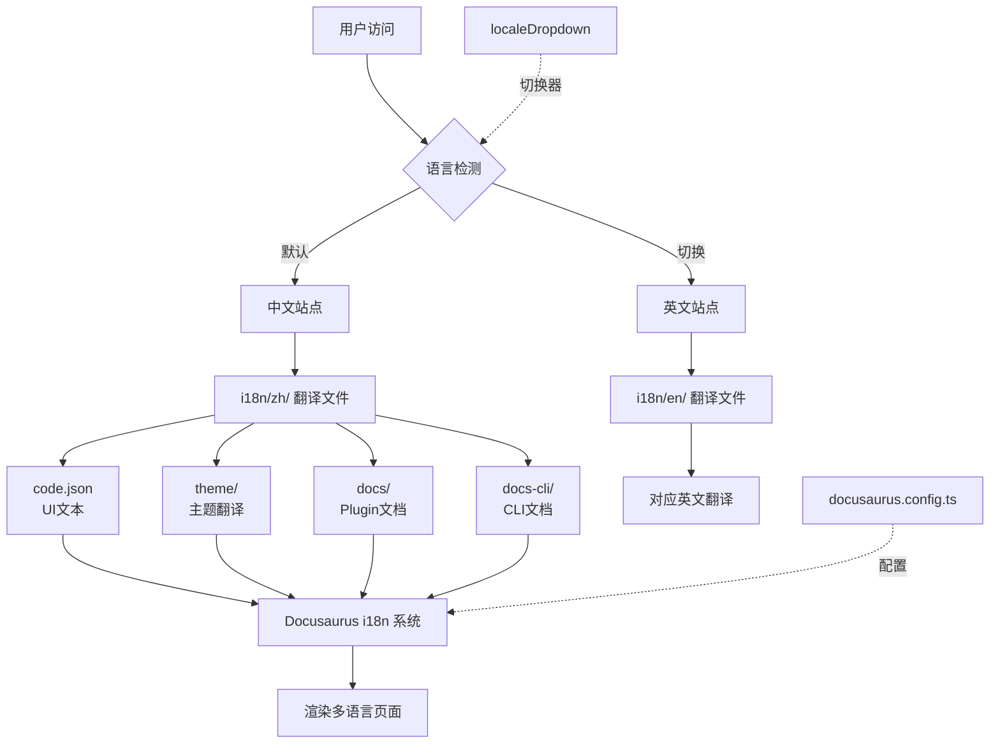
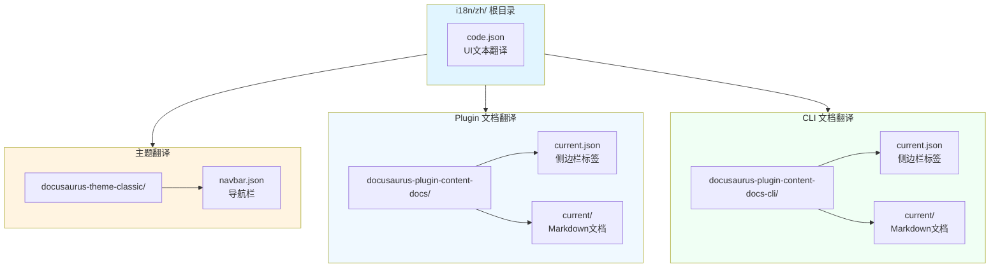
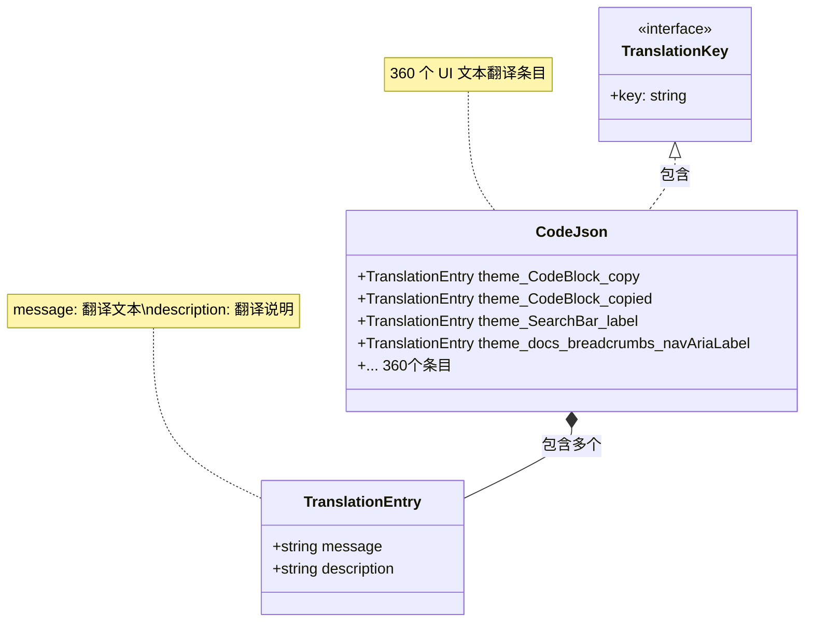
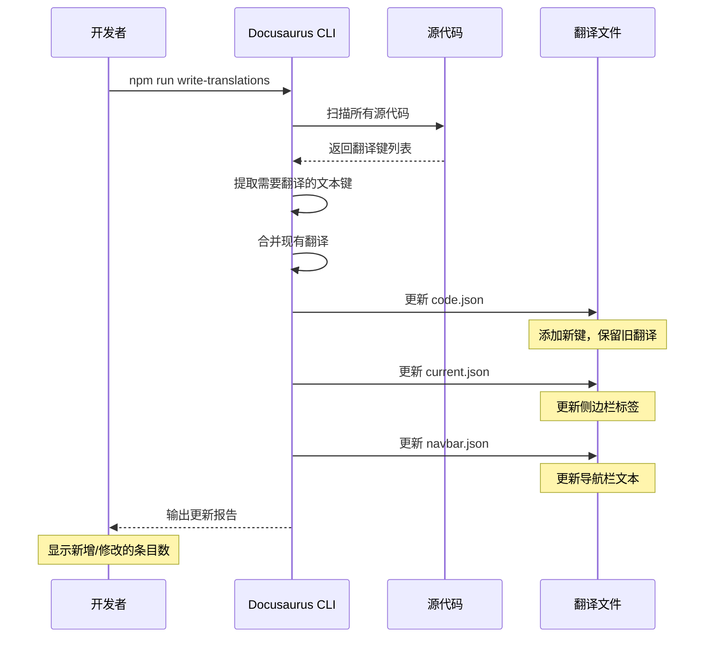
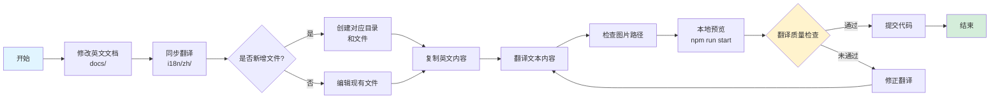

# 国际化工作流

<details>
<summary>相关源文件</summary>

- docusaurus.config.ts
- i18n/zh/code.json
- i18n/zh/docusaurus-theme-classic/navbar.json
- i18n/zh/docusaurus-plugin-content-docs/current.json
- i18n/zh/docusaurus-plugin-content-docs-cli/current.json
- package.json

</details>

## 概述

CoStrict 文档网站采用 Docusaurus 3.8.1 的国际化系统，实现中英文双语支持，默认语言为中文。国际化工作流涵盖了从配置管理、翻译文件组织、自动化工具使用到翻译维护的完整流程，确保文档在全球用户间的无缝切换和一致性体验。

核心特点：
- **双语言支持**：默认中文（zh），支持英文（en）切换
- **分层组织**：UI 文本、主题文本、文档内容分别管理
- **自动化工具**：write-translations 命令自动提取和更新翻译键
- **同步维护**：中英文文档路径一致，便于同步更新

## 系统架构

### 整体架构



## i18n 配置详解

### 配置位置

国际化配置集中在 `docusaurus.config.ts` 文件的第 58-61 行：

```typescript
// docusaurus.config.ts:58-61
i18n: {
  defaultLocale: 'zh',      // 默认语言设置为中文
  locales: ['zh', 'en'],    // 支持的语言列表
}
```

**配置说明**：
- `defaultLocale: 'zh'`：设置站点的默认语言为中文，用户首次访问时自动显示中文内容
- `locales: ['zh', 'en']`：定义站点支持的语言数组，包含中文（zh）和英文（en）两种语言

### 语言切换器

语言切换器配置在导航栏中（docusaurus.config.ts 第 105-108 行）：

```typescript
// docusaurus.config.ts:105-108
{
  type: 'localeDropdown',    // 语言下拉选择器类型
  position: 'right',          // 显示在导航栏右侧
}
```

**实现原理**：
1. Docusaurus 自动读取 `locales` 配置
2. 生成语言切换下拉菜单
3. 用户点击后切换 URL 前缀（如 `/zh/` 或 `/en/`）
4. 加载对应的翻译文件并重新渲染页面

### 配置架构图

```mermaid
graph LR
    A[docusaurus.config.ts] --> B[i18n 配置块]
    A --> C[navbar 配置]
    
    B --> D[defaultLocale: zh]
    B --> E[locales: zh, en]
    
    C --> F[localeDropdown]
    F --> G[语言切换器]
    
    D --> H[默认中文显示]
    E --> I[支持的语言列表]
    
    G --> J[用户交互]
    J --> K{选择语言}
    K -->|中文| L[/zh/ 路径]
    K -->|英文| M[/en/ 路径]
    
    L --> N[加载 i18n/zh/]
    M --> O[加载 i18n/en/]
```

## 翻译文件体系

### 目录结构

Docusaurus 采用约定式目录结构组织翻译文件，所有中文翻译存放在 `i18n/zh/` 目录下：

```
i18n/
└─ zh/                                           # 中文翻译根目录
   ├─ code.json                                  # 全局 UI 文本翻译（360行）
   │
   ├─ docusaurus-theme-classic/                 # 主题翻译
   │  └─ navbar.json                            # 导航栏文本（22行）
   │
   ├─ docusaurus-plugin-content-docs/           # Plugin 文档翻译
   │  ├─ current.json                           # 侧边栏标签翻译（70行）
   │  └─ current/                               # Markdown 文档翻译
   │     ├─ guide/                              # 使用指南
   │     ├─ deployment/                         # 部署文档
   │     ├─ product-features/                   # 产品功能
   │     ├─ billing/                            # 计费说明
   │     └─ ...                                 # 其他模块
   │
   ├─ docusaurus-plugin-content-docs-cli/       # CLI 文档翻译
   │  ├─ current.json                           # 侧边栏标签翻译（98行）
   │  └─ current/                               # Markdown 文档翻译
   │     ├─ guide/                              # 使用指南
   │     ├─ config/                             # 配置说明
   │     ├─ product-features/                   # 产品特性
   │     └─ ...                                 # 其他模块
   │
   └─ docusaurus-plugin-content-docs-ai-knowledge/  # AI 知识库文档
      └─ current/                               # Markdown 文档翻译
```

### 文件组织架构



### Plugin 文档翻译

Plugin 文档的元数据翻译存放在 `i18n/zh/docusaurus-plugin-content-docs/current.json`：

```json
{
  "version.label": {
    "message": "Next",
    "description": "The label for version current"
  },
  "sidebar.tutorialSidebar.category.Getting Started": {
    "message": "快速开始",
    "description": "The label for category Getting Started in sidebar tutorialSidebar"
  },
  "sidebar.tutorialSidebar.category.Local deployment": {
    "message": "私有化部署",
    "description": "The label for category Local deployment in sidebar tutorialSidebar"
  }
}
```

**关键条目说明**：
- `version.label`：文档版本标签
- `sidebar.*.category.*`：侧边栏分类标签的翻译
- 每个条目包含 `message`（翻译文本）和 `description`（描述信息）

### CLI 文档翻译

CLI 文档的元数据翻译存放在 `i18n/zh/docusaurus-plugin-content-docs-cli/current.json`：

```json
{
  "version.label": {
    "message": "Next",
    "description": "The label for version current"
  },
  "sidebar.cliSidebar.category.Getting Started": {
    "message": "快速开始",
    "description": "The label for category Getting Started in sidebar cliSidebar"
  },
  "sidebar.cliSidebar.category.Product Features": {
    "message": "产品功能",
    "description": "The label for category Product Features in sidebar cliSidebar"
  }
}
```

### 主题翻译

导航栏主题翻译存放在 `i18n/zh/docusaurus-theme-classic/navbar.json`：

```json
{
  "title": {
    "message": "COSTRICT",
    "description": "The title in the navbar"
  },
  "item.label.Plugin": {
    "message": "插件端",
    "description": "Navbar item with label Plugin"
  },
  "item.label.CLI": {
    "message": "CLI",
    "description": "Navbar item with label CLI"
  }
}
```

## code.json 文件结构

### 文件概述

`i18n/zh/code.json` 是全局 UI 文本翻译文件，共 360 行，采用 JSON 格式组织，每个键值对对应一个 UI 文本的翻译。

### 结构设计



### 键值对结构

每个翻译条目包含两个字段：

```json
{
  "theme.CodeBlock.copy": {
    "message": "Copy",
    "description": "The copy button label on code blocks"
  },
  "theme.CodeBlock.copied": {
    "message": "Copied",
    "description": "The copied button label on code blocks"
  },
  "theme.SearchBar.label": {
    "message": "Search",
    "description": "The ARIA label and placeholder for search button"
  }
}
```

**字段说明**：
- **键名**：Docusaurus 预定义的翻译键，采用点分隔命名（如 `theme.CodeBlock.copy`）
  - `theme.*`：主题相关文本
  - `theme.docs.*`：文档相关文本
  - `theme.blog.*`：博客相关文本
  - `theme.SearchBar.*`：搜索相关文本

- **message**：翻译后的文本内容
  - 对于中文版本，可以是中文文本（如"快速开始"）
  - 也可以保持英文（如"Copy"），视具体需求而定

- **description**：翻译说明，供开发者参考
  - 说明该文本的用途和上下文
  - 帮助翻译者理解翻译场景

### 典型示例

#### 代码块复制按钮

```json
{
  "theme.CodeBlock.copy": {
    "message": "Copy",
    "description": "The copy button label on code blocks"
  },
  "theme.CodeBlock.copied": {
    "message": "Copied",
    "description": "The copied button label on code blocks"
  },
  "theme.CodeBlock.copyButtonAriaLabel": {
    "message": "Copy code to clipboard",
    "description": "The ARIA label for copy code blocks button"
  }
}
```

#### 搜索功能

```json
{
  "theme.SearchBar.label": {
    "message": "Search",
    "description": "The ARIA label and placeholder for search button"
  },
  "theme.SearchBar.noResultsText": {
    "message": "No results"
  },
  "theme.SearchBar.seeAll": {
    "message": "See all results"
  }
}
```

#### 文档导航

```json
{
  "theme.docs.paginator.previous": {
    "message": "Previous",
    "description": "The label used to navigate to the previous doc"
  },
  "theme.docs.paginator.next": {
    "message": "Next",
    "description": "The label used to navigate to the next doc"
  }
}
```

### 更新机制

`code.json` 文件的更新有两种方式：

1. **自动更新**：执行 `npm run write-translations` 命令，自动提取新增的翻译键并添加到文件中
2. **手动编辑**：开发者直接编辑 JSON 文件，修改 `message` 字段的翻译内容

:::tip
`description` 字段由 Docusaurus 自动生成，通常不需要手动修改
:::

## write-translations 命令

### 命令定义

`write-translations` 命令在 `package.json` 第 14 行定义：

```json
// package.json:14
"write-translations": "docusaurus write-translations"
```

### 执行流程



### 自动生成机制

**扫描范围**：
1. React 组件中的 `<Translate>` 标签
2. 主题配置中的文本内容（如 `navbar.title`）
3. 侧边栏配置中的分类标签
4. Docusaurus 内置的 UI 文本

**生成规则**：
- **新键添加**：自动添加新发现的翻译键，`message` 字段使用源文本
- **旧键保留**：保留已翻译的条目，不覆盖 `message` 字段
- **废弃键保留**：不再使用的键不会被自动删除，需手动清理

### 使用场景

#### 场景1：新增 UI 组件

当在 React 组件中添加新的可翻译文本时：

```typescript
import { Translate } from '@docusaurus/Translate';

<Translate id="custom.button.submit" description="Submit button">
  Submit
</Translate>
```

执行 `npm run write-translations` 后，`code.json` 会自动添加：

```json
{
  "custom.button.submit": {
    "message": "Submit",
    "description": "Submit button"
  }
}
```

#### 场景2：添加侧边栏分类

在 `sidebars.ts` 中添加新的分类：

```typescript
{
  type: 'category',
  label: 'New Feature',  // 这个标签会被自动提取
  items: ['feature/intro'],
}
```

执行命令后，`current.json` 会自动添加：

```json
{
  "sidebar.tutorialSidebar.category.New Feature": {
    "message": "New Feature",
    "description": "The label for category New Feature in sidebar tutorialSidebar"
  }
}
```

### 更新策略

**推荐工作流**：
1. 修改源代码或配置文件
2. 执行 `npm run write-translations` 提取新键
3. 手动编辑翻译文件，翻译新增的 `message` 字段
4. 执行 `npm run start` 预览效果
5. 提交代码时同步更新中英文翻译

:::caution
执行 `write-translations` 命令不会删除已废弃的翻译键，需要定期手动清理
:::

## 文档翻译维护流程

### 文件路径对应关系

Docusaurus 要求翻译文件的路径必须与原文完全一致：

| 文档类型 | 英文原文路径 | 中文翻译路径 |
|---------|------------|------------|
| Plugin 文档 | `docs/guide/installation.md` | `i18n/zh/docusaurus-plugin-content-docs/current/guide/installation.md` |
| CLI 文档 | `docs-cli/config/shortcuts.md` | `i18n/zh/docusaurus-plugin-content-docs-cli/current/config/shortcuts.md` |
| 图片资源 | `docs/img/screenshot.png` | `i18n/zh/docusaurus-plugin-content-docs/current/img/screenshot.png` |

**路径映射规则**：
```
原文路径: docs/{path}
翻译路径: i18n/zh/docusaurus-plugin-content-docs/current/{path}

原文路径: docs-cli/{path}
翻译路径: i18n/zh/docusaurus-plugin-content-docs-cli/current/{path}
```

### 同步更新流程



### 维护最佳实践

#### 1. 新增文档

**步骤**：
1. 在 `docs/` 或 `docs-cli/` 创建新的 Markdown 文件
2. 在对应侧边栏配置中添加文档条目
3. 执行 `npm run write-translations` 生成翻译键
4. 在 `i18n/zh/` 对应目录创建同名文件
5. 翻译文档内容

**示例**：

```bash
# 创建英文文档
docs/product-features/new-feature.md

# 执行命令
npm run write-translations

# 创建中文翻译
i18n/zh/docusaurus-plugin-content-docs/current/product-features/new-feature.md
```

#### 2. 更新文档

**同步更新原则**：
- 修改英文文档时，必须同步修改中文翻译
- 保持文档结构一致（标题层级、段落顺序）
- 图片引用路径保持相对路径不变

**Frontmatter 处理**：

```yaml
---
sidebar_position: 1
title: Installation Guide  # 英文标题
---
```

中文版本保持相同的 frontmatter 结构：

```yaml
---
sidebar_position: 1
title: 安装指南  # 中文标题
---
```

#### 3. 删除文档

**步骤**：
1. 删除英文文档文件
2. 删除对应的中文翻译文件
3. 更新侧边栏配置
4. 手动清理 `current.json` 中的废弃翻译键

### 文档结构一致性

保持中英文文档的结构一致性至关重要：

| 项目 | 英文版本 | 中文版本 |
|-----|---------|---------|
| 文件名 | `installation.md` | `installation.md` |
| 目录结构 | `docs/guide/` | `i18n/zh/.../guide/` |
| 标题层级 | `#` → `##` → `###` | `#` → `##` → `###` |
| 图片路径 | `./img/screenshot.png` | `./img/screenshot.png` |
| 代码块 | ````typescript` | ````typescript` |

:::tip
使用 Git 的差异对比工具可以快速检查中英文文档的结构差异
:::

## 翻译规范与最佳实践

### 专业术语使用

#### 术语一致性表

| 英文术语 | 中文翻译 | 使用场景 |
|---------|---------|---------|
| Plugin | 插件端 | VS Code 扩展产品 |
| CLI | CLI | 命令行工具（保持英文） |
| Deployment | 私有化部署 | 本地部署场景 |
| Getting Started | 快速开始 | 新手入门 |
| Product Features | 产品特性 | 功能介绍 |
| Billing | 套餐&计费说明 | 收费相关 |
| Best Practices | 最佳实践 | 使用建议 |

**术语管理建议**：
- 建立项目术语表，记录所有专业术语的标准翻译
- 同一术语在不同文档中保持翻译一致
- 对于技术名词（如 API、SDK），可保持英文不翻译

### 语言风格一致性

#### 语调规范

- **正式程度**：使用正式、专业的技术文档语言
- **人称使用**：第三人称为主，避免"我"、"你"等人称代词
- **时态使用**：一般现在时为主，描述操作步骤时使用祈使句

**示例对比**：

❌ 不推荐：
```
你需要先安装 Node.js，然后你可以运行命令。
```

✅ 推荐：
```
首先安装 Node.js，然后运行以下命令。
```

### 标点符号规范

#### 中英文标点差异

| 场景 | 英文 | 中文 |
|-----|------|------|
| 句末 | `.` | `。` |
| 列表分隔 | `,` | `、` 或 `，` |
| 引用 | `"` | `""` 或 `「」` |
| 省略 | `...` | `……` |
| 代码块内 | 保持英文标点 | 保持英文标点 |

**特殊处理**：
- 代码块、命令行、文件路径中的标点保持英文
- Markdown 语法符号（`**`、`-`、`` ` ``）保持英文
- URL 和链接地址保持英文

### 定期同步策略

#### 同步周期

| 更新类型 | 同步周期 | 责任人 |
|---------|---------|-------|
| 紧急修复 | 24小时内 | 文档维护者 |
| 功能更新 | 3天内 | 文档维护者 |
| 常规更新 | 每周 | 文档维护者 |
| 版本发布 | 发布当天 | 文档维护者 |

#### 版本控制

使用 Git 分支管理翻译更新：

```bash
# 创建翻译更新分支
git checkout -b docs/update-i18n-2024

# 更新英文文档
git add docs/

# 同步中文翻译
git add i18n/zh/

# 提交时注明中英文同步
git commit -m "docs: update installation guide (zh & en)"
```

## 翻译工具与技巧

### VS Code i18n 插件

#### 推荐插件

1. **i18n Ally**：可视化翻译管理
   - 自动识别翻译键
   - 内联显示翻译内容
   - 支持多语言并排编辑

2. **JSON Tools**：JSON 格式化工具
   - 自动格式化 JSON 文件
   - 语法高亮和错误提示

#### 使用技巧

**批量查找翻译键**：
```bash
# 搜索特定翻译键的使用位置
rg "theme.CodeBlock.copy" --type ts
```

**快速定位翻译文件**：
- 使用 VS Code 的文件搜索（Ctrl+P）
- 输入 `i18n/zh/code.json` 快速打开
- 使用 JSON 搜索功能查找特定键

### 翻译管理工具

#### 本地工具

1. **翻译记忆工具**：
   - 记录已翻译的短语和句子
   - 重复内容自动提示
   - 保持翻译一致性

2. **术语管理工具**：
   - 维护项目术语表
   - 自动检查术语使用
   - 提供翻译建议

#### 在线工具

| 工具 | 用途 | 特点 |
|-----|------|------|
| Crowdin | 协作翻译 | 支持多人协作，版本控制 |
| Phrase | 翻译管理 | API 集成，自动化工作流 |
| Lokalise | 本地化平台 | 实时预览，团队协作 |

### 术语表建立

#### 术语表格式

建议使用 JSON 或 YAML 格式维护术语表：

```json
{
  "terms": {
    "Plugin": {
      "translation": "插件端",
      "context": "VS Code 扩展产品",
      "keep_english": false
    },
    "CLI": {
      "translation": "CLI",
      "context": "命令行工具",
      "keep_english": true
    },
    "API": {
      "translation": "API",
      "context": "应用程序接口",
      "keep_english": true
    }
  }
}
```

#### 术语表维护

1. **新增术语**：遇到新术语时立即记录
2. **定期审查**：每月审查术语表的准确性和一致性
3. **团队共享**：将术语表纳入项目文档，供团队成员参考

### 批量更新技巧

#### 使用脚本批量更新

```bash
#!/bin/bash
# update-translations.sh

# 执行翻译提取
npm run write-translations

# 查找新增的翻译键
git diff i18n/zh/code.json | grep '+  "' | head -10

# 提示手动翻译
echo "请手动翻译新增的条目，然后运行 npm run start 预览"
```

#### 对比中英文文档

```bash
# 使用 diff 工具对比文档结构
diff -r docs/guide/ i18n/zh/docusaurus-plugin-content-docs/current/guide/
```

### 效率提升建议

#### 1. 使用代码片段

在 VS Code 中创建翻译模板代码片段：

```json
{
  "Translation Entry": {
    "prefix": "trans",
    "body": [
      "\"${1:key}\": {",
      "  \"message\": \"${2:翻译文本}\",",
      "  \"description\": \"${3:描述信息}\"",
      "}"
    ]
  }
}
```

#### 2. 自动化检查

创建脚本检查翻译完整性：

```bash
# 检查 code.json 中是否有空 message
jq '.[] | select(.message == "")' i18n/zh/code.json
```

#### 3. 并行编辑

- 使用 VS Code 的分屏功能，左侧打开英文原文，右侧打开中文翻译
- 同步滚动查看，确保内容对应
- 使用多光标编辑，批量修改相似内容

## 总结

CoStrict 文档网站的国际化工作流建立在 Docusaurus 强大的 i18n 系统之上，通过清晰的配置、分层组织的翻译文件、自动化的工具支持和规范的维护流程，实现了高效的中英文双语文档管理。

**核心优势**：
- **配置简洁**：仅需几行配置即可启用多语言支持
- **自动化工具**：`write-translations` 命令大幅减少手动工作
- **规范清晰**：约定式目录结构便于维护和扩展
- **同步机制**：文件路径对应关系确保翻译不遗漏

**最佳实践**：
- 保持中英文文档结构和路径完全一致
- 建立项目术语表，确保翻译一致性
- 定期同步更新，避免翻译滞后
- 使用工具辅助，提升翻译效率

通过遵循本文档介绍的工作流程和规范，可以确保 CoStrict 文档网站的中英文内容始终保持同步和高质量，为全球用户提供优秀的文档体验。
