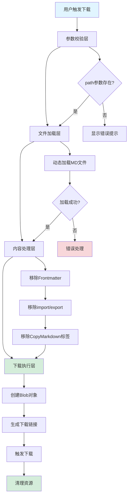
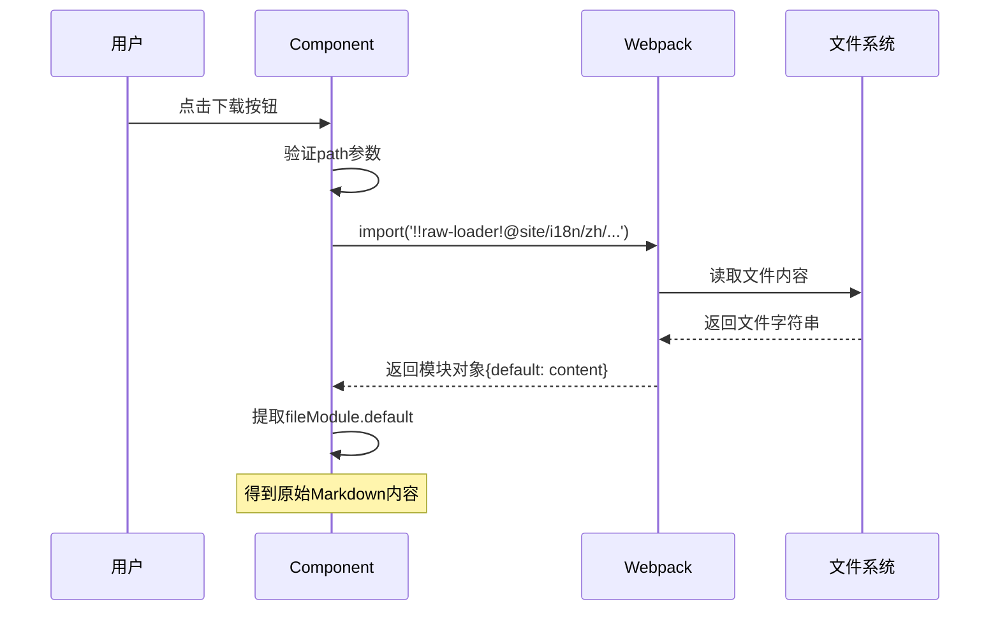

# 7、自定义组件开发

<details>
<summary>相关源文件</summary>

- src/components/DownloadButton/index.tsx
- package.json
- docusaurus.config.ts
- i18n/zh/docusaurus-plugin-content-docs/current/deployment/deploy-checklist.md
- AGENTS.md
- src/css/custom.css

</details>

## 概述

CoStrict 文档网站是一个基于 Docusaurus 3.8.1 构建的静态文档站点，项目整体采用简洁的技术架构，仅包含一个自定义 React 组件——`DownloadButton`。该组件位于 `src/components/DownloadButton/index.tsx`，共 83 行代码，提供了将 Markdown 文档下载为本地文件的核心功能。

该组件的设计理念是**极简实用**：通过动态加载 Markdown 文件内容，经过一系列内容清洗处理后，生成可下载的 Blob 对象并触发浏览器下载。这一功能解决了用户离线阅读和编辑文档的需求，是提升文档站点用户体验的关键组件。

组件采用函数式组件设计，使用 TypeScript 编写，完全遵循 React 19 最佳实践，并包含完善的错误处理机制。其实现展示了在 Docusaurus 框架下开发自定义组件的完整流程，包括动态资源加载、正则表达式文本处理、浏览器 API 使用等核心技术点。

## 组件架构

### 整体设计思路

DownloadButton 组件采用**单一职责原则**设计，专注于文档下载这一个功能点。整个组件的架构可以分为四个核心层次：



### 技术栈依赖

组件的核心技术依赖包括：

- **React 19.0.0**: 采用函数式组件和 Hooks 模式
- **TypeScript 5.6.2**: 提供类型安全和开发时智能提示
- **raw-loader 4.0.2**: Webpack loader，用于将文件作为字符串导入
- **Docusaurus 3.8.1**: 文档框架，提供 `@site` 路径别名和构建环境

### 文件结构

```
src/
└─ components/
   └─ DownloadButton/
      └─ index.tsx    # 唯一的组件实现文件（83行）
```

这种极简的文件结构反映了项目的**低复杂度特性**，所有逻辑集中在一个文件中，便于维护和理解。

## 核心实现分析

### 1. 参数校验机制

组件的首要任务是验证必需参数，这是防御性编程的第一道防线：

```typescript
export default function DownloadMarkdown({ path, filename }) {
  if (!path) {
    return <div style={{ color: 'red' }}>缺少 path 参数</div>;
  }
  // ...
}
```

**设计要点**：
- **必需参数**：`path` 是必须提供的参数，指定要下载的 Markdown 文件路径
- **可选参数**：`filename` 是可选的，如果不提供则从 `path` 中提取文件名
- **早期返回**：参数缺失时立即返回错误提示，避免后续无效操作
- **视觉反馈**：使用红色文字清晰标识错误状态

### 2. 动态文件加载

组件的核心技术是使用 `raw-loader` 动态加载 Markdown 文件内容：

```typescript
const fileModule = await import(
  /* @vite-ignore */ `!!raw-loader!@site/i18n${path}`
);

let content = fileModule.default;
```

**技术细节**：

- **`!!raw-loader!` 前缀**：这是 Webpack 的内联 loader 语法
  - `!!` 表示禁用所有其他 loader 配置
  - `raw-loader` 将文件内容作为字符串导入
  - 这种方式避免了 Docusaurus 默认的 Markdown 解析

- **`@site` 路径别名**：Docusaurus 提供的路径别名，指向项目根目录

- **`/* @vite-ignore */` 注释**：防止 Vite（Docusaurus 3.x 使用的构建工具）尝试预处理这个动态导入

- **路径拼接**：`@site/i18n${path}` 表明组件设计用于下载国际化后的中文文档

**工作原理流程图**：



### 3. 内容清洗处理

组件通过三个步骤清洗 Markdown 内容，确保下载的文件干净且可用：

#### 3.1 移除 Frontmatter 元数据

```typescript
content = content.replace(/^---[\s\S]*?---\s*/m, '');
```

**正则表达式解析**：
- `^---` - 匹配以 `---` 开头的行（Frontmatter 起始标记）
- `[\s\S]*?` - 非贪婪匹配任意字符（包括换行）
- `---\s*` - 匹配 Frontmatter 结束标记
- `/m` - 多行模式，使 `^` 匹配行首

**效果示例**：
```markdown
# 处理前
---
sidebar_position: 3
title: 部署检查清单
---

# 部署检查清单

# 处理后
# 部署检查清单
```

#### 3.2 移除 import/export 语句

```typescript
content = content
  .split('\n')
  .filter((line) => !/^import\s/.test(line))
  .filter((line) => !/^export\s/.test(line))
  .join('\n');
```

**处理逻辑**：
1. 按换行符拆分成数组（保留原始换行结构）
2. 过滤掉以 `import ` 开头的行
3. 过滤掉以 `export ` 开头的行
4. 重新拼接成字符串

**为什么需要移除**：
- import/export 语句是 Docusaurus 的 MDX 语法，用于导入 React 组件
- 下载的纯 Markdown 文件无法使用这些功能
- 移除后不影响内容的可读性

#### 3.3 移除 CopyMarkdown 组件标签

组件支持两种 CopyMarkdown 标签形式：

**单标签形式**：
```typescript
content = content.replace(
  /<CopyMarkdown[\s\S]*?\/>/g,
  ''
);
```

匹配示例：`<CopyMarkdown />` 或 `<CopyMarkdown title="xxx" abc />`

**块标签形式**：
```typescript
content = content.replace(
  /<CopyMarkdown[\s\S]*?<\/CopyMarkdown>/g,
  ''
);
```

匹配示例：
```markdown
<CopyMarkdown>
  内容...
</CopyMarkdown>
```

**设计考虑**：
- CopyMarkdown 组件本身用于下载功能，不应出现在下载内容中
- 使用非贪婪匹配 `*?` 避免过度删除
- 全局标志 `g` 确保删除所有匹配项

### 4. 文件下载实现

经过内容清洗后，组件使用浏览器标准 API 实现文件下载：

```typescript
// 创建 Blob 对象
const blob = new Blob([content], { type: 'text/markdown;charset=utf-8' });

// 生成对象 URL
const url = URL.createObjectURL(blob);

// 创建隐藏的 <a> 元素并触发点击
const a = document.createElement('a');
a.href = url;
a.download = filename || path.split('/').pop();
a.click();
a.remove();

// 清理 URL 对象，释放内存
URL.revokeObjectURL(url);
```

**实现细节**：

1. **Blob 创建**：
   - `type: 'text/markdown;charset=utf-8'` 指定 MIME 类型
   - UTF-8 编码确保中文字符正确保存

2. **文件名确定**：
   - 优先使用 `filename` 参数
   - 未提供时从 `path` 中提取最后一部分作为文件名

3. **下载触发**：
   - 创建隐藏的 `<a>` 元素
   - 设置 `download` 属性触发下载而非导航
   - 程序化触发点击事件
   - 立即移除 DOM 元素

4. **资源清理**：
   - `URL.revokeObjectURL(url)` 释放 Blob URL
   - 避免内存泄漏

**下载流程可视化**：


### 5. 错误处理机制

组件包含完整的错误处理，确保用户友好的体验：

```typescript
try {
  // ... 文件加载和处理逻辑
} catch (err) {
  console.error(err);
  alert('下载失败，文件不存在');
}
```

**错误场景覆盖**：
- 文件路径错误（文件不存在）
- raw-loader 加载失败
- Blob 创建异常
- 其他未知错误

**处理策略**：
- 控制台输出详细错误信息（供开发者调试）
- 用户界面显示友好提示（避免技术术语）
- 阻止错误冒泡（组件不会崩溃）

## API 接口设计

### 组件 Props 定义

虽然组件代码中未显式定义 TypeScript 接口，但从实现可以推断出完整的接口定义：

```typescript
interface DownloadButtonProps {
  /**
   * Markdown 文件的相对路径（相对于 @site/i18n 目录）
   * 必需参数
   * @example "/zh/docusaurus-plugin-content-docs/current/deployment/deploy-checklist.md"
   */
  path: string;
  
  /**
   * 下载后的文件名（可选）
   * 如果不提供，将使用 path 的最后一部分作为文件名
   * @example "deploy-checklist.md"
   */
  filename?: string;
}
```

### 使用约定

**路径格式约定**：
- 路径必须以 `/zh/` 开头（指向中文文档目录）
- 路径相对于 `@site/i18n` 目录
- 必须是有效的 Markdown 文件路径（`.md` 扩展名）

**文件名约定**：
- 建议使用小写字母和连字符
- 必须包含 `.md` 扩展名
- 避免使用特殊字符

### 组件渲染输出

组件渲染一个具有固定样式的按钮元素：

```typescript
return (
  <button
    onClick={downloadFile}
    style={{
      padding: '8px 16px',
      background: '#3578e5',      // Docusaurus 主题蓝色
      borderRadius: 6,
      color: '#fff',
      border: 'none',
      cursor: 'pointer',
      marginBottom: 12,
    }}
  >
    下载文件
  </button>
);
```

**样式特点**：
- 内联样式（简化实现，未使用 CSS Modules）
- 与 Docusaurus 主题颜色一致（`#3578e5`）
- 固定的按钮文字"下载文件"（未国际化）

## 使用指南

### 基本使用方式

在 Docusaurus 的 Markdown 文档中引入并使用 DownloadButton 组件：

```markdown
---
sidebar_position: 3
---

import CopyMarkdown from '@site/src/components/DownloadButton';

# 部署检查清单

<CopyMarkdown 
  path="/zh/docusaurus-plugin-content-docs/current/deployment/deploy-checklist.md" 
  filename="deploy-checklist.md"
/>

用于检查校验，在 CoStrict 后端服务部署流程中...
```

**导入路径说明**：
- `@site/src/components/DownloadButton` 是 Docusaurus 提供的路径别名
- 虽然导入名为 `CopyMarkdown`，但实际导入的是 `DownloadButton` 组件
- 这是命名约定的差异，不影响功能

### 完整使用示例

#### 示例 1：使用默认文件名

```markdown
import DownloadButton from '@site/src/components/DownloadButton';

# 快速开始指南

<DownloadButton path="/zh/docusaurus-plugin-content-docs/current/guide/quick_start.md" />
```

**效果**：下载文件名为 `quick_start.md`

#### 示例 2：自定义文件名

```markdown
import DownloadButton from '@site/src/components/DownloadButton';

# API 参考文档

<DownloadButton 
  path="/zh/docusaurus-plugin-content-docs/current/api/reference.md" 
  filename="costrict-api-reference-v2.md"
/>
```

**效果**：下载文件名为 `costrict-api-reference-v2.md`

#### 示例 3：在多语言文档中使用

由于组件硬编码了 `/zh/` 前缀，当前仅适用于下载中文文档。如需下载英文文档，需要修改组件实现或创建新组件。

### 集成到文档的最佳实践

1. **位置建议**：将下载按钮放在文档标题下方，正文内容之前
2. **命名建议**：使用语义化的导入名称（如 `DownloadButton` 而非 `CopyMarkdown`）
3. **文件名建议**：提供清晰的 `filename` 参数，包含版本或日期信息
4. **错误处理**：确保 `path` 参数正确，否则用户会看到错误提示

## 开发规范

### TypeScript 类型定义规范

虽然当前组件未显式定义 Props 接口，但按照项目规范应添加类型定义：

**推荐改进**：

```typescript
import React from 'react';

// 明确定义 Props 接口
interface DownloadButtonProps {
  path: string;
  filename?: string;
}

// 使用解构和类型注解
export default function DownloadButton({ 
  path, 
  filename 
}: DownloadButtonProps): JSX.Element | null {
  if (!path) {
    return <div style={{ color: 'red' }}>缺少 path 参数</div>;
  }

  // ... 其余实现
}
```

**优势**：
- 提供编译时类型检查
- 支持 IDE 智能提示
- 生成可读的 API 文档
- 避免运行时类型错误

### React 19 最佳实践遵循

组件完全遵循 React 19 的最佳实践：

1. **函数式组件**：使用函数而非 Class 组件
2. **Hooks 就绪**：组件内部使用 `async/await` 处理异步操作
3. **事件处理**：使用内联箭头函数或定义在组件内的函数
4. **条件渲染**：早期返回模式处理错误状态
5. **资源清理**：正确清理 DOM 元素和 Blob URL

**当前实现**：
```typescript
const downloadFile = async () => {
  // 异步操作
};

return (
  <button onClick={downloadFile}>
    下载文件
  </button>
);
```

### 代码组织规范

组件代码遵循单一文件组织模式，适合 83 行的小型组件：

**代码结构**：
1. 参数校验（第 4-6 行）
2. 核心逻辑函数 `downloadFile`（第 8-65 行）
   - 文件加载
   - 内容处理
   - 下载执行
   - 错误处理
3. JSX 渲染（第 67-82 行）

**命名规范**：
- 组件文件：`index.tsx`（目录名即组件名）
- 函数名：`downloadFile`（动词开头，语义清晰）
- 参数名：`path`、`filename`（小驼峰，语义化）

### 错误处理规范

组件实现了**防御性编程**的三个层次：

**第一层：参数验证**
```typescript
if (!path) {
  return <div style={{ color: 'red' }}>缺少 path 参数</div>;
}
```

**第二层：异常捕获**
```typescript
try {
  // 文件加载和处理
} catch (err) {
  console.error(err);  // 开发者日志
  alert('下载失败，文件不存在');  // 用户提示
}
```

**第三层：资源清理**
```typescript
a.remove();  // 清理 DOM
URL.revokeObjectURL(url);  // 清理内存
```

**改进建议**：
- 将错误提示文案国际化（当前硬编码中文）
- 考虑使用更友好的 UI 组件替代 `alert`
- 添加详细的错误类型判断（404、权限错误等）

## 最佳实践

### 性能优化建议

1. **缓存机制**：
   - 对频繁下载的文件添加内容缓存
   - 使用 `useMemo` 缓存处理结果

2. **懒加载**：
   - 组件已经是懒加载的（通过动态 import）
   - 可进一步优化为仅在视口内时加载

3. **样式优化**：
   - 将内联样式提取到 CSS 文件
   - 使用 CSS Modules 或 styled-components
   - 支持主题切换

**优化示例**：
```typescript
// 使用 CSS Modules
import styles from './DownloadButton.module.css';

return (
  <button className={styles.downloadButton} onClick={downloadFile}>
    下载文件
  </button>
);
```

### 可访问性改进

当前组件缺少 ARIA 属性，建议添加：

```typescript
<button
  onClick={downloadFile}
  aria-label="下载当前文档的 Markdown 文件"
  role="button"
  type="button"
>
  下载文件
</button>
```

### 国际化支持

**当前局限**：
- 组件硬编码中文错误提示
- 路径固定为 `/zh/` 前缀
- 按钮文字固定为"下载文件"

**改进方案**：

```typescript
import { useIntl } from 'docusaurus-theme-common';

export default function DownloadButton({ path, filename, locale = 'zh' }) {
  const intl = useIntl();
  
  const errorText = intl.formatMessage({
    id: 'components.downloadButton.error',
    defaultMessage: 'Download failed, file not found'
  });
  
  const buttonText = intl.formatMessage({
    id: 'components.downloadButton.text',
    defaultMessage: 'Download File'
  });
  
  const fullPath = `/${locale}${path}`;
  
  // ... 其余逻辑
}
```

### 测试覆盖建议

**单元测试场景**：
1. 参数缺失时的错误处理
2. 文件加载成功的内容处理
3. Frontmatter 正则匹配
4. import/export 语句过滤
5. CopyMarkdown 标签移除
6. Blob 创建和下载触发

**测试示例**：
```typescript
describe('DownloadButton', () => {
  it('should show error when path is missing', () => {
    render(<DownloadButton />);
    expect(screen.getByText('缺少 path 参数')).toBeInTheDocument();
  });
  
  it('should remove frontmatter correctly', () => {
    const content = '---\ntitle: Test\n---\n# Content';
    const cleaned = removeFrontmatter(content);
    expect(cleaned).toBe('# Content');
  });
});
```

### 扩展功能建议

基于当前实现，可以考虑以下功能扩展：

1. **多格式导出**：支持 PDF、HTML 等格式
2. **下载进度**：对于大文件显示进度条
3. **批量下载**：支持下载整个文档目录
4. **自定义样式**：通过 props 传递样式配置
5. **下载统计**：记录文档下载次数用于分析

**扩展示例**：
```typescript
interface DownloadButtonProps {
  path: string;
  filename?: string;
  locale?: 'zh' | 'en';
  format?: 'markdown' | 'html' | 'pdf';
  onDownloadStart?: () => void;
  onDownloadComplete?: () => void;
  onError?: (error: Error) => void;
  className?: string;
  children?: React.ReactNode;
}
```

## 总结

DownloadButton 组件是 CoStrict 文档网站中唯一的自定义组件，其设计体现了**极简主义**和**实用主义**原则。通过 83 行代码实现了完整的文档下载功能，包括动态文件加载、内容清洗、Blob 下载和错误处理等核心技术点。

该组件展示了在 Docusaurus 框架下开发自定义组件的标准模式：
- 使用 `raw-loader` 加载静态资源
- 利用正则表达式处理文本内容
- 使用浏览器 API 实现文件下载
- 遵循 React 19 函数式组件最佳实践
- 实现防御性编程和错误处理

虽然组件功能相对简单，但其实现为项目后续扩展自定义组件提供了清晰的参考模板。建议未来在类型定义、国际化、可访问性等方面进行增强，以提升组件的健壮性和用户体验。
