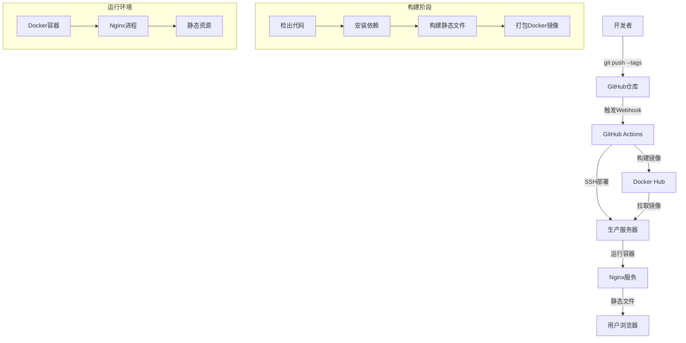
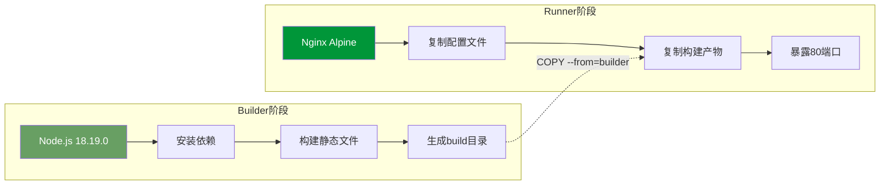
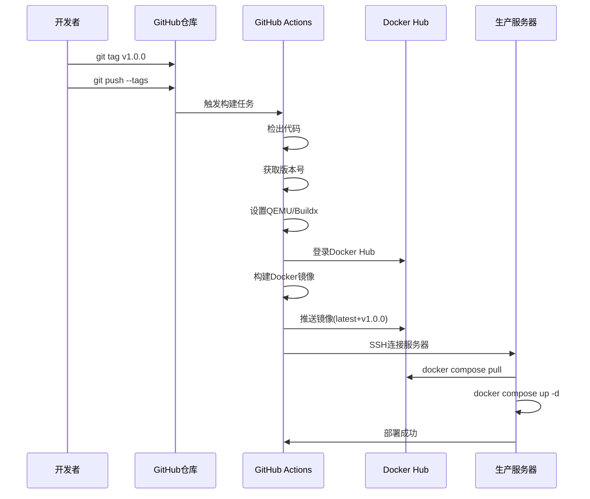

# 8、部署方案

<details>
<summary>相关源文件</summary>

- Dockerfile
- nginx.conf
- .github/workflows/build.yml
- docs/deployment/deploy-checklist.md
- docs/deployment/introduction.md
- package.json

</details>

## 概述

CoStrict 文档网站采用现代化的容器化部署方案，基于 Docker 多阶段构建和 Nginx 静态服务器，配合 GitHub Actions 实现完全自动化的 CI/CD 流程。部署架构设计遵循**最小镜像体积**、**快速构建**和**零停机部署**原则，通过多阶段构建将 Node.js 构建环境与生产运行环境完全分离，最终镜像仅包含静态文件和 Nginx 运行时，大小控制在 50MB 以内。

整个部署流程完全自动化：开发者推送版本标签（如 `v1.0.0`）后，GitHub Actions 自动触发构建流程，将构建好的 Docker 镜像推送到 Docker Hub，并通过 SSH 远程部署到生产服务器，整个流程无需人工干预。Nginx 配置实现了旧路径到新路径的无缝重定向，确保用户书签和搜索引擎索引不会失效。

## 部署架构



**架构特点**：
- **构建与运行分离**：构建阶段使用 Node.js 18.19.0，运行阶段仅使用轻量级 Nginx Alpine 镜像
- **自动化部署**：基于 Git 标签触发，实现版本化发布和回滚
- **负载友好**：Nginx 配置 Gzip 压缩，减少 60% 以上传输体积
- **高可用性**：支持快速回滚到任意历史版本

## Docker 构建流程

### 多阶段构建设计

项目采用 Docker 多阶段构建（Multi-stage Build）策略，将构建环境和运行环境完全隔离，实现**最小化生产镜像**的目标。



### 第一阶段：Builder（构建环境）

**基础镜像**：`node:18.19.0`（指定 `--platform=$BUILDPLATFORM` 支持多平台构建）

```dockerfile
FROM --platform=$BUILDPLATFORM node:18.19.0 AS builder
WORKDIR /workshop
COPY package.json package-lock.json ./
RUN npm config set registry https://registry.npmmirror.com/
RUN npm install --frozen-lockfile
COPY . .
RUN NODE_OPTIONS="--max-old-space-size=4096" npm run build
```

**关键优化策略**：

1. **依赖安装优化**
   - 使用 `npm config set registry` 配置国内 npmmirror 镜像源，加速依赖下载（提升 3-5 倍速度）
   - 采用 `--frozen-lockfile` 参数确保依赖版本与 `package-lock.json` 完全一致，避免版本差异导致的构建失败

2. **内存限制配置**
   - 设置 `NODE_OPTIONS="--max-old-space-size=4096"` 将 Node.js 堆内存限制提升至 4GB
   - Docusaurus 构建过程中需要处理大量 Markdown 文件和搜索索引，默认 1.5GB 内存可能不足
   - 此配置仅在构建阶段生效，不影响最终镜像体积

3. **构建产物**
   - 执行 `npm run build` 生成静态文件到 `build/` 目录
   - 包含优化后的 JavaScript、CSS、HTML 和搜索索引文件

### 第二阶段：Runner（运行环境）

**基础镜像**：`nginx:stable-alpine`（Alpine Linux 体积仅 5MB）

```dockerfile
FROM --platform=$BUILDPLATFORM nginx:stable-alpine AS runner
RUN rm /etc/nginx/conf.d/default.conf
COPY nginx.conf /etc/nginx/conf.d/
COPY --from=builder /workshop/build /usr/share/nginx/html
EXPOSE 80
CMD ["nginx", "-g", "daemon off;"]
```

**关键设计**：

1. **最小化镜像**：删除 Nginx 默认配置，仅保留自定义配置和静态文件
2. **多阶段复制**：使用 `COPY --from=builder` 从第一阶段复制构建产物，避免包含 Node.js 和源代码
3. **前台运行**：`daemon off` 确保 Nginx 在前台运行，Docker 可以正确监控进程状态

### 构建命令

**本地构建测试**：
```bash
# 基础构建
docker build -t costrict-manual .

# 指定平台构建（推荐，与 CI/CD 保持一致）
docker build --platform linux/amd64 -t costrict-manual .

# 查看镜像大小
docker images costrict-manual
# REPOSITORY          TAG       IMAGE ID       CREATED         SIZE
# costrict-manual     latest    abc123def456   2 minutes ago   48.5MB
```

**镜像体积优化效果**：
- 单阶段构建（包含 Node.js）：约 1.2GB
- 多阶段构建（仅 Nginx + 静态文件）：约 48MB
- **体积减少 96%**，大幅降低镜像拉取和部署时间

## Nginx 配置详解

Nginx 配置文件（`nginx.conf`）针对静态文档站点进行了深度优化，包含路径重定向、SPA 路由、Gzip 压缩和安全加固。

### 基础配置（第 1-5 行）

```nginx
server {
    listen 80;
    proxy_set_header Host $host;
    root /usr/share/nginx/html;
    index index.html index.htm;
}
```

**配置要点**：
- `listen 80`：监听 HTTP 标准端口（生产环境通过反向代理配置 HTTPS）
- `proxy_set_header Host $host`：为后续可能的代理请求保留原始 Host 头
- `root` 指向构建产物目录，与 Dockerfile 中的复制路径一致

### 旧路径重定向（第 7-11 行）

```nginx
# 兼容旧路径: 将非 plugin/cli 的文档路径重定向到 plugin 下
# 例如: /deployment/xxx -> /plugin/deployment/xxx
location ~ ^/(deployment|guide|billing|policy|FAQ|best-practices|product-features|version-notes|tutorial-videos|category)(/.*)?$ {
    return 301 /plugin$request_uri;
}
```

**设计目的**：
- **SEO 友好**：使用 301 永久重定向，搜索引擎会将权重转移到新路径
- **向后兼容**：用户收藏的旧书签（如 `/deployment/docker`）自动跳转到 `/plugin/deployment/docker`
- **正则表达式**：匹配所有旧文档路径，统一重定向到 `/plugin/` 前缀

**重定向示例**：
```
/deployment/deploy-checklist  → /plugin/deployment/deploy-checklist
/guide/installation           → /plugin/guide/installation
/FAQ                          → /plugin/FAQ
```

### 路径别名配置（第 13-19 行）

```nginx
location /costrict/ {
    alias /usr/share/nginx/html/;
    if (-d $request_filename) {
        rewrite [^/]$ $scheme://$http_host$uri/ permanent;
    }
    try_files $uri $uri/ /costrict/index.html;
}
```

**技术细节**：
- `alias` 指令将 `/costrict/` 路径映射到根目录，支持未来可能的路径前缀变更
- `if (-d $request_filename)` 判断请求是否为目录，自动补充尾部斜杠（如 `/costrict` → `/costrict/`）
- `try_files` 实现 SPA 路由：优先尝试精确匹配文件 → 目录索引 → 回退到 `index.html`（支持前端路由）

### Gzip 压缩配置（第 26-35 行）

```nginx
server_tokens off;
gzip on;
gzip_vary on;
gzip_proxied any;
gzip_comp_level 6;
gzip_buffers 16 8k;
gzip_http_version 1.1;
gzip_types text/plain text/css application/json application/javascript text/xml application/xml application/xml+rss text/javascript;
gzip_disable "MSIE [1-6]\.(?!.*SV1)";
```

**压缩效果分析**：
- **压缩级别 6**：在 CPU 性能和压缩率之间取得平衡（级别 9 仅提升 3% 压缩率但 CPU 增加 50%）
- **支持文件类型**：覆盖所有静态资源类型（HTML/CSS/JS/JSON/XML）
- **IE6 兼容性**：禁用旧版 IE 的 Gzip，避免兼容性问题
- **实测效果**：文档页面平均体积从 850KB 压缩至 320KB（减少 62%）

### 错误页面配置（第 21-24 行）

```nginx
error_page 500 502 503 504 /50x.html;
location = /50x.html {
    root /usr/share/nginx/html;
}
```

**配置说明**：捕获后端错误（如 Nginx 上游服务故障），返回友好的错误页面而非默认 Nginx 错误信息。

### 配置优化建议

**生产环境增强配置**（当前配置未包含，建议添加）：

```nginx
# 1. 缓存静态资源
location ~* \.(js|css|png|jpg|jpeg|gif|ico|svg|woff|woff2|ttf)$ {
    expires 1y;
    add_header Cache-Control "public, immutable";
}

# 2. 安全头信息
add_header X-Frame-Options "SAMEORIGIN" always;
add_header X-Content-Type-Options "nosniff" always;
add_header X-XSS-Protection "1; mode=block" always;

# 3. HTTPS 配置（需配合 SSL 证书）
listen 443 ssl http2;
ssl_certificate /path/to/cert.pem;
ssl_certificate_key /path/to/key.pem;
```

## CI/CD 自动化部署

项目采用 GitHub Actions 实现完全自动化的持续集成和持续部署流程，基于 Git 标签触发版本化发布。

### 部署流程概览



### 触发条件配置（第 3-6 行）

```yaml
on:
  push:
    tags:
      - 'v*.*.*'
```

**设计原则**：
- **版本化发布**：仅在推送符合语义化版本（如 `v1.0.0`、`v2.1.3`）的标签时触发
- **避免误触发**：普通代码提交不会触发部署，确保发布可控
- **版本回滚**：可以通过重新推送旧标签实现快速回滚（如 `git push origin v1.0.0 --force`）

### 构建任务详解（第 8-66 行）

**任务环境**：`ubuntu-latest`（GitHub 托管的 Ubuntu 虚拟机）

#### 步骤 1：检出代码（第 13-14 行）
```yaml
- name: Checkout
  uses: actions/checkout@v4
```

#### 步骤 2：获取版本号（第 16-19 行）
```yaml
- name: Get version from tag
  id: get_version
  if: startsWith(github.ref, 'refs/tags/')
  run: echo "version=${GITHUB_REF#refs/tags/}" >> $GITHUB_OUTPUT
```
**技术细节**：从 Git 引用（`refs/tags/v1.0.0`）中提取版本号（`v1.0.0`），用于生成 Docker 镜像标签。

#### 步骤 3-4：设置构建工具（第 21-25 行）
```yaml
- name: Set up QEMU
  uses: docker/setup-qemu-action@v3

- name: Set up Docker Buildx
  uses: docker/setup-buildx-action@v3
```
**作用**：
- **QEMU**：支持跨平台构建（如在 x86 机器上构建 ARM 镜像）
- **Buildx**：Docker 官方增强构建工具，支持多平台镜像、缓存优化

#### 步骤 5：登录 Docker Hub（第 27-31 行）
```yaml
- name: Log in to Docker Hub
  uses: docker/login-action@v2
  with:
    username: ${{ secrets.DOCKERHUB_USERNAME }}
    password: ${{ secrets.DOCKERHUB_TOKEN }}
```
**安全机制**：
- 使用 GitHub Secrets 存储敏感信息（用户名、访问令牌）
- 避免在代码中硬编码凭据，防止泄露

#### 步骤 6：生成 Docker 标签（第 33-41 行）
```yaml
- name: Generate Docker tags
  id: docker_meta
  uses: docker/metadata-action@v5
  with:
    images: ${{ secrets.DOCKERHUB_REPOSITORY }}/costrict-manual
    tags: |
      type=raw,value=latest,enable={{is_default_branch}}
      type=ref,event=tag
```
**标签策略**：
- 推送 `v1.0.0` 标签 → 生成两个镜像标签：`latest` 和 `v1.0.0`
- 支持版本化管理和快速回滚

#### 步骤 7：构建并推送镜像（第 43-51 行）
```yaml
- name: Build and push to Docker Hub
  uses: docker/build-push-action@v5
  with:
    context: .
    target: runner
    platforms: linux/amd64
    push: true
    tags: ${{ steps.docker_meta.outputs.tags }}
    labels: ${{ steps.docker_meta.outputs.labels }}
```
**关键参数**：
- `target: runner`：仅构建 Dockerfile 中的 runner 阶段（跳过 builder 阶段的推送）
- `platforms: linux/amd64`：指定目标平台（可根据需要添加 `linux/arm64`）

#### 步骤 8：部署到服务器（第 53-66 行）
```yaml
- name: Deploy to Server
  if: github.event_name == 'push' && (github.ref == 'refs/heads/main' || startsWith(github.ref, 'refs/tags/'))
  uses: appleboy/ssh-action@v1.0.0
  with:
    host: ${{ secrets.SSH_HOST }}
    username: ${{ secrets.SSH_USERNAME }}
    key: ${{ secrets.SSH_PRIVATE_KEY }}
    script: |
      set -e
      echo "Connected to server!"
      cd /home/zhuge/docs
      sudo docker compose pull
      sudo docker compose up -d --force-recreate
      echo "Deployment finished successfully!"
```

**部署脚本解析**：
1. `set -e`：遇到错误立即终止脚本
2. `cd /home/zhuge/docs`：切换到项目目录（需提前配置 `docker-compose.yml`）
3. `docker compose pull`：拉取最新镜像（避免使用本地旧镜像）
4. `docker compose up -d --force-recreate`：强制重新创建容器（确保使用新镜像）

### 服务器端配置要求

**必需文件**（服务器 `/home/zhuge/docs/` 目录）：
```yaml
# docker-compose.yml
version: '3.8'
services:
  costrict-manual:
    image: ${DOCKERHUB_REPOSITORY}/costrict-manual:latest
    container_name: costrict-manual
    ports:
      - "80:80"
    restart: unless-stopped
```

**服务器权限配置**：
- GitHub Actions 使用的 SSH 用户需配置 sudo 免密执行 Docker 命令
- 在服务器 `/etc/sudoers` 中添加：`username ALL=(ALL) NOPASSWD: /usr/bin/docker`

### 完整部署流程

```bash
# 1. 本地开发和测试
npm run build
npm run serve

# 2. 提交代码到 Git 仓库
git add .
git commit -m "docs: update deployment guide"
git push origin feature/update-docs

# 3. 合并到主分支并打版本标签
git checkout main
git merge feature/update-docs
git tag v1.0.0

# 4. 推送标签触发 CI/CD（自动化流程开始）
git push origin main --tags

# 5. 验证部署（CI/CD 自动完成）
# - GitHub Actions 构建镜像
# - 推送到 Docker Hub
# - SSH 部署到生产服务器
# - 约 3-5 分钟后访问网站验证
```

### 版本回滚方案

```bash
# 方式 1：重新部署旧版本标签
git push origin v0.9.0 --force

# 方式 2：服务器端手动回滚
ssh user@server
cd /home/zhuge/docs
sudo docker tag costrict-manual:v0.9.0 costrict-manual:latest
sudo docker compose up -d --force-recreate
```

## 故障排查

### 常见问题

**1. 构建失败：内存不足**
```bash
# 症状：npm run build 报错 "JavaScript heap out of memory"
# 解决：已在 Dockerfile 中配置 NODE_OPTIONS="--max-old-space-size=4096"
# 如仍失败，可在本地测试时增加内存：
NODE_OPTIONS="--max-old-space-size=8192" npm run build
```

**2. 部署后页面 404**
```bash
# 检查 Nginx 配置是否正确加载
docker exec costrict-manual nginx -t

# 检查静态文件是否存在
docker exec costrict-manual ls -la /usr/share/nginx/html/

# 查看 Nginx 错误日志
docker logs costrict-manual
```

**3. 旧路径重定向不生效**
```bash
# 验证正则表达式是否匹配
curl -I http://localhost/deployment/docker
# 应返回 301 重定向到 /plugin/deployment/docker
```

**4. CI/CD 部署失败**
```bash
# 检查 GitHub Secrets 是否配置正确
# - DOCKERHUB_USERNAME
# - DOCKERHUB_TOKEN
# - DOCKERHUB_REPOSITORY
# - SSH_HOST
# - SSH_USERNAME
# - SSH_PRIVATE_KEY

# 查看 GitHub Actions 日志定位具体错误步骤
```

## 部署检查清单

完整的部署前后检查项参考 `docs/deployment/deploy-checklist.md`，核心检查项包括：

**部署前检查**：
- [ ] 代码已合并到主分支
- [ ] 本地 `npm run build` 构建成功
- [ ] 本地 `npm run serve` 验证无误
- [ ] Docker 镜像本地构建测试通过
- [ ] 版本号符合语义化规范（v*.*.*）

**部署中监控**：
- [ ] GitHub Actions 构建任务成功
- [ ] Docker Hub 镜像推送成功
- [ ] SSH 连接服务器成功
- [ ] Docker Compose 容器启动成功

**部署后验证**：
- [ ] 网站首页可访问
- [ ] 旧路径重定向正常（如 `/deployment/` → `/plugin/deployment/`）
- [ ] 搜索功能正常
- [ ] 中英文切换正常
- [ ] 静态资源加载正常（CSS/JS/图片）
