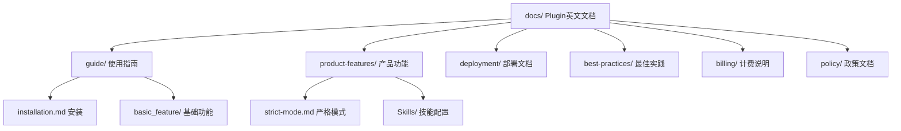
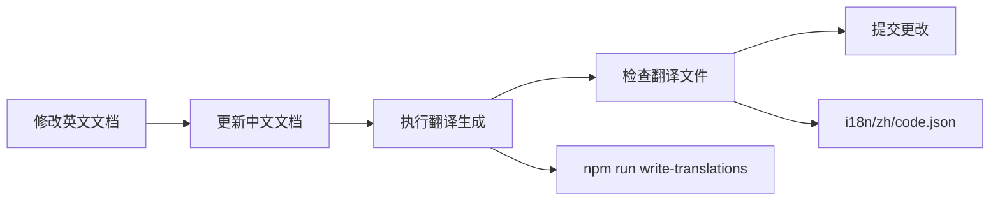
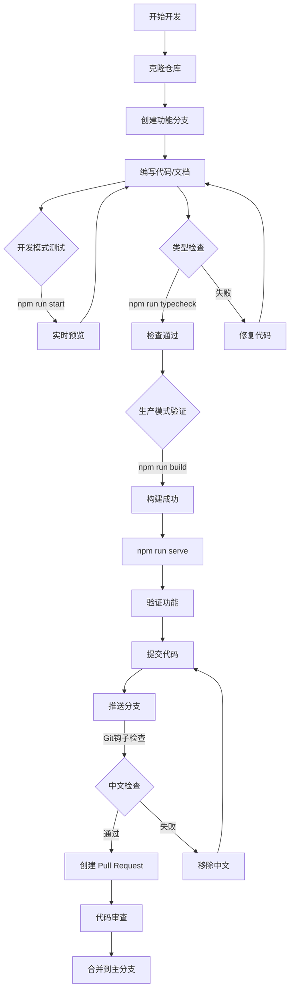

# 9、开发规范与最佳实践

<details>
<summary>相关源文件</summary>

- package.json
- .github/semantic.yml
- scripts/pre-push
- docs/guide/_category_.json
- tsconfig.json
- docusaurus.config.ts
- README.md

</details>

## 概述

CoStrict 文档项目基于 Docusaurus 3.8.1 构建，是一个支持中英文双语的静态文档网站。为了确保代码质量、文档一致性和团队协作效率，项目制定了一套完整的开发规范和最佳实践。本文档详细说明了文件命名、Git 提交、文档组织、国际化维护、代码质量、测试验证等方面的规范要求，帮助开发者快速上手并编写高质量的代码和文档。

所有规范均基于实际项目代码和配置，每个规范条款都有具体的示例和工具支持，确保开发者能够准确理解和执行。

## 文件命名规范

### Markdown 文档命名

所有 Markdown 文档文件使用**小写连字符式**（kebab-case）命名，避免空格和特殊字符。

**正确示例**：
```
docs/guide/installation.md
docs/product-features/strict-mode.md
docs/deployment/deploy-checklist.md
```

**命名规则**：
- 全部小写字母
- 单词之间用连字符 `-` 分隔
- 避免使用空格、下划线或驼峰式

### React 组件命名

React 组件文件使用**大驼峰式**（PascalCase）命名，与组件名称保持一致。

**正确示例**：
```
src/components/DownloadButton/index.tsx
src/components/NavigationBar/index.tsx
```

**参考实现**：项目中的 `src/components/DownloadButton/index.tsx` 组件遵循此规范。

### 配置文件命名

特殊配置文件使用**下划线前缀**命名，用于标识其特殊用途。

**正确示例**：
```
docs/guide/_category_.json
docs/product-features/_category_.json
```

**用途**：`_category_.json` 用于配置文档分组的标签、位置和链接信息。

### Git 分支命名

分支命名使用**前缀/描述**格式，清晰标识分支类型和目的。

**标准前缀**：
- `feature/` - 新功能开发，如 `feature/add-search`
- `docs/` - 文档更新，如 `docs/update-installation`
- `fix/` - Bug 修复，如 `fix/sidebar-issue`
- `chore/` - 杂项任务，如 `chore/update-dependencies`

**最佳实践**：避免在 `main` 或 `master` 分支直接开发，必须创建功能分支。

## Git 提交规范

### 语义化提交前缀

项目采用语义化提交规范，所有提交信息必须使用标准前缀。

**标准前缀**：
- `docs:` - 文档更新
- `feat:` - 新功能
- `fix:` - Bug 修复
- `chore:` - 构建配置、依赖更新等
- `refactor:` - 代码重构
- `test:` - 测试相关

**提交信息示例**：
```bash
git commit -m "docs: add contributing guide"
git commit -m "feat: add download button component"
git commit -m "fix: resolve sidebar navigation issue"
```

### 语义化配置

项目通过 `.github/semantic.yml` 强制执行语义化提交规范：

```yaml
titleAndCommits: true    # 同时验证 PR 标题和提交信息
anyCommit: true          # 要求至少一个提交有效
allowMergeCommits: false # 禁止合并提交
allowRevertCommits: false # 禁止回退提交
```

**配置要点**：
- PR 标题和所有提交信息都必须符合语义化规范
- 不允许使用 Merge 和 Revert 提交类型
- 参考配置文件：`.github/semantic.yml`

### 提交信息最佳实践

**良好的提交信息**：
```bash
# ✅ 好的提交
git commit -m "docs: update installation guide with Node.js 18 requirement"
git commit -m "feat: add Chinese search support"

# ❌ 不好的提交
git commit -m "update docs"
git commit -m "fix bug"
git commit -m "changes"
```

**建议**：
- 使用祈使语气（add, update, fix, remove）
- 简洁明了，控制在 50 字符以内
- 说明"做了什么"而非"怎么做的"

## 文档组织最佳实践

### 目录结构分类

文档按功能模块分类存放，保持清晰的层次结构。



**核心分类**：
- **guide/** - 快速开始、安装指南、基础功能
- **product-features/** - 产品功能介绍（AI Agent、代码审查、MCP 等）
- **deployment/** - Docker 部署、Higress 部署指南
- **best-practices/** - 使用技巧和最佳实践
- **billing/** - 套餐购买、服务说明
- **policy/** - 隐私政策、服务条款

### 分组配置文件

使用 `_category_.json` 配置文档分组的标签和位置。

**配置示例**（`docs/guide/_category_.json`）：
```json
{
  "label": "Getting Started",
  "position": 1,
  "link": {
    "title": "Getting Started",
    "type": "generated-index"
  }
}
```

**配置说明**：
- `label` - 分组在侧边栏显示的名称
- `position` - 分组在侧边栏的排序位置
- `link.type` - 设为 `generated-index` 自动生成索引页

### 文档排序控制

每个 Markdown 文件通过 frontmatter 的 `sidebar_position` 控制排序。

**示例**（`docs/guide/installation.md`）：
```markdown
---
sidebar_position: 1
---

# Installation

Installation requirements...
```

**排序规则**：
- 数字越小，位置越靠前
- 同一分组内的文档按 `sidebar_position` 升序排列
- 未设置 `sidebar_position` 的文档按文件名字母顺序排列

### 中英文文档结构一致性

确保中英文文档目录结构完全一致，便于同步维护。

**对应关系**：
```
docs/guide/installation.md          # 英文文档
↓
i18n/zh/docusaurus-plugin-content-docs/current/guide/installation.md  # 中文文档
```

**维护要点**：
- 新增英文文档时，同步创建中文版本
- 修改文档结构时，同时更新中英文目录
- 保持文件名和目录名完全一致

## 国际化维护规范

### 目录结构规范

项目采用 Docusaurus 的标准国际化目录结构：

```
i18n/
└─ zh/                                    # 中文翻译
   ├─ docusaurus-plugin-content-docs/     # Plugin 中文文档
   │  └─ current/                         # 对应 docs/
   ├─ docusaurus-plugin-content-docs-cli/ # CLI 中文文档
   │  └─ current/                         # 对应 docs-cli/
   ├─ docusaurus-theme-classic/           # 主题文本翻译
   └─ code.json                           # UI 文本翻译
```

**关键规则**：
- **英文文档**：存放在 `docs/` 和 `docs-cli/`
- **中文文档**：存放在 `i18n/zh/docusaurus-plugin-content-docs/current/`
- **禁止混用**：英文文档中不得包含中文字符

### 中文内容检查机制

项目通过多层机制确保英文文档不含中文：

#### 1. Git 钩子自动检查

`scripts/pre-push` 钩子在推送前自动检查：

```bash
#!/bin/sh
# 检查 docs 文件夹中的 .md 和 .json 文件是否包含中文
changed_files=$(git diff --name-only $remote_sha..$local_sha -- docs/** 2>/dev/null | grep -E '\.(md|json)$')

# 使用正则检查中文字符
if LC_ALL=C grep -q '[一-龯]' "$file" 2>/dev/null; then
    echo "❌ 文件 $file 包含中文字符"
    exit 1
fi
```

**触发时机**：每次执行 `git push` 时自动运行

#### 2. 手动检查脚本

`test-chinese-check.js` 提供手动检查功能：

```javascript
const chineseRegex = /[\u4e00-\u9fff]/;

function checkChinese(filePath) {
  const content = fs.readFileSync(filePath, 'utf8');
  const lines = content.split('\n');
  
  lines.forEach((line, index) => {
    if (chineseRegex.test(line)) {
      console.error(`行 ${index + 1}: ${line.trim()}`);
    }
  });
}
```

**使用方法**：
```bash
node test-chinese-check.js
```

### 翻译更新流程

更新国际化文本的标准流程：



**操作步骤**：
1. 修改英文文档（`docs/` 或 `docs-cli/`）
2. 同步更新中文文档（`i18n/zh/...`）
3. 执行翻译生成命令：
   ```bash
   npm run write-translations
   ```
4. 检查生成的翻译文件，补充缺失的翻译
5. 测试验证后提交更改

**重要提示**：
- 更新文档标题或导航时，必须运行 `write-translations`
- 检查 `i18n/zh/code.json` 中的 UI 文本翻译
- 确保中英文文档内容一致

## 代码质量规范

### TypeScript 类型检查

项目使用 TypeScript 5.6.2，所有代码必须通过类型检查。

**配置文件**（`tsconfig.json`）：
```json
{
  "extends": "@docusaurus/tsconfig",
  "compilerOptions": {
    "baseUrl": "."
  },
  "exclude": [".docusaurus", "build"]
}
```

**类型检查命令**：
```bash
npm run typecheck
```

**要求**：
- 提交代码前必须通过类型检查
- 遵循 TypeScript 最佳实践
- 为函数和组件添加类型注解

### 代码格式化

虽然项目未强制配置 ESLint 和 Prettier，但建议遵循以下规范：

**TypeScript/JavaScript**：
- 使用 2 空格缩进
- 使用单引号或双引号保持一致
- 语句末尾不加分号（可选，保持一致即可）
- 最大行宽 100 字符

**Markdown**：
- 使用 ATX 风格标题（`#` 风格）
- 代码块指定语言类型
- 列表项前后保持空行

### TypeScript 最佳实践

**组件开发**（参考 `src/components/DownloadButton/index.tsx`）：
```typescript
// ✅ 使用函数式组件
export default function DownloadMarkdown({ path, filename }) {
  // 组件逻辑
}

// ✅ 添加类型注解
interface Props {
  path: string;
  filename?: string;
}

export default function DownloadMarkdown({ path, filename }: Props) {
  // ...
}
```

**避免的做法**：
- ❌ 在 Docusaurus 配置文件中使用浏览器 API
- ❌ 在客户端代码中直接使用 Node.js 模块
- ❌ 忽略 TypeScript 类型错误

## 测试和验证流程

### 开发模式测试

**启动命令**：
```bash
npm run start        # 中文开发服务器（localhost:3000）
npm run start:en     # 英文开发服务器
```

**特点**：
- 支持热重载，实时预览修改
- 适合快速迭代和调试
- **限制**：无法测试中英文切换和搜索功能

**适用场景**：
- 文档内容编写
- 组件样式调整
- 快速预览效果

### 生产模式验证

**完整测试流程**：
```bash
# 1. 清除缓存（可选，首次构建时不需要）
npm run clear

# 2. 构建生产版本
npm run build

# 3. 启动生产服务器
npm run serve
```

**验证要点**：
- ✅ 检查所有页面是否正常加载
- ✅ 测试中英文切换功能
- ✅ 验证搜索功能是否正常
- ✅ 检查链接是否正确（无 404 错误）
- ✅ 确认国际化文本是否完整

**重要提示**：
- 提交 PR 前必须通过生产模式验证
- 构建错误时先尝试 `npm run clear` 清除缓存
- 检查控制台是否有错误或警告

### Docker 环境验证

**构建 Docker 镜像**：
```bash
docker build -t costrict-manual .
```

**启动容器**：
```bash
docker compose up -d
```

**查看日志**：
```bash
docker compose logs
```

**验证内容**：
- Nginx 配置是否正确
- 静态资源是否正常加载
- 路径重定向是否生效

## 常见问题与解决方案

### 构建失败

**问题 1：Node.js 版本不兼容**

**现象**：
```
error: The engine "node" is incompatible with this module.
```

**解决方案**：
```bash
# 检查 Node.js 版本
node --version

# 要求 Node.js >= 18.0
# 使用 nvm 切换版本
nvm install 18
nvm use 18
```

**问题 2：内存不足**

**现象**：
```
FATAL ERROR: Ineffective mark-compacts near heap limit Allocation failed
```

**解决方案**：
```bash
# 临时增加内存限制
export NODE_OPTIONS="--max-old-space-size=4096"
npm run build

# 或在 package.json 中配置
"scripts": {
  "build": "NODE_OPTIONS='--max-old-space-size=4096' docusaurus build"
}
```

**参考**：Dockerfile 中已配置 `NODE_OPTIONS="--max-old-space-size=4096"`

**问题 3：缓存导致的问题**

**现象**：构建结果与预期不符，或出现莫名其妙的错误

**解决方案**：
```bash
# 清除所有缓存和构建产物
npm run clear

# 重新安装依赖
rm -rf node_modules package-lock.json
npm install

# 重新构建
npm run build
```

### 链接失效

**问题：404 Not Found 错误**

**可能原因**：
1. 文件路径错误
2. 侧边栏配置不正确
3. 文件名或目录名修改后未更新引用

**解决方案**：
```bash
# 检查配置
# 1. 确认文件实际路径
ls docs/guide/installation.md

# 2. 检查侧边栏配置（sidebars.ts）
# 3. 检查文档中的相对路径引用
```

**配置示例**（`sidebars.ts`）：
```typescript
const sidebars: SidebarsConfig = {
  tutorialSidebar: [
    {
      type: 'autogenerated',
      dirName: 'guide',  // 确保目录名正确
    },
  ],
};
```

### 翻译缺失

**问题：切换语言后部分文本未翻译**

**解决方案**：
```bash
# 1. 生成翻译文件
npm run write-translations

# 2. 检查并补充翻译
# 打开 i18n/zh/code.json，找到缺失的翻译项
{
  "theme.NotFound.title": {
    "message": "页面未找到",
    "description": "The title of the 404 page"
  }
}

# 3. 重新构建验证
npm run build && npm run serve
```

### 推送被阻止

**问题：Git push 时提示包含中文**

**现象**：
```
🚨 发现中文字符！docs文件夹中的文件不应包含中文内容。
推送被阻止。修复问题后再次尝试推送。
```

**解决方案**：
```bash
# 1. 检查哪些文件包含中文
node test-chinese-check.js

# 2. 将中文内容移至正确的翻译目录
# 英文：docs/guide/installation.md
# 中文：i18n/zh/docusaurus-plugin-content-docs/current/guide/installation.md

# 3. 移除英文文档中的中文
# 4. 重新提交和推送
```

## 工具和脚本

### Git 钩子管理

#### 安装钩子

```bash
# 使用 npm 脚本安装
npm run install-hooks

# 或手动安装
bash scripts/install-git-hooks.sh
```

**安装效果**：
- 创建 `.git/hooks/pre-push` 文件
- 设置执行权限
- 每次推送前自动检查中文内容

#### 卸载钩子

```bash
# 删除钩子文件
rm .git/hooks/pre-push
```

### 中文检查工具

#### 自动检查（Git 钩子）

**脚本位置**：`scripts/pre-push`

**检查范围**：
- `docs/` 目录下的 `.md` 和 `.json` 文件
- 仅检查即将推送的提交中的变更文件

**检查逻辑**：
```bash
# 使用正则匹配中文字符范围
if LC_ALL=C grep -q '[一-龯]' "$file"; then
    # 发现中文，阻止推送
fi
```

#### 手动检查（Node.js 脚本）

**脚本位置**：`test-chinese-check.js`

**使用方法**：
```bash
# 检查所有 docs 文件夹中的文件
node test-chinese-check.js
```

**输出示例**：
```
检查 45 个文件...

❌ 文件 "docs/guide/installation.md" 包含中文字符:
  行 10: 这是中文标题
  行 15: 下载链接：[点击这里]

🚨 发现中文字符！docs文件夹中的文件不应包含中文内容。
```

### 常用命令速查

| 命令 | 用途 | 说明 |
|------|------|------|
| `npm run start` | 启动中文开发服务器 | localhost:3000，热重载 |
| `npm run start:en` | 启动英文开发服务器 | 测试英文版本 |
| `npm run build` | 构建生产版本 | 输出到 build/ 目录 |
| `npm run serve` | 启动生产服务器 | 构建后使用 |
| `npm run clear` | 清除缓存 | 解决构建问题时使用 |
| `npm run typecheck` | TypeScript 类型检查 | 提交前必须通过 |
| `npm run write-translations` | 生成翻译文件 | 更新 i18n 文件 |
| `npm run install-hooks` | 安装 Git 钩子 | 首次设置时执行 |

### 开发流程总结



## 总结

CoStrict 文档项目的开发规范涵盖了从文件命名、Git 提交、文档组织到测试验证的完整流程。这些规范基于项目实际代码和配置，并通过自动化工具（Git 钩子、检查脚本）确保执行。

**核心要点**：
- 严格遵循文件命名规范（小写连字符、大驼峰、下划线前缀）
- 使用语义化提交信息，配置强制验证
- 保持中英文文档结构一致，禁止英文文档包含中文
- 提交前通过类型检查和生产模式验证
- 遇到问题时优先清除缓存，检查配置

通过遵循这些规范，可以确保代码质量、提高协作效率，并维护文档的一致性和可维护性。
