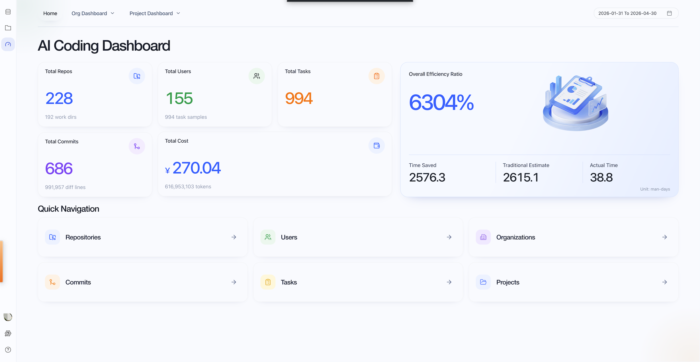

# CoStrict Cloud

**Official Cloud URL: [https://zgsm.sangfor.com/cloud](https://zgsm.sangfor.com/cloud)**

[CoStrict Cloud](https://zgsm.sangfor.com/cloud/workspace) is an **AI-powered cloud programming workspace** that lets you remotely connect to your personal devices (local or private servers) from any browser. It features conversational AI programming, project file management, multi-session persistence, and remote terminal collaboration — enabling **seamless browser-based remote development, real-time AI coding and debugging, and cross-device project continuity**.

## Quick Start

### 1. Sign In

**Official Cloud Entry: [https://zgsm.sangfor.com/cloud](https://zgsm.sangfor.com/cloud)**

Open the official cloud URL above to enter the web portal, then sign in to your personal account. If you are not signed in, click the **Sign In** button at the bottom of the left sidebar.

> **Important:**
> The CoStrict CLI command-line tool and the CoStrict Cloud web portal **must be signed in with the same account**. If the accounts do not match, the device will not appear in the web portal's device list.

### 2. Register a Device

On the personal computer or server you want to connect to remotely, first install the [CoStrict CLI tool](https://docs.costrict.ai/cli/guide/installation).

Sign in via CLI:

```bash
cs auth login
```

After signing in, run the device registration and startup command:

```bash
cs cloud start
```

> The first time you run `cs cloud start`, it will automatically pull dependency plugins and runtime components from the cloud. Please be patient while the automatic download and installation completes — no manual intervention is required.

Once registered, the device will automatically sync and appear in the **device list** in the left sidebar of the web portal.

### 3. Create a Workspace

1. Visit the default cloud URL: [https://zgsm.sangfor.com/cloud](https://zgsm.sangfor.com/cloud) and open the device list.
2. Find the registered online device and click the **"+" button** on the right side of the device card.
3. Select the target project directory on the device to create the workspace.
4. Each workspace **uniquely maps to an independent project directory** on the device. Multiple projects can be managed via separate, isolated workspaces.

### 4. Connect to a Workspace

When a workspace is in the **idle** state, click the **connect icon** on the right side of the workspace card to establish a remote connection.

Once connected, you can use the following core capabilities:

- **Remote Conversational Programming** — Interact with the AI assistant in real time for requirements, code generation, bug debugging, and logic refactoring.
- **Multi-Session Management** — Freely create, switch between, and revisit sessions with full conversation history preserved.
- **Remote Project Collaboration** — Browse, edit, and run code files on the remote device directly from the browser.
- **Built-in API Documentation** — The service comes with API documentation that can be accessed directly for debugging.

---

## Skill Store

🧩 Skill Store (Knowledge Hub)

URL: [https://zgsm.sangfor.com/cloud/store](https://zgsm.sangfor.com/cloud/store) — a one-stop platform for extending AI programming capabilities, offering four core types of extensions:

### 1. Four Modules

| Module | Purpose | Typical Scenarios |
|---|---|---|
| Skill | A capability package that encapsulates instructions, templates, and workflows for specific tasks, which the AI automatically matches and executes | Standardized processes such as requirements analysis, backend development, frontend design, and deployment operations |
| Sub-agent | An "expert role" focused on a single responsibility, callable by the main AI to collaborate on complex tasks | Role-based agents such as senior Java backend engineer, code audit expert, and test engineer |
| Command | Shortcut commands executable directly in the CLI / conversation, encapsulating scripts / command templates for common operations | One-click deployment, environment initialization, log troubleshooting, and other repetitive operations |
| MCP Server | A standardized tool connector based on the Model Context Protocol, allowing the AI to securely call external services / data | Connecting to external resources such as databases, third-party APIs, and cloud services |

### 2. Key Information on Skill Cards

- **Title / Description**: Explains the skill's purpose and scenario (e.g., azure-servicebus-py is a Python message queue development tool package).
- **Category**: Quickly filter by scenario (requirements analysis, backend development, frontend development, deployment operations, etc.).
- **Risk Level**: Marked as "No Risk / Low Risk / Medium Risk" to help judge suitability for production.
- **Tags**: Such as development design, for keyword-based filtering.
- **Source Platform / Score**: Indicates community source and popularity to identify high-quality resources.
- **Favorites / Update Time**: Reflects community recognition and maintenance status; prioritize recently updated, highly favorited skills.

### 3. Value

- **Out-of-the-box professional capabilities**: No need to write complex prompts; load with one click to give the AI professional capabilities in specific domains.
- **Reduce reinvention costs**: Reuse community-curated best practices to improve development efficiency.
- **Flexible workflow extension**: Through sub-agents and MCP servers, adapt the AI to complex business scenarios.

---

## Metrics Dashboard



### Core Value Proposition

Use real data to quantify the productivity gains from AI-assisted development, transforming "AI efficiency" from a subjective impression into a measurable, trackable, and optimizable productivity metric.

### Key Capabilities

1. **Automatic Collection, Zero Distraction**
   - The client automatically collects AI conversation data from the IDE and Git commit data; developers do not need to take any extra action.
2. **Intelligent Estimation, Dual-Track Comparison**
   - AI analyzes code complexity to estimate "time required for traditional development"
   - Combines time-series algorithms to calculate "actual time spent with AI assistance"
   - Automatically generates an efficiency ratio (traditional time / actual time)
3. **Multi-Dimensional Drill-Down**
   - Aggregate layer by layer: Task → Commit → Repository → Project → User → Organization
4. **Manual Calibration for Trustworthiness**
   - Supports manual correction of AI-estimated and actual time spent, with reasons recorded to ensure data reliability
5. **Virtual Groups and Multi-Level Organizations**
   - Supports custom virtual groups (e.g., cross-project teams)
   - Adapts to multi-level organizational structures (org1~org9) to meet the needs of large enterprises

> **Note:** The metrics dashboard involves organizational performance data. Contact your administrator to request access permissions.

---

## Common Operations

### Start the Cloud Service

After first-time registration or if the service has stopped, run the start command:

```bash
cs cloud start
```

### Restart the Cloud Service

If the device goes offline, connection becomes abnormal, or the service hangs, run the restart command:

```bash
cs cloud restart
```

### Normal Startup Log Example

```
➜  cs cloud start
  ✓ Device registered
  device_id: 21484ad96b82e1468cba65be0e55a666df1aba78834ffdeee19404a5e72b0ce9
  ✓ Device token validated
  → Starting daemon...
  ✓ cs-cloud started
  pid: 16571
  mode: cloud
  url: http://127.0.0.1:56973
  docs: http://127.0.0.1:56973/api/v1/docs
  logs: /User/user/.costrict/cs-cloud/app.log
```

Key information explained:

- `device_id`: Unique device identifier.
- `pid`: Background daemon process ID.
- `url`: Local service access address.
- `docs`: API documentation address.
- `logs`: Log file path, the key reference for troubleshooting.

---

## FAQ

### Q1: The CLI is running, but the device is not visible on the web portal?

**A1:**

1. Make sure you are accessing the default cloud URL: [https://zgsm.sangfor.com/cloud](https://zgsm.sangfor.com/cloud).
2. Verify that the account used for `cs auth login` is **exactly the same** as the web portal account.
3. Run `cs cloud restart` to restart the service and re-sync the device list.
4. Check whether the local network can access the cloud platform normally and that the firewall is not blocking the port.

### Q2: The first `cs cloud start` hangs or downloads slowly?

**A2:**

1. The first startup will automatically pull cloud plugins and dependencies. This is normal behavior.
2. Check the device's network connectivity and try switching networks if needed.
3. Do not manually interrupt the process; wait for the automatic initialization to complete.

### Q3: Workspace connection fails or drops frequently?

**A3:**

1. First, run `cs cloud restart` to restart the local daemon.
2. Check the log file at `~/.costrict/cs-cloud/app.log` for error messages.
3. Confirm that the local firewall or security group is not blocking the service port.

### Q4: How to troubleshoot errors, exceptions, or unavailable features?

**A4:**

For all exceptions, prioritize locating the cause via the **log file**. The log path is:

```
~/.costrict/cs-cloud/app.log
```

You can view full logs covering process start/stop, device authentication, network connections, and plugin loading to quickly identify the root cause.

### Q5: How do I view the local service address and API documentation?

**A5:**

After running `cs cloud start` successfully, the terminal will automatically output:

- Local service access address `url`
- API documentation address `docs`

Copy these directly into your browser to access them.

---

## Learn More

- Official Cloud Entry: [https://zgsm.sangfor.com/cloud](https://zgsm.sangfor.com/cloud)
- Try the Workspace Now: [CoStrict Cloud Workspace](https://zgsm.sangfor.com/cloud/workspace)
- Capability Extensions: [App Store — Skills / Sub-agents / MCP Servers](https://zgsm.sangfor.com/cloud/store)
- Official Docs & Updates: [costrict.ai](https://costrict.ai)
