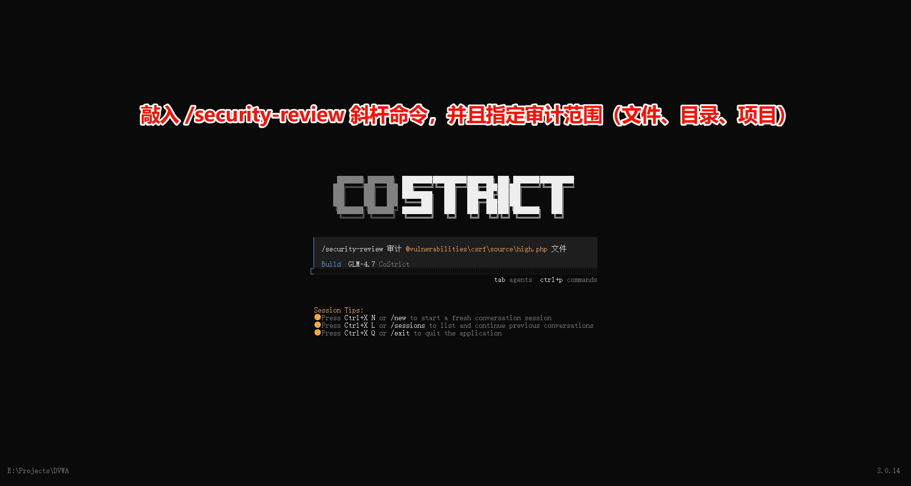
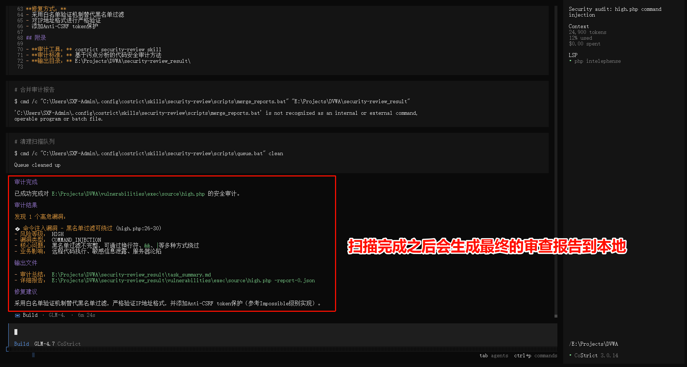

# Security Review

> CoStrict Security is a self-developed AI-powered security scanning tool that helps developers quickly identify security vulnerabilities and risks in their code.

## Installation Guide

For detailed download and installation steps, please visit: **[https://costrict.ai/download](https://costrict.ai/download)**

Three installation methods are supported:
- **CLI Command Line Tool** (version requirement: >= 3.0.15)
- **VSCode Plugin** (version requirement: >= 2.4.7)
- **JetBrains Plugin** (version requirement: >= 2.4.7, supports IDEA / PyCharm / WebStorm, etc.)

## How to Use

### Step 1: Enter Interactive Window

Enter the following command in the terminal to start CoStrict:

```bash
cs
```


### Step 2: Select Scan Target

After entering the security scan, the system will ask you what you want to scan:

| Option | Description |
|------|------|
| Current directory | Scan the current directory |
| Specific file | Scan a specific file |
| Specific directory | Scan a specific directory |



### Step 3: View Scan Report

After the scan is complete, the system generates a detailed security scan report, including:

- **Scan Summary**: The number of files scanned and the total number of issues found
- **Issue List**: Detailed information for each security issue
  - File path and line number
  - Severity level
  - Issue description
  - Fix suggestions



## Private Deployment Requirements

### Model Configuration

**Conversation Model** (shared by CoStrict Conversation, Code Review, and Security Review)

| Model Name | GPU Resources (Recommended) |
|---------|----------------|
| GLM-4.7-FP8 or GLM-4.7-Flash | 4 x H20 or 4 x RTX4090 |

### Backend Server Requirements

**Hardware Requirements**

| Configuration | Minimum Requirements |
|--------|---------|
| CPU | Intel x64 architecture, 16 cores |
| Memory | 32GB RAM |
| Storage | 512GB available space |

**Software Requirements**

| Software | Version Requirements |
|--------|---------|
| Operating System | CentOS 7+ or Ubuntu 18.04+ |
| Docker | 20.10+ |
| Docker Compose | 2.0+ |

### Deployment Documentation

For detailed deployment steps, please refer to: **[Deployment Checklist](https://docs.costrict.ai/plugin/deployment/deploy-checklist/)**

## Get Help

- Official website: https://costrict.ai
- Download page: https://costrict.ai/download
- Feedback: support@costrict.ai
