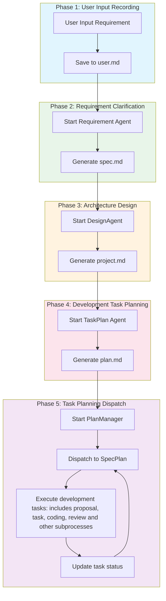

# StrictSpec Mode

StrictSpec mode is suitable for requirement development scenarios that require **rigorous specifications**, systematically completing feature development through **five strict phases**.

## Use Cases

StrictSpec mode is suitable for the following scenarios:

1. **New Feature Development** - New features that need to be planned and implemented from scratch
2. **Complex Requirements** - Complex requirements involving multiple modules that need architectural design
3. **Team Collaboration** - Team projects that require clear documentation and task lists

Note: This mode consumes a large amount of tokens and consists of multiple StrictPlan-like modes. For simple scenarios, it is recommended to use a single StrictPlan or build mode.

## Workflow Overview



## File System Structure

Complete file structure of StrictSpec mode:

```
.cospec/
├── spec/
│   └── {feature-name}/
│       ├── user.md       # Phase 1: User original input
│       ├── spec.md       # Phase 2: System requirement list
│       ├── project.md    # Phase 3: Overall design document
│       └── plan.md       # Phase 4: Execution plan tasks
│
└── plan/
    ├── changes/          # In-development/pending features
    │   └── {sub-feature-name}/
    │       ├── proposal.md
    │       └── task.md
    │
    └── archive/          # Archived completed features
        └── {completed-sub-feature-name}/
            ├── proposal.md
            └── task.md
```

## Selecting StrictSpec Mode

In the TUI interface, switch to StrictSpec mode using Tab, and use /new to start a new session to avoid historical context interference for better results

<!--  -->

## Input Requirement

You can directly input your requirements

<!--  -->

## Start Process

<!--  -->


## User Input Recording Phase

AI will record the user's original requirements in full to the user.md file

Output path: `.cospec/spec/{feature-name}/user.md`


<!--  -->

## Requirement Clarification Phase

AI will start the Requirement agent for requirement design, transforming vague ideas into structured requirement documents

### Requirement Clarification

The Requirement agent will ask questions to clarify requirements as needed:

<!--  -->

It is recommended to use left/right arrow keys `←` `→` or mouse click to switch questions to avoid accidentally switching modes with Tab. After selecting each question, switch to Confirm and press Enter to submit

<!--  -->

### Output Document

Output path: `.cospec/spec/{feature-name}/spec.md`

### Output Requirement Document

<!--  -->

## Architecture Design Phase

AI will start the DesignAgent agent for architecture design, transforming requirements into implementable technical solutions

### Workflow

DesignAgent performs architecture design based on the C4 Model methodology:

1. **System Context Modeling (L1)** - Describe the relationship between the system and the external world
2. **Container Modeling (L2)** - Decompose the main technical units within the system
3. **Component Modeling (L3)** - Dive into containers, decompose components and module structures
4. **Code Design (L4)** - Perform code-level design for core complex logic (when necessary)
5. **Key Decision Records (ADR)** - Record architecture decisions

### Phase Interaction

DesignAgent will display the architecture design diagram to the user and request confirmation:

<!--  -->

### Output Document

Output path: `.cospec/spec/{feature-name}/project.md`

The document includes:

- System Context Diagram (C4 Context)
- Container Diagram (C4 Container)
- Component Diagram (C4 Component)
- Architecture Decision Records (ADR)

<!--  -->

## Development Task Planning Phase

AI will start the TaskPlan agent for task planning, transforming design solutions into development task lists

### Workflow

TaskPlan is responsible for transforming requirement documents and design documents into high-level task planning:

1. **Parse Input Documents** - Read spec.md and project.md
2. **Create Task List** - Create corresponding task entries for each sub-requirement
3. **Generate plan.md Document** - Output task list using checkbox format

### Output Document

Output path: `.cospec/spec/{feature-name}/plan.md`

<!--  -->

## Task Planning Dispatch Phase - SpecPlan Mode

AI will start the PlanManager agent for task dispatch, distributing development tasks to SpecPlan for execution

### Workflow

1. **Understand Global** - Deeply understand task planning (plan.md)
2. **Task Dispatch** - Distribute development tasks to SpecPlan for execution
3. **Decision Response** - Handle issues fed back by SpecPlan, make technical decisions or adjust tasks
4. **Progress Tracking** - Maintain plan.md, accurately record task completion status

### Dispatch Tasks

PlanManager will determine dispatch strategy based on task correlation and dependencies:

- **Low correlation** tasks are dispatched separately
- **High correlation** multiple tasks can be dispatched together (such as creating different parts of the same page)

<!--  -->

### Progress Update

After each task is completed, PlanManager will immediately update the plan.md file, marking the task as completed (`- [x]`)

<!--  -->

## Implement Tasks

After PlanManager starts SpecPlan, SpecPlan will refine tasks into specific coding steps and execute them

### Workflow

1. **Code Exploration** - Explore current code based on current sub-feature name to find modification solutions
2. **Generate Change Proposal** - Generate `.cospec/plan/changes/{sub-feature-name}/proposal.md`
3. **Generate Coding Task** - Generate `.cospec/plan/changes/{sub-feature-name}/task.md`
4. **Check Coding Task** - Secondary check of `task.md` format and content
5. **Start Coding** - Dispatch and execute development tasks in `task.md`
6. **Check Coding** - Check completion of development tasks in `task.md` and add completion tags
7. **Sub-feature Document Archiving** - If all completed, archive to `.cospec/plan/archive/{sub-feature-name}`

<!--  -->

### Generate Proposal

<!--  -->

### Generate Coding Task

<!--  -->

## Coding Complete

All tasks in plan.md are marked as complete

<!--  -->
