# Casdoor Basic Configuration Guide

This document describes how to configure Casdoor from scratch. Most configurations in this tutorial are already set up after installation. If you need to add users, refer to the **Add Users** section.

<span style={{color: 'red', fontWeight: 'bold'}}>Reminder again, this tutorial is an example of configuring Casdoor from scratch. Currently, Casdoor has built-in organizations and users related to costrict. You only need to add users to the costrict organization.</span> (The names of organizations and users may change due to version updates. As long as you see two organizations, the built-in organization is the admin group and can be ignored, and the other organization is the one for costrict users.)

## Configuration Page

### Accessing the Configuration Page

Visit http://\{COSTRICT_BACKEND\}:\{PORT_CASDOOR\} to access the admin login page.

```commandline
Default username: admin
Default password: 123
```

Then proceed to the admin dashboard.

## Add Organization

The organization you create here will store all CoStrict users. The organization name is not critical and can be customized.

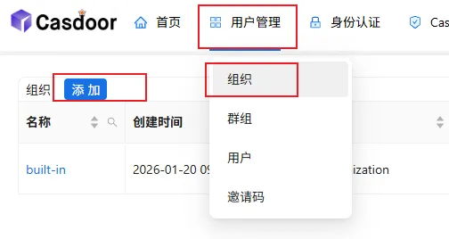

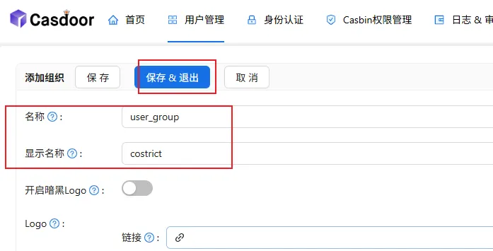

## Add Application

This will be the application used for CoStrict login. The application name is not critical and can be customized.

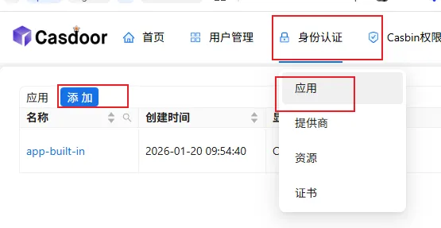


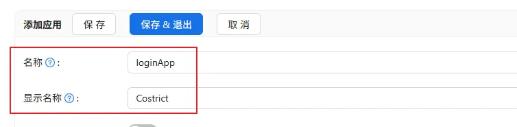


> The Client ID and Client Secret correspond to the `OIDC_CLIENT_ID` and `OIDC_CLIENT_SECRET` variables in the deployment directory's `configure.sh`, for example(Note that these two IDs must be consistent with those in the OIDC configuration. Please refer to the OIDC authentication-related configuration in the deployment directory.):

```
9e2fc5d4fbcd52ef4f6f
ab5d8ba28b0e6c0d6e971247cdc1deb269c9eea3
```

> The organization field should be set to the organization created in the previous step.

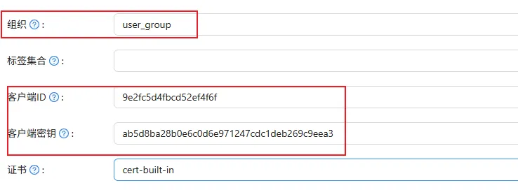


For the redirect URLs, update the IP and port to match the `COSTRICT_BACKEND_BASEURL` IP and port defined in the deployment directory's `configure.sh` file. (Note: choose http or https based on your setup. Following this tutorial completely means using http — use the actual IP and port, not variables.)

One-click deployment sets a wildcard by default. For better security, you may update this accordingly.

```
http://ip:port/oidc-auth/api/v1/plugin/login/callback
http://ip:port/oidc-auth/api/v1/manager/bind/account/callback
http://ip:port/oidc-auth/api/v1/manager/login/callback
```

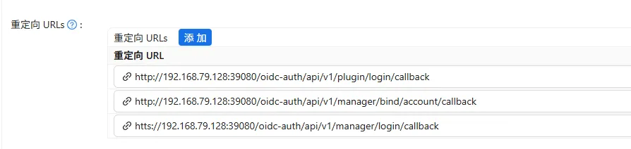

> Finally, save the current application.

## Add Users

Navigate to the organization's user list, then click Add.

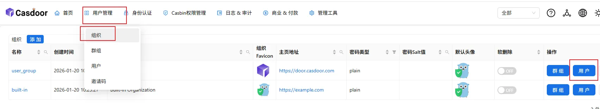

Add a demo user and click Save & Exit.

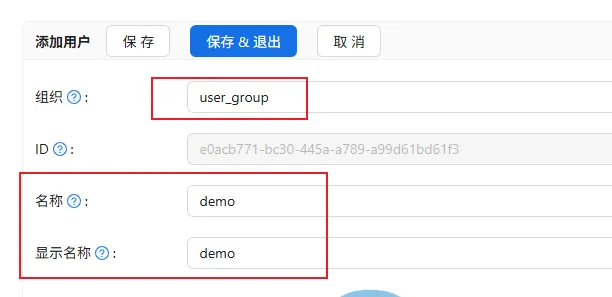

After adding, you can update the password:

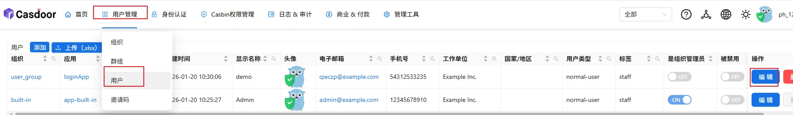

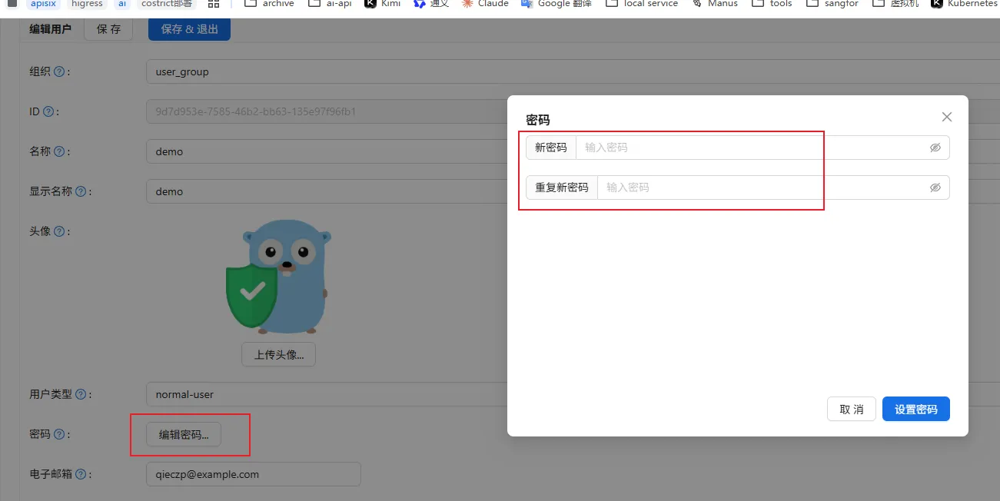


If you need to import users in bulk, refer to the official documentation: [Import Users from XLSX File](https://www.casdoor.org/docs/user/overview/#import-users-from-xlsx-file)

> Configuration is complete. You can now log in to CoStrict (not Casdoor) using the demo user. 

## Integrating with Third-Party Authentication Systems

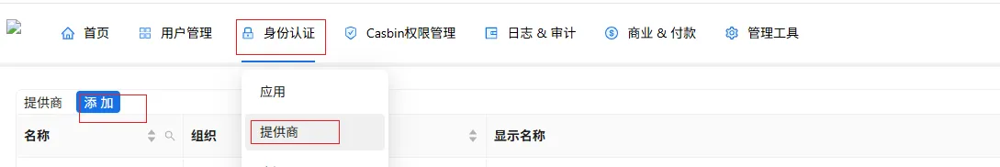

Please configure according to the actual situation. The client ID and client secret can be set the same as those in the organization.
