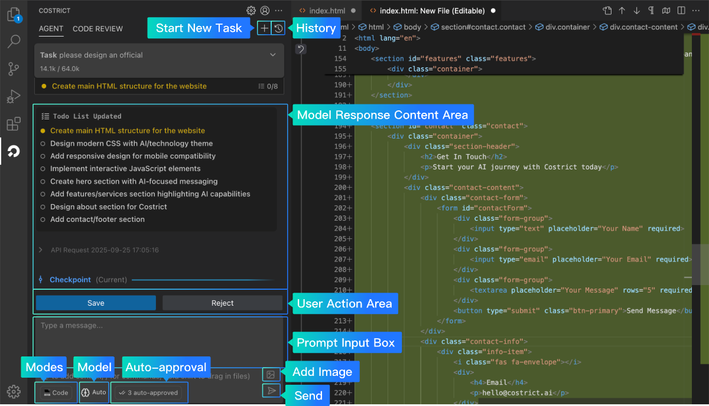
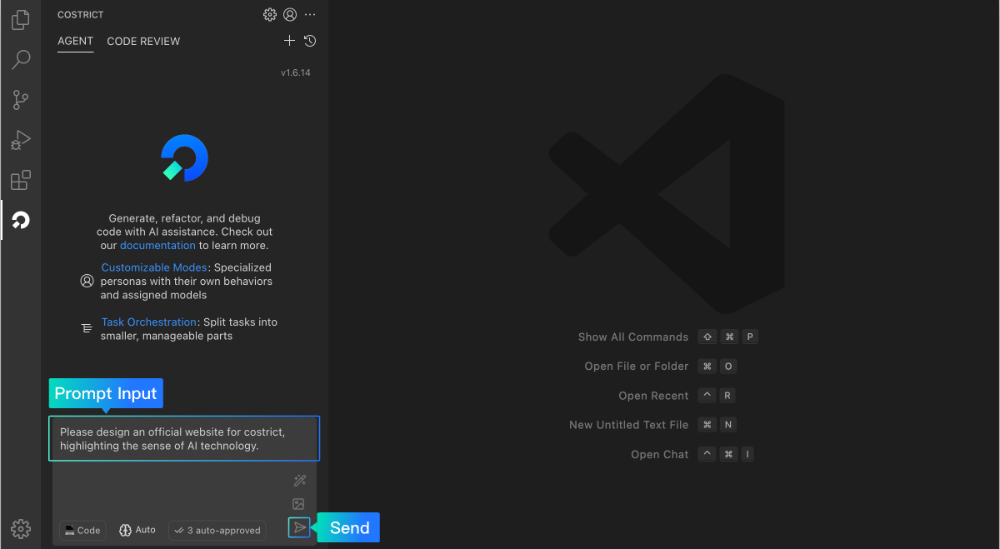
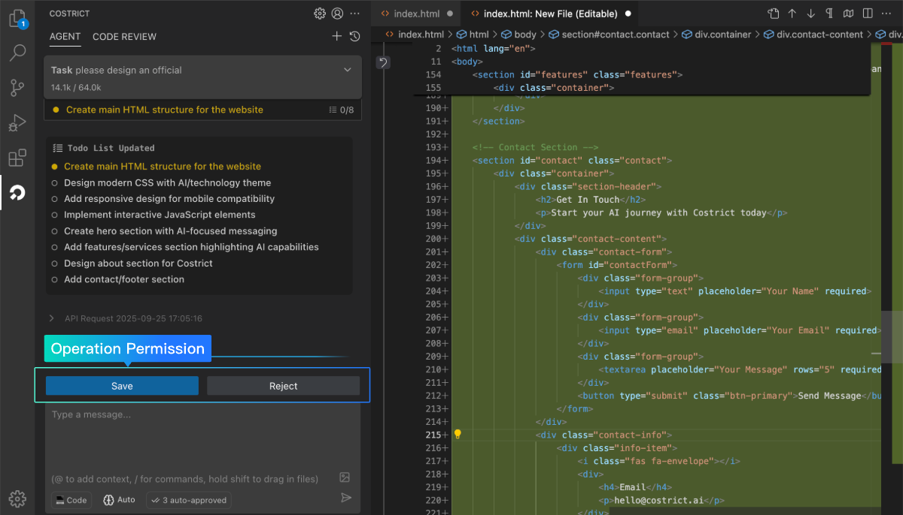
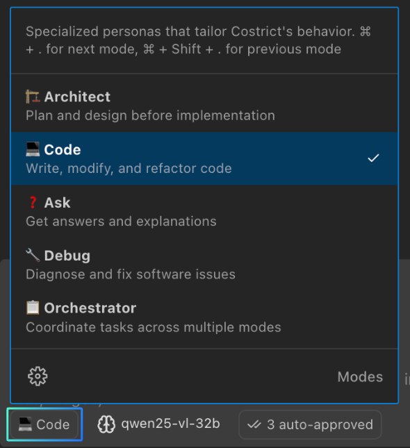
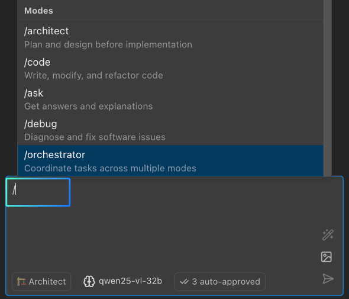
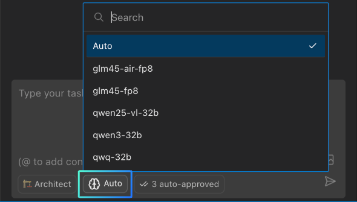

### AI Agent

Users only need to describe their requests in natural language, and the AI Agent can complete tasks end-to-end based on requirements. It is powerful, intelligent, and controllable. Capabilities include: autonomous decision-making, full repository context retrieval, tool calling, error fixing, terminal operation, and more.

## Intelligent AI Agent

When you encounter doubts during coding, you can use the Intelligent AI Agent. It can help answer questions, quickly generate code, add code comments, optimize code, explain code, fix code issues, troubleshoot compilation errors, and more.

AI Agent Interface Elements

## Start a Conversation Quickly

1. Open the `Costrict` plugin; it defaults to Agent dialogue mode.
2. Locate the dialog box, enter your command, and send it. For example: "Help me generate a Snake game"; "Optimize the current code," etc.
3. Wait for the model to return results. If you encounter permission issues related to local file access, running commands, file saving, browser access, etc., please approve them as needed.

## Context

Context provides Costrict with specific information about your project, enabling it to perform tasks more accurately and efficiently. You can use context to `reference files`, `folders`, `issues`, `URL`, `Git commits`, and more.

Use the shortcut `@` to invoke context.

**Overview**

**Image Context**

When you need to generate code based on images, fix issues, or create graphical expressions, click the button below the dialog box to add image context. The availability of this feature depends on whether the model supports images. If the model does not support images, this function will be unavailable.

To check a model's image support, go to: `Settings > Providers` page, and view the `Model` description information.

## Modes

Modes in Costrict are personalized roles designed for specific tasks. Each mode offers different functions, excels in different areas, and has varying access permissions. Users can make choices based on their specific situation. If you are unfamiliar with these modes, it is recommended to use the Orchestrator mode, which automatically assigns the appropriate mode based on the task type.

There are two ways to select a mode: Method 1: Click the first button at the bottom of the input box to manually select a mode. Method 2: Use the shortcut / in the input box to quickly invoke the mode function.

**Mode Function Introductions**

**Architect**

**Code**

**Ask**

**Debug**

**Orchestrator**

**Mode Customization Settings**

Costrict supports customizing existing modes or creating new ones. You can define the mode name, API, role definition, rule constraints, and accessible tools.

## Model Selection

The Costrict plugin provides multiple models for users to use free of charge. The latest version of Costrict introduces an `Auto mode`. For new users without specific model preferences, using this mode is recommended. `Auto mode` comprehensively considers the effectiveness, speed, and Credit consumption of the current model list, intelligently selecting the most suitable model to complete the task based on the task type. Click the second button below the input box to switch models.

