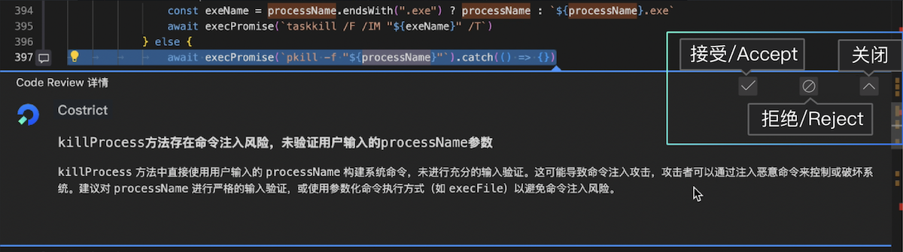
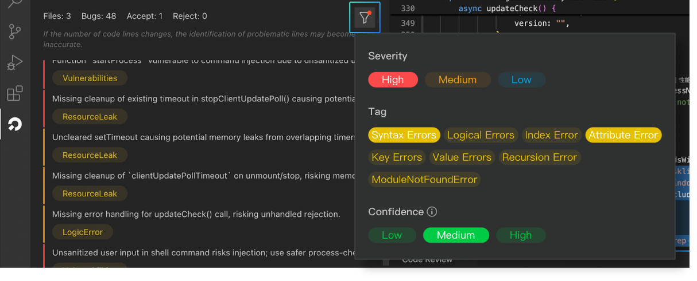

# Code Review

CoStrict Code Review is an intelligent code quality inspection tool that precisely covers four categories of defects: logical defects, security vulnerabilities, static defects, and memory issues. It provides complete defect tracing with actionable fix recommendations, making your coding more focused and your submissions more confident.

## How to Use

### Interactive Scan

#### Scan Methods

##### Method 1: Scan Code File

In the file explorer, **right-click on a file** and select **CoStrict > Code Review** to perform a code scan on the entire file.

##### Method 2: Scan Selected Code Snippet

In the editor, **select a code snippet**, then **right-click** and choose **Code Review** to scan the selected code.

##### Method 3: Scan Code Changes

Click the **CoStrict icon** on the left sidebar, switch to the **Code Scan** page, and scan code changes in the current workspace.

#### Scan Report

##### View Report

After the scan is complete, results are displayed in the sidebar panel, including:

- **Scan Summary**: The number of files scanned and the total number of issues found
- **Issue List**: Detailed information for each security issue
  - File path and line number
  - Severity level
  - Issue description
  - Fix suggestions

##### Handle Defects

Click on an issue to view details in the code editor. We encourage users to click the buttons in the top-right corner of the detail card according to the actual situation. There are three buttons: `Accept`, `Reject`, and `Close`:

- **Accept**: Indicates that you agree with the issue identified by the AI
- **Reject**: Indicates that you believe this is not an issue or the output is incorrect
- **Close**: Closes the current detail window

## Execution Process & Results

After triggering a code review, the CODE REVIEW panel in CoStrict will display the real-time progress. The scanning duration is proportional to the amount of code being processed, ranging from a few seconds to several tens of minutes.

The review results will be displayed as a list. Accodring to the title description,  the color bar on the left , and the issue labels.
You can get a general overview of the issues and its severity.

Three color bars—red, yellow, and blue—correspond to the severity levels: high, medium, and low. Click on an issue to view details in the code editor. The corresponding problematic code line will be automatically located and highlighted`. A pop-up window below the issue line displays detailed information.

In order to make the Codereview feature more intelligent and better trained for future use, we encourage users to click the buttons in the top-right corner of the detail card according to the actual situation. There are three buttons: `Accept`, `Reject,` and `Close`.
- Accept: Indicates that you agree with the issue identified by the AI.

- Reject: Indicates that you believe this is not an issue or the output is incorrect, and you do not agree with the result.

- Close: Closes the current detail window.

## Filter Conditions

Code Review supports filtering issues based on three dimensions: severity, issue labels, and confidence level.

- **Severity**: High, medium, low, corresponding to the color bars on the left side of the issue list: red, yellow, blue.

- **Labels**: The AI automatically categorizes and tags issues based on their descriptions. Typically, an issue will have one or more tags. Common issue label types include: syntax errors, logic errors, memory leaks, security vulnerabilities, etc.

