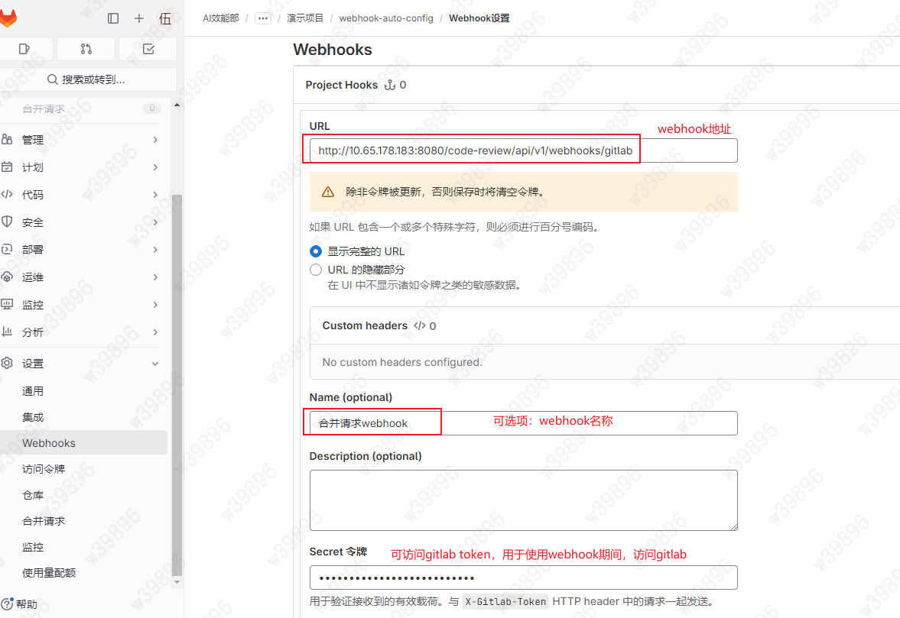
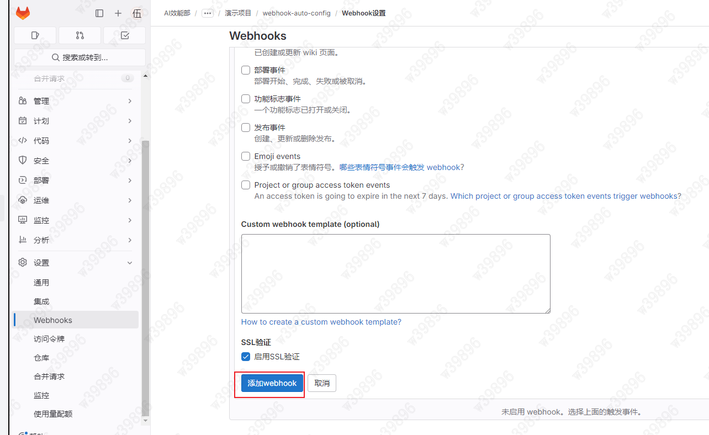

# 企业集成 (Enterprise Integration)

Supports deep integration with enterprise GitLab for automated quality review of merge requests, flexibly adapting to personal development and team collaboration workflows (for private deployment only)

## 创建访问令牌

**Note:** After generating the token, do not close the page immediately. Once the page is refreshed or closed, the token cannot be retrieved again.

## 配置 Webhook

- Configuration entry:

- Required parameters:

Webhook URL: `https://xxx/code-review/api/v1/webhooks/gitlab`

Secret Token: Use the token created above, **can be left blank**

**Return 200 indicates successful test**
