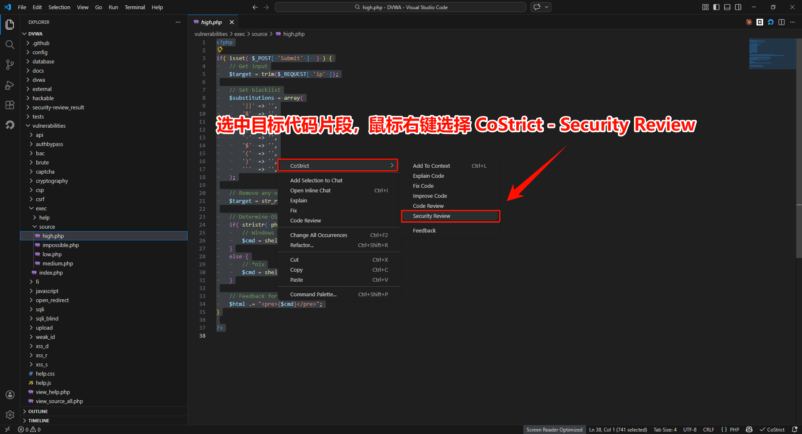
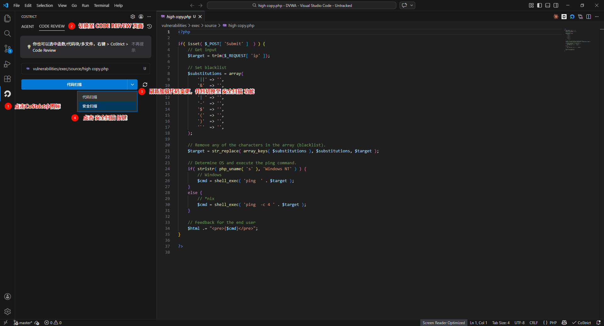

# Quick Start

> CoStrict Security is a self-developed AI-powered security scanning tool that helps developers quickly identify security vulnerabilities and risks in their code.

## System Requirements

| Installation Method | Version Requirement | Supported Platforms |
|---|---|---|
| VSCode Plugin | >= 2.4.7 | VSCode |
| JetBrains Plugin | >= 2.4.7 | IDEA / PyCharm / WebStorm, etc. |

## How to Use

Perform interactive security scans through the IDE during the coding phase, providing real-time assistance to developers in identifying and fixing security issues.

- Supports conversational interaction windows for instant communication and quick issue localization
- Can incorporate prior knowledge (such as business context, threat models, etc.) to improve detection accuracy
- Displays model reasoning process so you know exactly why an issue was reported

### Scan Methods

#### Method 1: Scan Code File

In the file explorer, **right-click on a file** and select **CoStrict > Security Review** to perform a security scan on the entire file.

<!-- TODO: Add screenshot - Scan code file -->

#### Method 2: Scan Selected Code Snippet

In the editor, **select a code snippet**, then **right-click** and choose **Security Review** to scan the selected code.

<!-- TODO: Add screenshot - Scan code snippet -->

#### Method 3: Scan Code Changes

Click the **CoStrict icon** on the left sidebar, switch to the **CODE REVIEW** page, and select **Security Review** to scan code changes in the current workspace (such as Git diffs).

<!-- TODO: Add screenshot - Scan code changes -->

### Scan Report

After triggering a security review, the AGENT panel displays the scanning process in real time. During the scan, any dangerous operations require manual user confirmation before proceeding. The scanning duration is proportional to the amount of code being processed, ranging from a few minutes to several tens of minutes. Once the scan is complete, a security review report is generated locally in the project. The report includes the following three types:

| Report File | Type | Description |
|---|---|---|
| `task_summary.md` | Summary Report | A human-readable summary for developers, including scan overview and issue summary |
| `[target_file]-report-[vulnerability_index].json` | Per-File Vulnerability Report | Detailed vulnerabilities for individual files, suitable for integration into custom review workflows |
| `full_report.jsonl` | Combined Report | A consolidated file of all scan results in JSONL format, suitable for engineering workflow integration |

