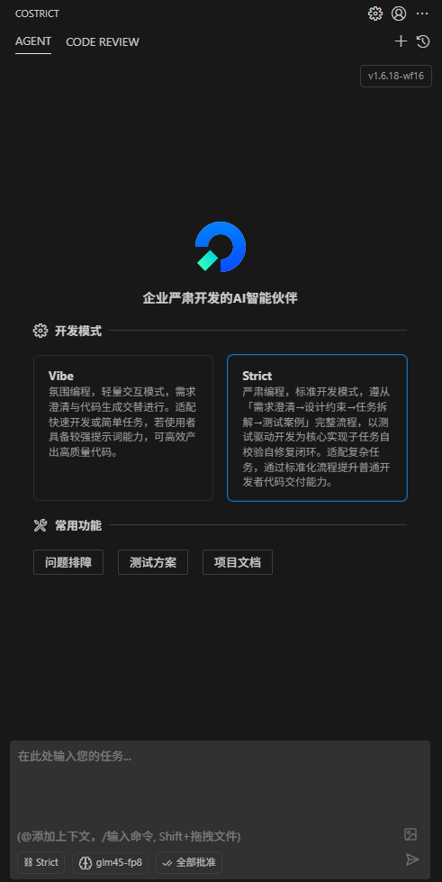
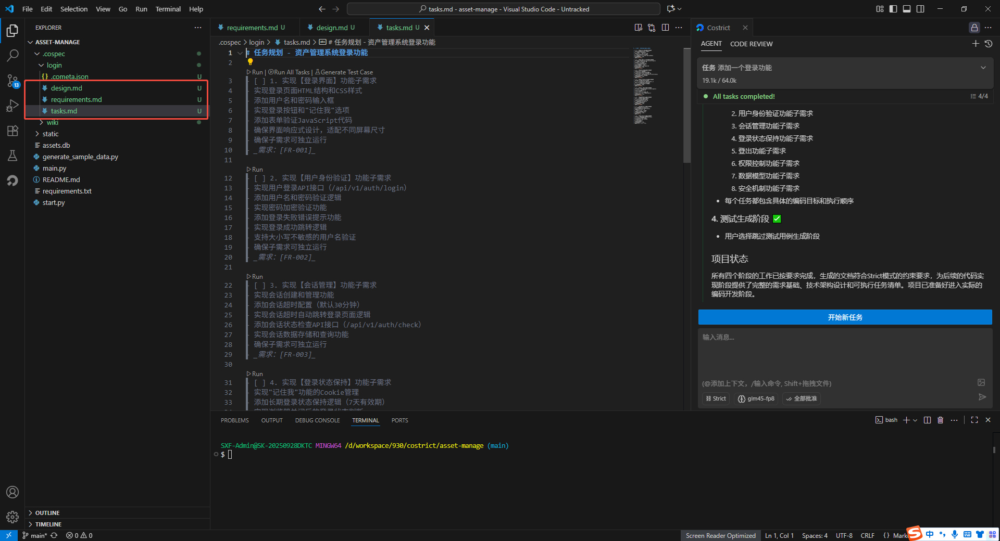
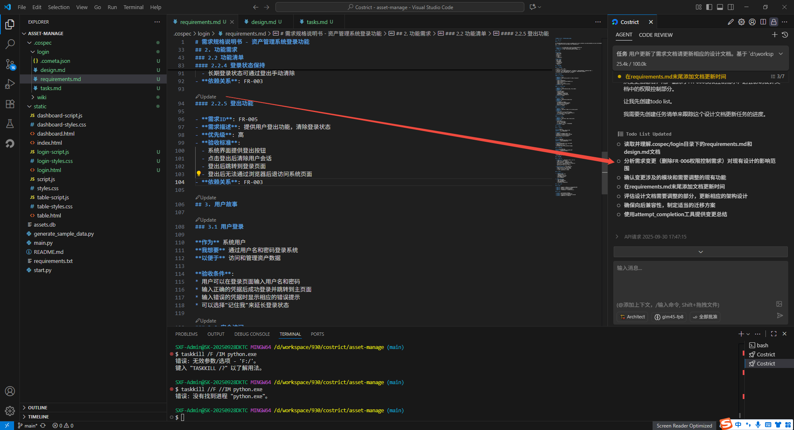

# 严格模式（Strict Mode）

Strict模式是一种结构化、系统化的开发模式，它严格遵循企业开发流程规范，通过项目理解、需求澄清、任务拆解、测试自校验自修复等环节，帮助AI更好地理解企业业务，不断提高AI编码质量，让AI编程的重心从代码生成速度转向代码生成质量，从而实现真正的提效。

------------------------------------------------------------------------

# 新增Strict模式，加强对已有项目的理解，让AI编程更可靠

本次更新中，我们引入了Vibe和Strict两种开发模式，以满足不同场景的开发需求。

### 1.1 Strict模式

Strict模式即严肃编程模式，遵从**「项目反推→需求澄清→设计→任务拆解→测试自校验自修复」**流程，能有效帮助AI准确地理解已有项目的依赖关系，复用已有的代码规范，通过标准化流程提升AI交付质量，**生成可用性更强的代码。**

值得注意的是，Strict模式下的Token消耗量较大，推荐用于**"老代码加新特性"等复杂任务场景。**

### 1.2 Vibe模式

Vibe模式沿用了此前的开发模式，需求澄清与代码生成交替进行，**适合快速开发或简单任务场景，**若使用者具备较强提示词能力，仍可通过Vibe模式产出高质量代码。

------------------------------------------------------------------------

## 内置多个增强生成效果的智能工具，提高编码质量

Costrict内置多项增强生成效果的智能工具，包括项目理解、测试方案与问题排障。

### 2.1 项目理解

大模型生成「适配AI读取」的项目知识库与规则（Rules），帮助AI理解业务，提升代码生成准确度。可同时使用于Strict模式和Vibe模式。

### 2.2 测试方案

分析并生成项目测试方案，可同时使用于Strict模式和Vibe模式。

### 2.3 问题排障

输入问题日志或故障描述，AI协助定位问题根源，提供修复方案。

详细使用教程参见[Costrict
2.0版本用户手册](../../best-practices/user-manual)

## 支持智能化协作流程，让开发更高效更可控

Strict模式支持任务过程的可视化与可编辑，开发者可在执行过程中直接修改文档，与AI实时协作。整个流程遵循「需求澄清
→ 设计 → 任务拆解 →
测试自校验自修复」的自动化链路，当需求文档更新后，可一键同步至设计与实现阶段。同时，拆分后的子任务可独立执行与测试，使整体流程更高效、更可控。

------------------------------------------------------------------------

### 3.1 任务过程可视化、可编辑

执行过程中可以编辑相应文档，与AI相互协作。

### 3.2 流程自动同步

遵从「需求澄清→设计→任务拆解→测试自校验自修复」流程，当更新需求文档，点击更新可以自动同步到设计。

### 3.3 子任务独立执行

由需求拆分后的对应的每个任务可独立执行、测试、任务更可控。

#  获取Costrict 2.0版本

打开VS Code，点击插件市场，搜索Costrict，更新插件。

# 注意事项

1.  由于Strict模式下token消耗大，使用前请确保是否有足够的模型token。

2.  为保障生成效果，建议使用GLM4.5或GLM4.6模型

------------------------------------------------------------------------
