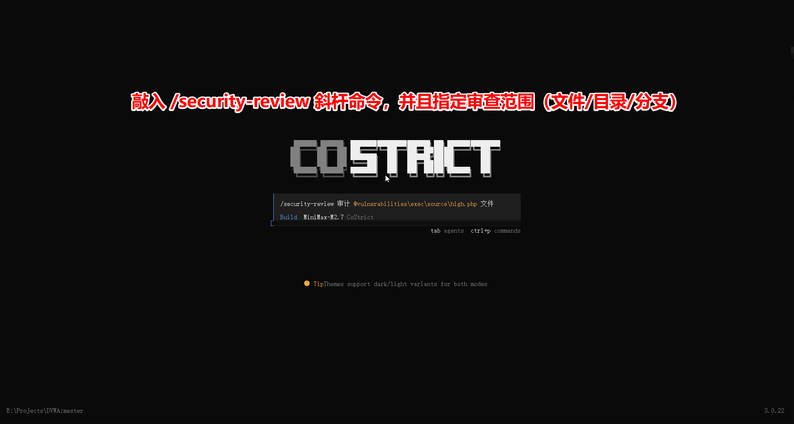
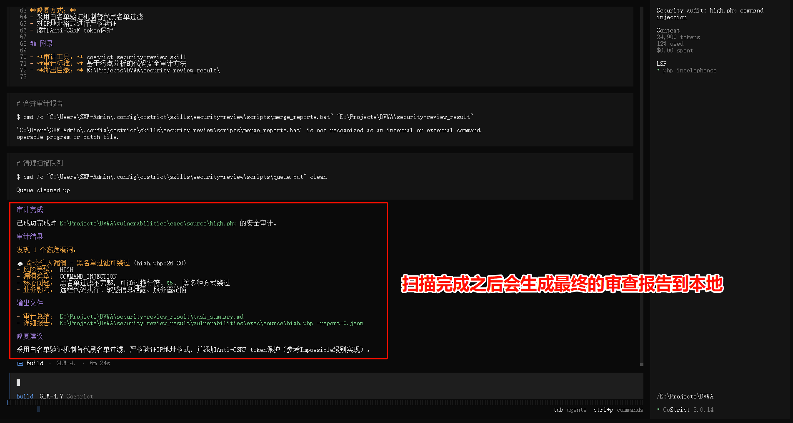

# 快速上手

CoStrict Security 是一款自研的 AI 驱动安全扫描工具，精准覆盖注入攻击、越权访问、敏感信息泄露、不安全配置等常见安全漏洞，并提供完整的风险溯源与可执行的修复建议，让你在代码上线前有效消除安全隐患。

## 系统要求

| 安装方式 | 版本要求 | 支持平台 |
|---|---|---|
| CLI 命令行工具 | ≥ 3.0.15 | CLI 终端 |

## 使用方式

### 交互扫描

在编码阶段通过 IDE 进行交互式安全扫描，实时辅助开发人员发现并修复安全问题。

- 支持对话式交互窗口，随时沟通、快速定位问题
- 可结合业务上下文、威胁模型等先验知识，让检测结果更精准
- 展示模型推理过程，让你清楚知道为什么报这个问题

#### 步骤 1：进入交互窗口

在终端中输入以下命令启动 CoStrict：

```bash
cs
```


#### 步骤 2：指定审查范围

进入安全扫描后，系统会询问您想要扫描的内容，支持以下三种审查范围：

| 范围 | 说明 |
|------|------|
| 指定文件 | 扫描指定的单个文件，适用于针对特定文件的安全排查 |
| 指定目录 | 扫描指定目录及其子目录下的所有代码文件，适用于审查指定模块或组件 |
| 指定分支 | 扫描指定 Git 分支的代码变更，适用于审查待合并的分支代码 |



#### 步骤 3：查看扫描报告

扫描完成后，系统会生成详细的安全扫描报告，包括：

- **扫描摘要**：扫描的文件数量和发现的问题总数
- **问题列表**：每个安全问题的详细信息
  - 文件路径和行号
  - 严重级别
  - 问题描述
  - 修复建议


