# StrictSpec模式

StrictSpec模式适合需要**严谨规范**的需求开发场景，通过**五个严格阶段**系统化完成特性开发。

## 适用场景

StrictSpec模式适合以下场景：

1. **新功能开发** - 需要从零开始规划和实现的新功能
2. **复杂需求** - 涉及多个模块、需要架构设计的复杂需求
3. **团队协作** - 需要清晰文档和任务清单的团队项目

注意:该模式消耗token量大，由多个类StrictPlan模式构成，简单场景建议用单个StrictPlan或build模式。

## 工作流程概览

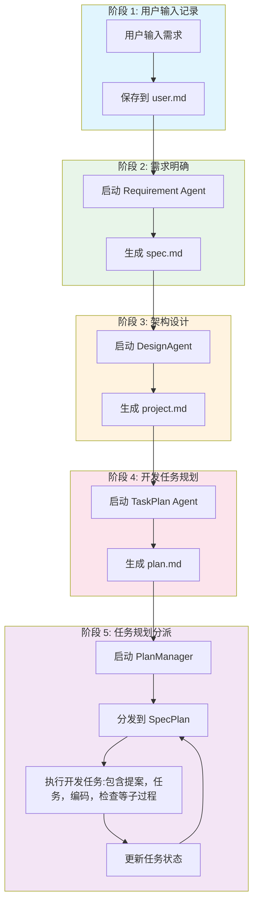

## 文件系统结构

StrictSpec模式的完整文件结构：

```
.cospec/
├── spec/
│   └── {功能名}/
│       ├── user.md       # 第一阶段：用户原始输入
│       ├── spec.md       # 第二阶段：系统需求清单
│       ├── project.md    # 第三阶段：总体设计文件
│       └── plan.md       # 第四阶段：执行计划任务
│
└── plan/
    ├── changes/          # 开发中/待开发功能
    │   └── {子功能名}/
    │       ├── proposal.md
    │       └── task.md
    │
    └── archive/          # 已归档完成的功能
        └── {已完成子功能名}/
            ├── proposal.md
            └── task.md
```

## 选择StrictSpec模式

在TUI界面中，Tab切换到StrictSpec模式，并使用/new开启新会话，避免历史上下文影响，以便取得更好效果

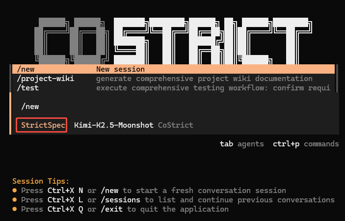

## 输入需求

可以直接输入你的需求

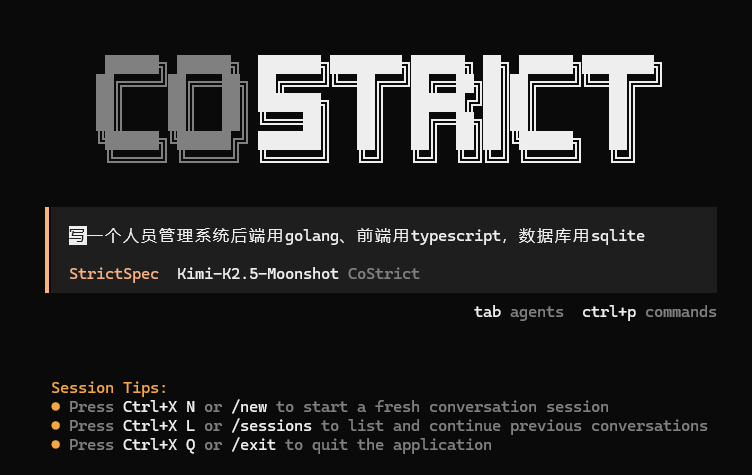

## 启动流程

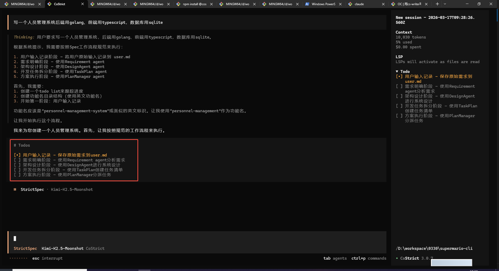


## 用户输入记录阶段

AI会将用户原始需求完整记录到user.md文件中

输出路径：`.cospec/spec/{功能名}/user.md`


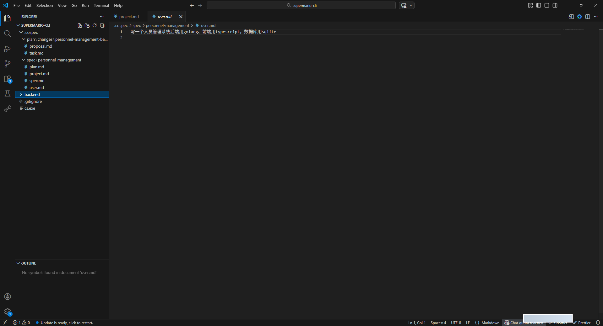

## 需求明确阶段

AI会启动Requirement agent进行需求设计，将模糊想法转化为结构化需求文档

### 需求澄清

Requirement agent会根据需要向用户提问澄清需求：

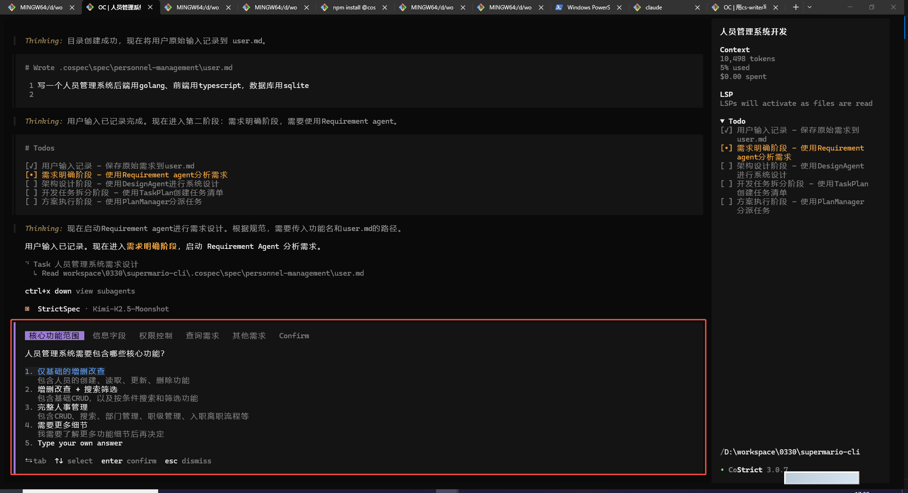

切换问题推荐用左右键`←` `→`或者鼠标点击，以免用Tab误触切换了模式。每个问题选择后切换到Confirm按Enter提交

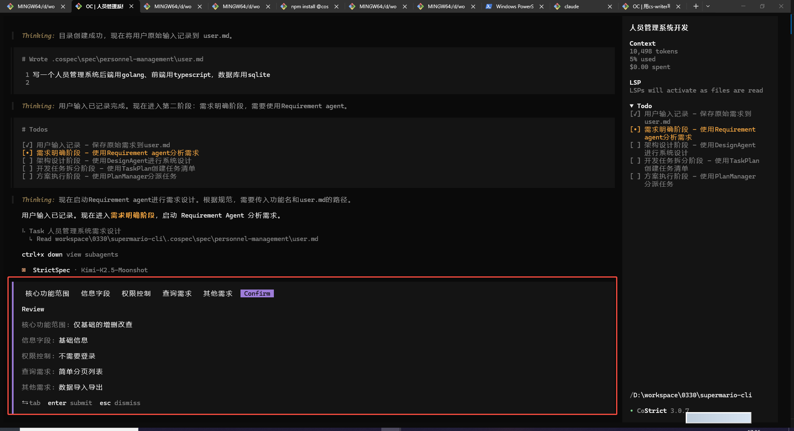

### 输出文档

输出路径：`.cospec/spec/{功能名}/spec.md`

### 输出需求文档

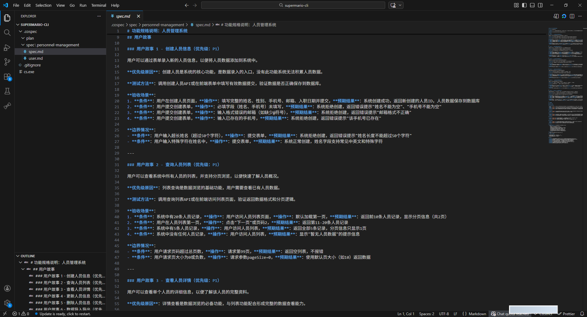

## 架构设计阶段

AI会启动DesignAgent agent进行架构设计，将需求转化为可落地技术方案

### 工作流程

DesignAgent基于C4 Model方法论进行架构设计：

1. **System Context建模（L1）** - 描述系统与外部世界的关系
2. **Container建模（L2）** - 分解系统内部的主要技术单元
3. **Component建模（L3）** - 深入容器内部，分解组件与模块结构
4. **Code设计（L4）** - 对核心复杂逻辑进行代码级设计（必要时）
5. **关键决策记录（ADR）** - 记录架构决策

### 阶段交互

DesignAgent会向用户展示架构设计图，并征求确认：

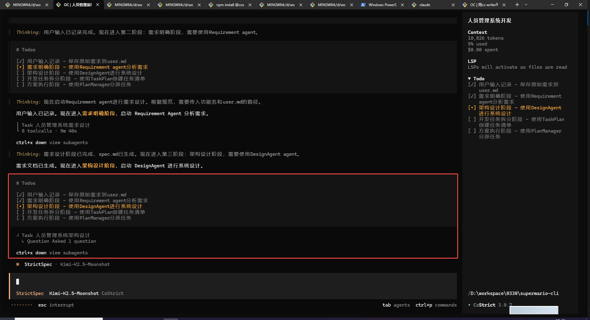

### 输出文档

输出路径：`.cospec/spec/{功能名}/project.md`

文档包含：

- 系统上下文图（C4 Context）
- 容器图（C4 Container）
- 组件图（C4 Component）
- 架构决策记录（ADR）

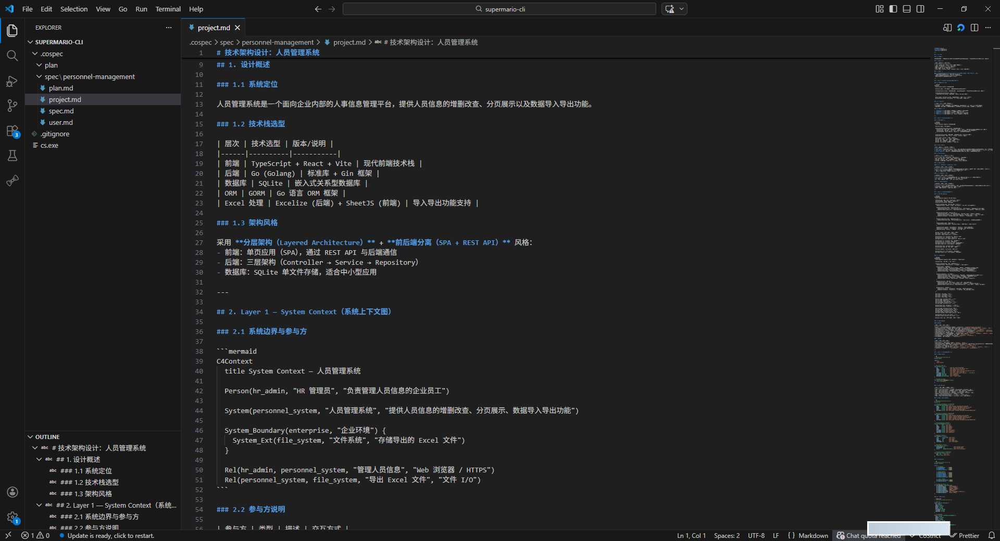

## 开发任务规划阶段

AI会启动TaskPlan agent进行任务规划，将设计方案转化为开发任务清单

### 工作流程

TaskPlan负责将需求文档和设计文档转化为高层次的任务规划：

1. **解析输入文档** - 读取spec.md和project.md
2. **制定任务清单** - 为每个子需求创建对应的任务条目
3. **生成plan.md文档** - 使用复选框格式输出任务清单

### 输出文档

输出路径：`.cospec/spec/{功能名}/plan.md`

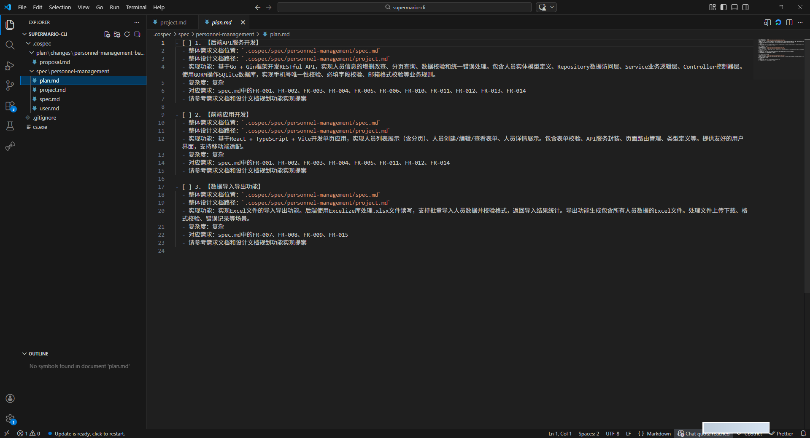

## 任务规划分派阶段-SpecPlan模式

AI会启动PlanManager agent进行任务分派，将开发任务分发给SpecPlan执行

### 工作流程

1. **理解全局** - 深入理解任务规划（plan.md）
2. **任务分发** - 将开发任务分发给SpecPlan执行
3. **决策响应** - 处理SpecPlan反馈的问题，做出技术决策或调整任务
4. **进度追踪** - 维护plan.md，准确记录任务完成状态

### 分发任务

PlanManager会根据任务的关联性和依赖关系决定分发策略：

- **关联性不高**的任务单独分发
- **强关联性**的多个任务可一起分发（如创建同一个页面的不同部分）

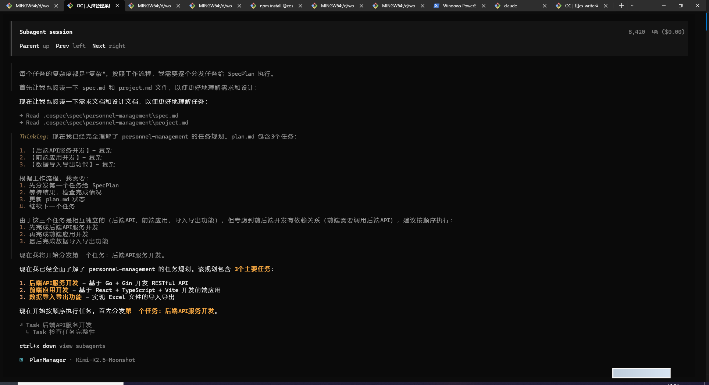

### 进度更新

每个任务完成后，PlanManager会立即更新plan.md文件，将任务标记为已完成（`- [x]`）

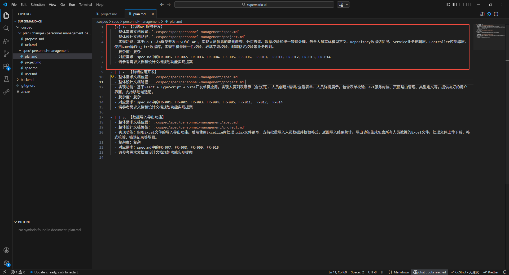

## 实施任务

PlanManager启动SpecPlan后，SpecPlan会将任务细化为具体的编码步骤并执行

### 工作流程

1. **代码探索** - 根据当前子功能名对当前代码进行探索，寻找修改方案。
2. **生成变更提案** - 生成`.cospec/plan/changes/{子功能名}/proposal.md`
3. **生成编码任务** - 生成`.cospec/plan/changes/{子功能名}/task.md`
4. **检查编码任务** - 二次检查`task.md`格式及内容
4. **开始编码** - 分发并执行`task.md`中开发任务
4. **检查编码** - 检查`task.md`开发任务完成情况，并打上完成标签
5. **子功能名文档归档** - 如全部完成，则归档到`.cospec/plan/archive/{子功能名}`

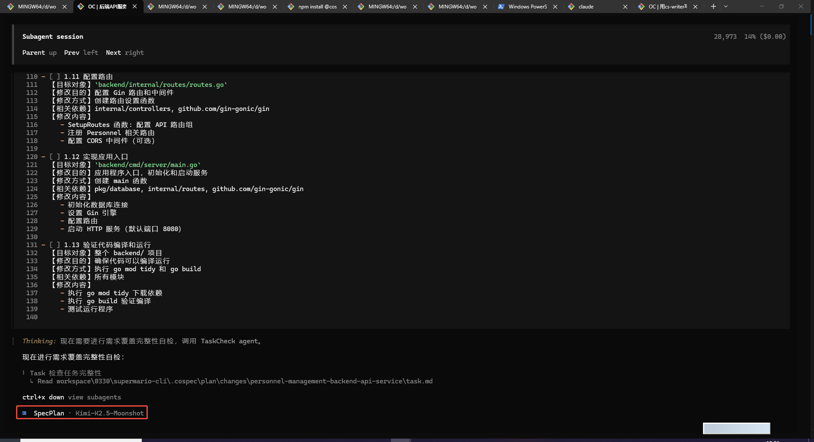

### 生成提案

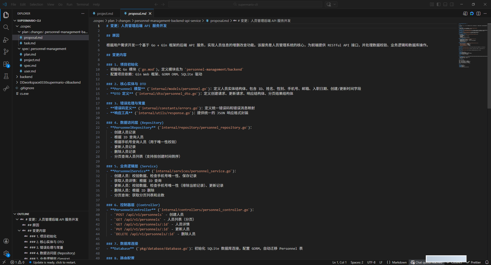

### 生成编码任务

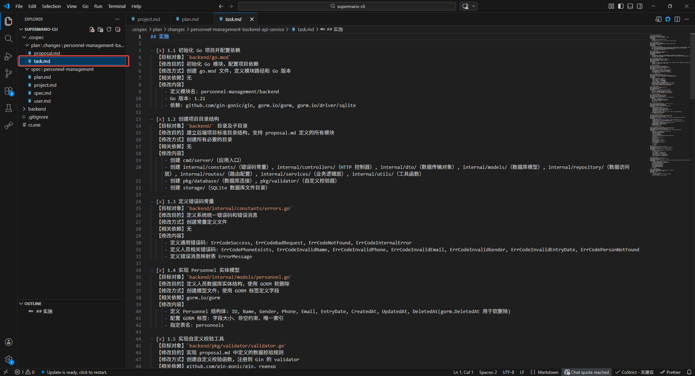

## 编码结束

plan.md中任务全部标记完成

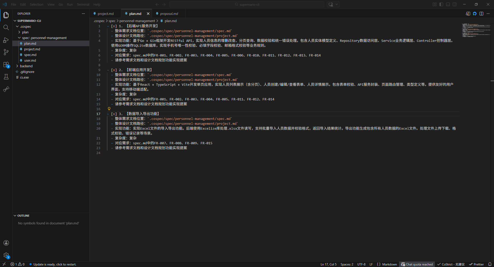