# 代码扫描

CoStrict 代码扫描是一款智能化的代码质量检查工具，它像一位随时在线、经验丰富的技术搭档，无缝融入你的开发流程，默默把关代码质量。系统采用智能体驱动扫描方案，深度理解代码语义，精准覆盖逻辑缺陷、安全漏洞、静态缺陷和内存问题四大类缺陷，并提供完整的缺陷溯源与可执行的修改建议。在权威评测中综合得分达 63%，发现的缺陷建议采纳率超过 50%，让你写代码时更专注、提交变更时更安心。

### 触发方式

支持用户对函数、代码块、代码文件和整个代码仓库进行代码审查。

代码行和函数采用通用触发方式，点击鼠标 **右键选择"CoStrict > 代码审查"** 触发

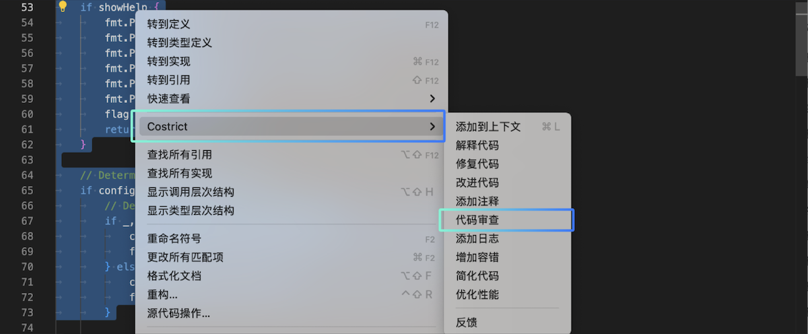

对于函数支持点击顶部 **快捷按钮"代码审查"** 触发

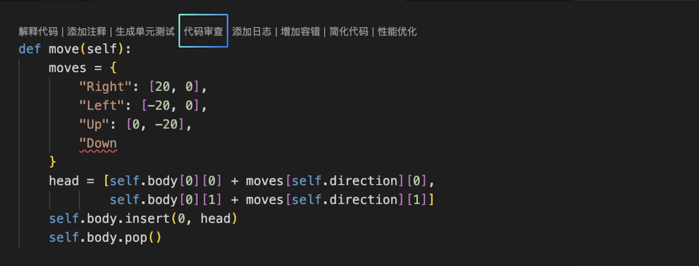

对于代码文件和代码仓库，打开文件目录，选中其中一个文件，点击鼠标右键选择" **CoStrict > 代码审查"** 则可对该代码文件进行代码审查，点击" **CoStrict > 检查仓库** "则会对检查该文件所在的全量代码仓库。

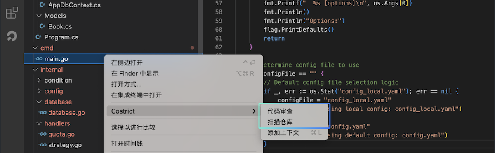

### 执行过程&结果

代码触发审查之后，CoStrict面板的CODE REVIEW栏实时展示代码审查的进度，扫描的时间长短跟执行的代码量成正比，短到几秒，长到几十分钟。

审查结果会以列表形式展示在侧边栏，根据标题描述、左侧颜色和问题标签可以对整体问题以及严重程度做一个大致的了解。

三种颜色条红、黄、蓝对应问题严重等级：高、中、低。点击某个问题可在代码编辑区查看详情，右侧对应的问题代码行会被自动定位，呈高亮显示，问题行下方浮窗展示问题详情。

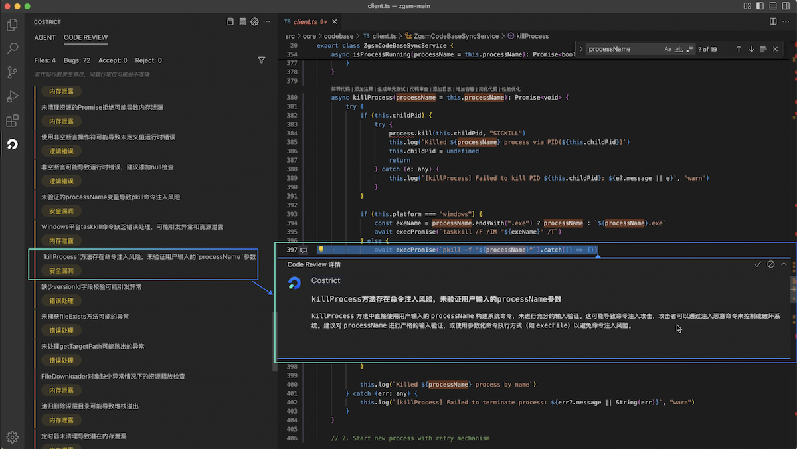

为了Codereview功能后续能被训练的更智能更好，我们鼓励用户根据实际情况点击详情卡片右上角的按钮，有"接受"、"拒绝"、"关闭"三个按钮。接受：表示你认可AI输出的问题；拒绝：表示你认为这不是一个问题或者输出有误，你不认可输出结果；关闭：关闭当前详情窗口。

### 过滤条件

Codereview支持对问题做过滤，支持对严重程度、问题标签和确信度三个维度过滤。

- **严重程度**：高、中、低，对应问题列表的左侧颜色条：红黄蓝
- **问题标签**：AI会根据问题描述自动给问题进行归类打标，通常一个问题会有一到多个标签。常见的问题标签类型有：语法错误、逻辑错误、内存泄露、安全漏洞等等。

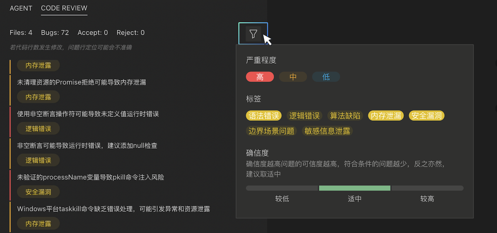

### Codebase索引构建

Codebase索引是一套套针对代码库进行结构化解析、关联与存储的智能系统，通过建立代码元素（如函数、类、变量、调用关系等）的高效检索机制，为提高代码审查的准确度，CoStrict在执行代码审查之前会先做Codebase索引构建工作。

你可以在 **"设置 > 上下文"** 模块看到构建的进度和具体情况。CoStrict插件默认会几分钟检查同步一次Codebase索引，如果有文件变更，也会自动触发索引同步。

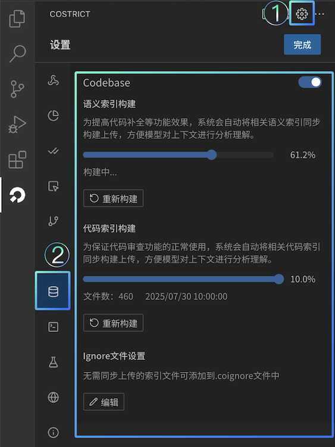

如果用户需要设置排除文件，点击 **"Ignore文件配置"** 模块下方的"编辑"按钮可以将索引文件配置到.coignore文件中，插件在做Codebase索引同步时就会自动过滤掉.coignore文件中的文件。该排除文件是与项目绑定的，如果用户切换了项目，则需要重新配置排除文件。如果用户未设置排除文件，则系统会使用默认的排除配置。

### 多场景覆盖

支持与企业内部GitLab深度集成，实现合并请求的自动化质量审查，灵活适配个人开发与团队协作流程（只面向私有化部署的用户）

#### 创建访问令牌

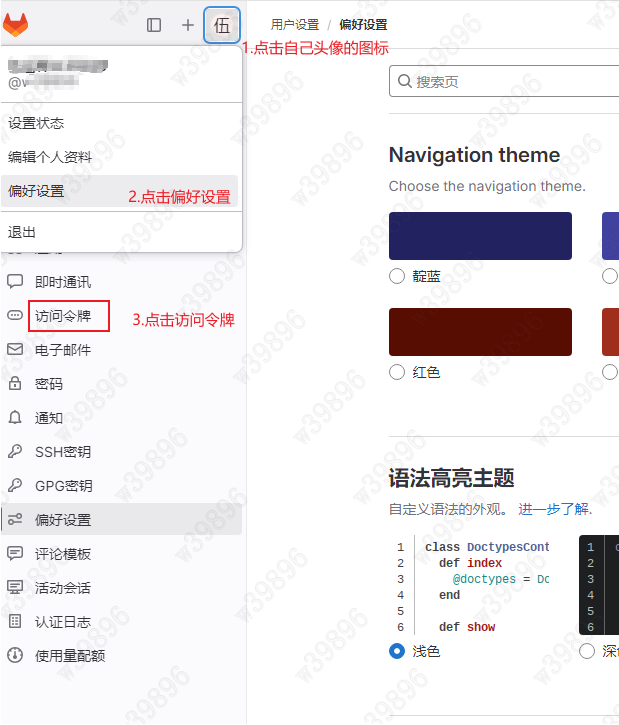

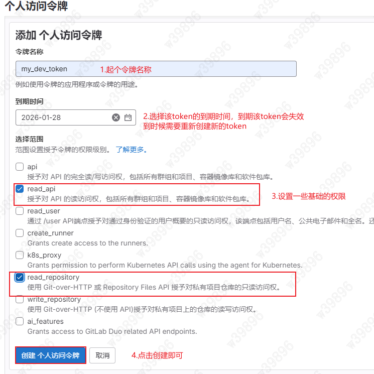

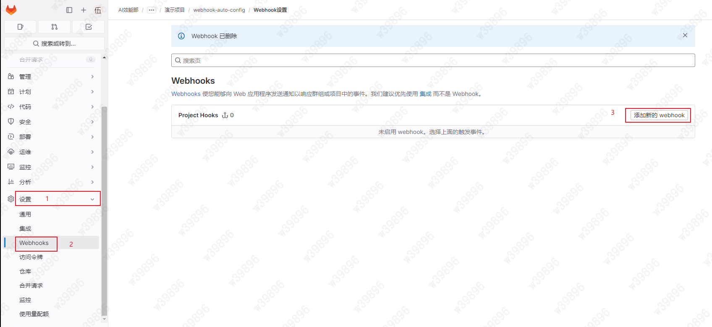

**注意：** 生成完token后，请不要立刻关闭该页面，因为该页面的token一旦被刷新或者关闭后无法再次获取

#### 配置webhook

-   配置入口如下：

-   配置必须参数：

webhook URL: https:/xxx/code-review/api/v1/webhooks/gitlab

Secret 令牌：使用上面创建的token，也 **允许留空**

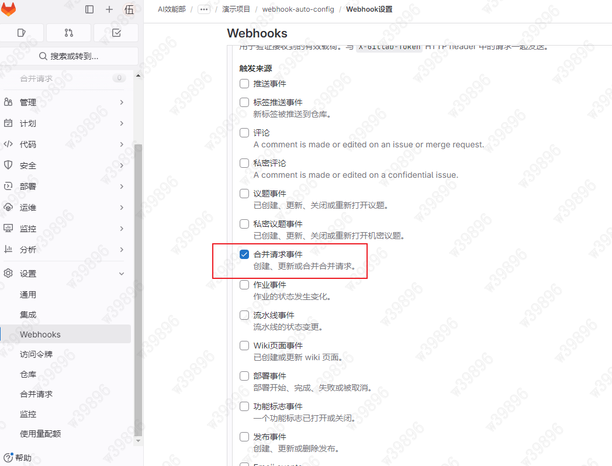

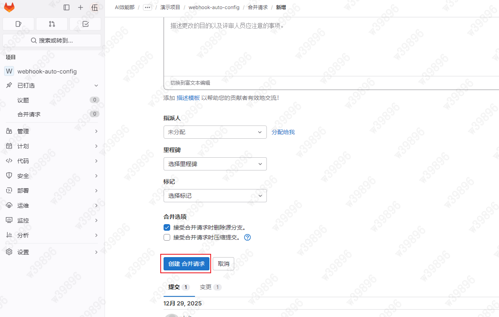

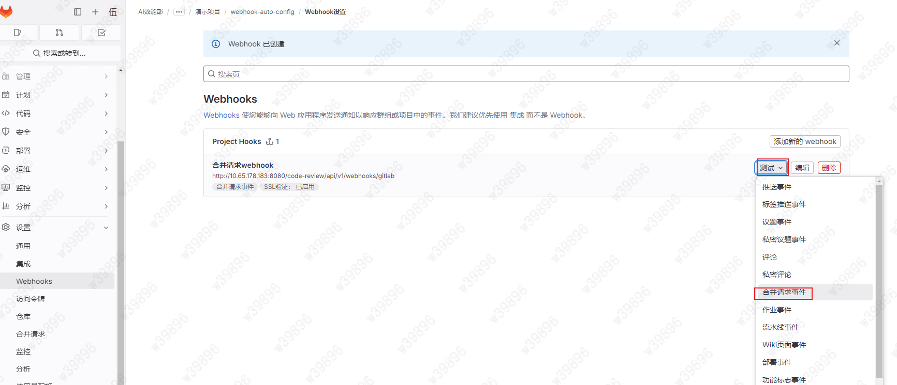

**返回200则测试成功**
