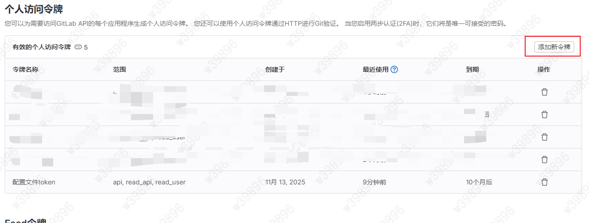
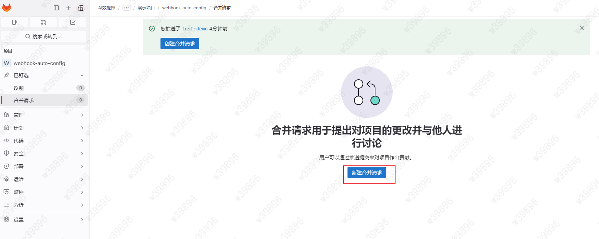
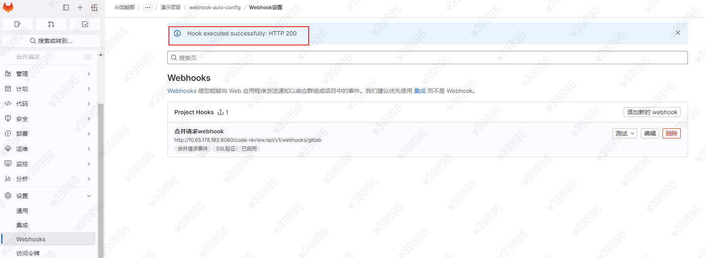

# 企业集成

支持与企业内部 GitLab 深度集成，实现合并请求的自动化质量审查，灵活适配个人开发与团队协作流程（只面向私有化部署的用户）

## 创建访问令牌

**注意：** 生成完 token 后，请不要立刻关闭该页面，因为该页面的 token 一旦被刷新或者关闭后无法再次获取

## 配置 Webhook

- 配置入口如下：

- 配置必须参数：

webhook URL: `https://xxx/code-review/api/v1/webhooks/gitlab`

Secret 令牌：使用上面创建的 token，也 **允许留空**

**返回 200 则测试成功**
