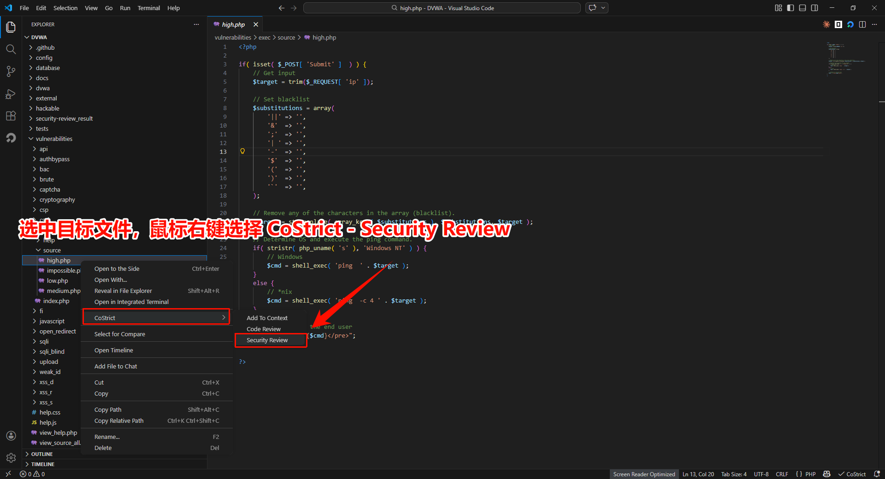
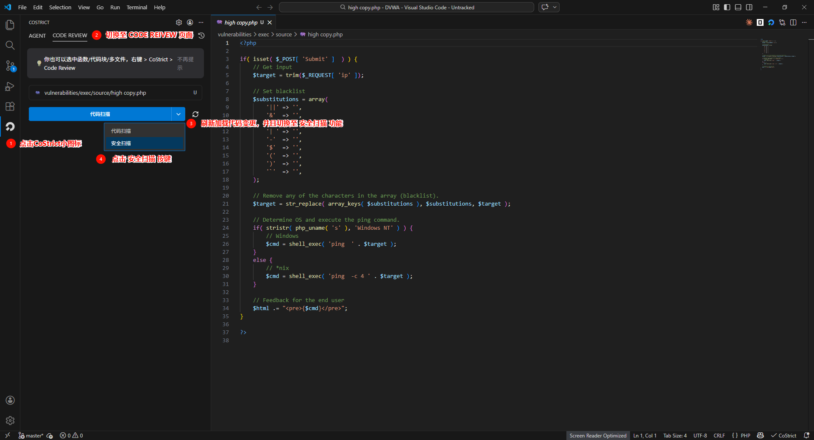
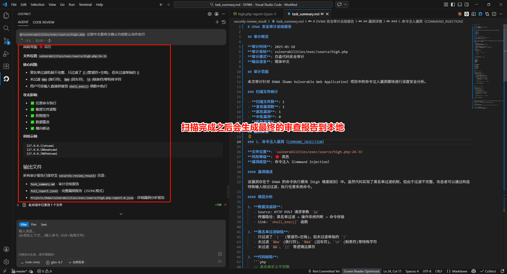

# 快速上手

CoStrict Security 是一款自研的 AI 驱动安全扫描工具，精准覆盖注入攻击、越权访问、敏感信息泄露、不安全配置等常见安全漏洞，并提供完整的风险溯源与可执行的修复建议，让你在代码上线前有效消除安全隐患。

---

## 安装教程

详细下载安装步骤请访问：**[https://costrict.ai/download](https://costrict.ai/download)**

支持三种安装方式：
- **CLI 命令行工具**（版本要求：≥ 3.0.15）
- **VSCode 插件**（版本要求：≥ 2.4.7）
- **JetBrains 插件**（版本要求：≥ 2.4.7，支持 IDEA / PyCharm / WebStorm 等）

---

## 使用方式

### 步骤 1：选择扫描方式

**方式 1：扫描整个文件**

在文件浏览器中**右键点击文件**，选择 **CoStrict - Security Review** 即可对整个文件进行安全扫描。

**方式 2：扫描选中代码片段**

在编辑器中**选中代码片段**，**右键点击**选择 **Security Review** 即可对选中的代码进行安全扫描。

**方式 3：扫描代码变更**

点击左侧 **CoStrict 图标**，切换至 **CODE REVIEW** 页面，选择 **安全扫描**，即可扫描当前工作区的代码变更（如 Git 差异）。

### 步骤 2：查看扫描报告

扫描完成后，结果会在侧边栏面板中展示，包括：

- **扫描摘要**：扫描的文件数量和发现的问题总数
- **问题列表**：每个安全问题的详细信息
  - 文件路径和行号
  - 严重级别
  - 问题描述
  - 修复建议

---

## 私有化部署要求

### 模型配置

**对话模型**（CoStrict 对话、Code Review、Security Review 共用）

| 模型名称 | GPU 资源（推荐） |
|---------|----------------|
| GLM-4.7-FP8 或 GLM-4.7-Flash | 4 × H20 或 4 × RTX4090 |

### 后端服务器要求

**硬件要求**

| 配置项 | 最低要求 |
|--------|---------|
| CPU | Intel x64 架构，16 核 |
| 内存 | 32GB RAM |
| 存储 | 512GB 可用空间 |

**软件要求**

| 软件项 | 版本要求 |
|--------|---------|
| 操作系统 | CentOS 7+ 或 Ubuntu 18.04+ |
| Docker | 20.10+ |
| Docker Compose | 2.0+ |

### 部署文档

详细部署步骤请参考：**[部署检查清单](https://docs.costrict.ai/plugin/deployment/deploy-checklist/)**

---

## 获取帮助

- 官网：https://costrict.ai
- 下载页面：https://costrict.ai/download
- 问题反馈：support@costrict.ai
