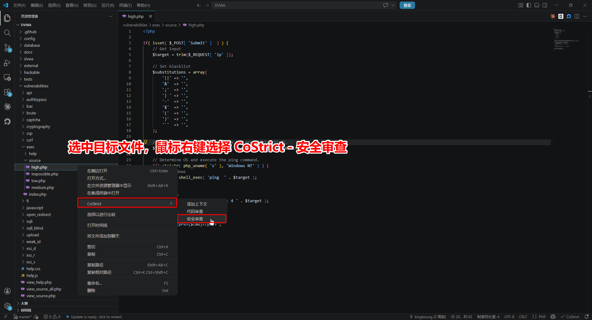
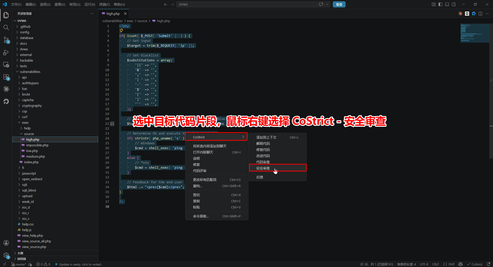
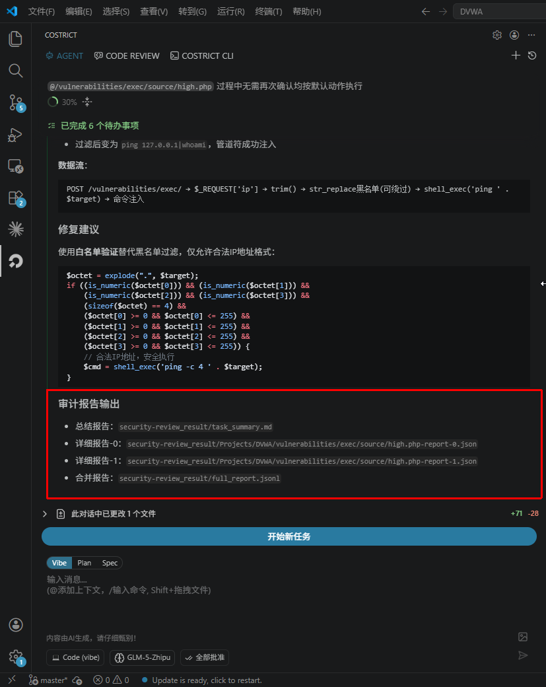

# 快速上手

CoStrict Security 是一款自研的 AI 驱动安全扫描工具，精准覆盖注入攻击、越权访问、敏感信息泄露、不安全配置等常见安全漏洞，并提供完整的风险溯源与可执行的修复建议，让你在代码上线前有效消除安全隐患。

## 系统要求

| 安装方式 | 版本要求 | 支持平台 |
|---|---|---|
| VSCode 插件 | ≥ 2.4.7 | VSCode |
| JetBrains 插件 | ≥ 2.4.7 | IDEA / PyCharm / WebStorm 等 |

## 使用方式

在编码阶段通过 IDE 进行交互式安全扫描，实时辅助开发人员发现并修复安全问题。

- 支持对话式交互窗口，随时沟通、快速定位问题
- 可结合业务上下文、威胁模型等先验知识，让检测结果更精准
- 展示模型推理过程，让你清楚知道为什么报这个问题

### 扫描方式

#### 方式一：扫描代码文件

在文件浏览器中**右键点击文件**，选择 **CoStrict > Security Review** 即可对整个文件进行安全扫描。

#### 方式二：扫描代码片段

在编辑器中**选中代码片段**，**右键点击**选择 **安全审查** 即可对选中的代码进行代码扫描。

#### 方式三：扫描代码变更

点击左侧 **CoStrict 图标**，切换至 **CODE REVIEW** 页面，选择 **安全扫描**，即可扫描当前工作区的代码变更（如 Git 差异）。

### 扫描报告

触发安全审查后，AGENT 面板会实时展示扫描过程。扫描过程中如涉及危险操作，需要用户手动确认后方可继续。扫描时长与代码量有关，从几分钟到几十分钟不等。扫描完成后，会在项目本地生成安全审查报告。报告包含以下三种类型：

| 报告文件 | 类型 | 说明 |
|---|---|---|
| `task_summary.md` | 总结报告 | 面向开发人员的可读性摘要，包含扫描概览与问题汇总 |
| `[目标文件]-report-[漏洞序号].json` | 单文件漏洞报告 | 对应单个文件的漏洞详情，适合接入自定义审查流程 |
| `full_report.jsonl` | 合并报告 | 所有扫描结果的汇总文件（JSONL 格式），适合工程化流程对接 |

